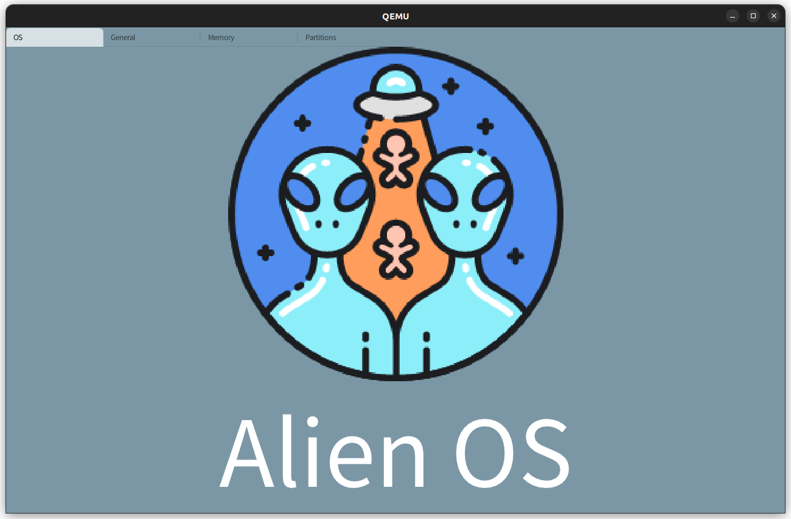

# Alien

A simple operating system implemented in rust. The purpose is to explore how to use modules to build a complete os, so the system is composed of a series of independent modules. At present, the system already supports user-mode programs and some simple functions.



## Project Structure

```
├── LICENSE
├── Makefile                (编译命令)
├── README.md               (readme)
├── apps                    (rust程序)
├── assert
├── kernel                  (核心子系统)
├── doc                     (开发文档与内核相关模块文档)
├── subsystems							
    ├── arch            (riscv相关代码)
    ├── platform        (平台相关代码)
    ├── config		    (内核配置)
    ├── devices         (设备注册管理)
    ├── drivers         (设备驱动合集)
    ├── unwinder        (内核panic处理)
    ├── vfs             (虚拟文件系统)
    ├── interrupt       (外中断注册管理)
    ├── ipc             (进程间通信模块)
    ├── mem          	(内存管理)
    ├── knet            (网络模块)
    ├── ksync           (内核锁实现)
    ├── timer           (时间相关实现)
    ├── constants		(常量、错误定义)
    ├── device_interface(设备接口定义)
├── tests                   (测试程序)
├── tools                   (一些dts文件)
└── userlibc                (rust lib库)
```


## Run

1. install qemu 7.0.0(qume版本最低要求7.0.0)
2. install rust nightly
3. install riscv64-linux-musl [toolchain](https://musl.cc/)

可以参考[简明 ArceOS Tutorial Book](https://rcore-os.cn/arceos-tutorial-book/ch01-02.html)

```
make help
```

```
# 一键运行qemu，注意在编译busybox时选择静态链接Settings->Build static binary (no shared libs)
# 忘记设置静态链接可以使用make clean重新配置
make run
# run test
> cd tests
> ./final_test
```

### Run with GUI (QEMU)

```
make run GUI=y
# 在编译和运行的时候指定参数y
cd tests
slint or sysinfo or todo or printdemo or memorygame 
```

### [Run VisionFive2](./docs/doc/boot.md)

Update the `TFTPBOOT`  variable in Makefile.

```
make sdcard
make vf2 VF2=y SMP=2
// 生成testos.bin
// 这里smp=2 表示的是单核启动，对于u74-mc处理器，0号核不会被启动，从1号开始。
```

## GDB

1. `make gdb-server`
2. `make gdb-client`

## [Doc](https://godones.github.io/Alien/)


## Reference

- rCoreTutorial-v3 http://rcore-os.cn/rCore-Tutorial-Book-v3/chapter0/index.html
- Maturin https://gitlab.eduxiji.net/scPointer/maturin
- Redox https://gitlab.redox-os.org/redox-os/
- [Files · master · FTL OS / OSKernel2022-FTLOS · GitLab (eduxiji.net)](https://gitlab.eduxiji.net/DarkAngelEX/oskernel2022-ftlos/-/tree/master)

