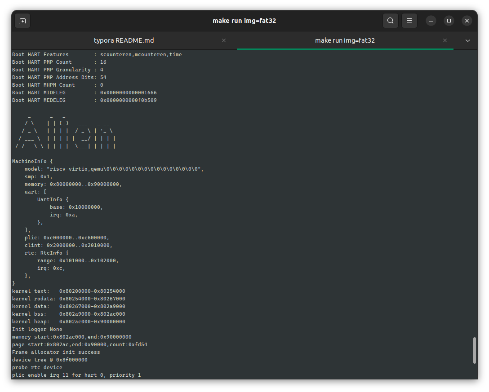

# Alien

A simple operating system implemented in rust. The purpose is to explore how to use modules to build a complete os,so
the system is composed of a series of independent modules. At present, the system already supports user-mode programsand
some simple functions.



## Modules

`pci` ：pci driver to detect devices on the bus

`rtc` ：rtc driver to get time

`page-table `： page table to manage virtual memory

`pager`： buddy and bitmap to manage frames

`gmanager`: a simple allocator to manage `process`/ `fd` and so on

`rvfs `: a vfs framework like linux, it can support multiple file systems

`fat32-vfs`: a disk file system, it can support fat32

`jammdb `: a key-value database, it can support `dbfs`

`dbfs2 `:  a disk file system, it is based on `jammdb`

`trace_lib `: stack trace library

`preprint ` : a simple print library

`rslab `: slab allocator like linux

`syscall-table `: A tool to automatically collect syscalls

`dbop`: Make database functions available to users as system calls

`plic`: riscv plic driver

`uart`: uart driver, it supports interrupt

Other modules are not listed here, you can find them in the cargo.toml file.

## Run

1. install qemu 7.0.0
2. install rust nightly

```
make run LOG=WARN img=fat32 SMP=4
```

## Doc

[文件系统接口](./doc/fs.md)

[下一步规划](./doc/target.md)

[测试](./doc/test.md)

[slab](https://github.com/os-module/rslab/blob/main/src/slab.rs)

[dbfs](https://github.com/Godones/dbfs2)

[物理页帧分配器](./modules/pager/README.md)

## Feature

- [ ] Thread/Mutil-core
- [x] full vfs
- [x] fat32
- [x] dbfs
- [x] Mutex
- [x] sleep task queue
- [x] uart task queue
- [ ] block driver task queue
- [x] a simple shell
- [x] memory management
- [x] process management
- [x] stack trace
- [ ] signal
- [ ] ....

## Project Structure

```
├── apps 一些测试程序+shell
│   ├── cat
│   ├── forktest
│   ├── init
│   ├── ls
│   ├── mkdir
│   ├── mmmap
│   ├── pipetest
│   ├── pipetest2
│   ├── pwd
│   ├── run_test
│   ├── shell
│   ├── time
│   └── touch
│── boot 启动模块
│   └── src
├── doc  相关文档
├── kernel
│   └── src
│       ├── arch  riscv
│       ├── driver 驱动模块
│       ├── fs	   文件系统
│       ├── ipc    进程间通信
│       ├── memory 内存管理
│       ├── print  输出
│       ├── sync   同步机制
│       ├── task   进程与线程模块
│       ├── timer  时钟
│       ├── trace  内核堆栈回溯
│       └── trap   异常处理
├── modules
│   ├── basemachine  dtb基本信息获取
│   ├── gmanager     最小索引分配与管理
│   ├── pager        页分配
│   ├── pci-rs       PCI
│   ├── plic         riscv平台中断控制器
│   ├── syscall		 
│   ├── syscall-table  系统调用过程宏
│   ├── systable-macro-derive  
│   └── uart           串口驱动c le |
└── userlib   		用户库
    └── src
```

## Reference

- rCoreTutorial-v3 http://rcore-os.cn/rCore-Tutorial-Book-v3/chapter0/index.html
- Maturin https://gitlab.eduxiji.net/scPointer/maturin
- Redox https://gitlab.redox-os.org/redox-os/


