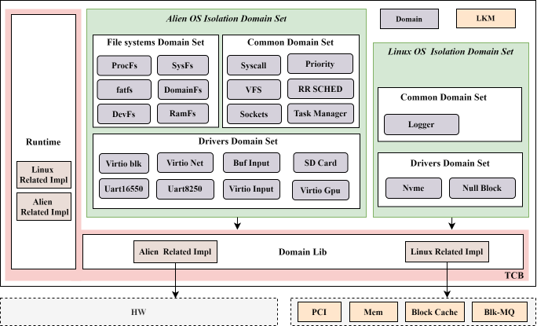

# Alien(Isolated Operating System)


## 1. Introduction

Alien is an isolated operating system that supports multiple isolated domains running on a single operating system kernel. Each domain has its own isolated memory space and can be loaded and unloaded dynamically. 


## 2. Implementation

    
## 3. Run
- rust
- riscv64-linux-musl-gcc
- git submodule update --init --recursive

```
make run
```
```
make build        # build kernel
make sdcard       # build all domains and user app
make initrd       # build initrd (choose static busybox)
```


You can press `Esc` to exit the app. 

### Load domain from disk
```shell
# cd tests folder
> cd tests
# load new vfs module
> dvfs
```


#### Run GUI app
```
make run GUI=y
```

```shell
# cd tests folder
> cd tests
# load gpu module
> dgpu
# load input device module
> dinput
# run memory_game/slint app
> memory_game
```

#### Run scheduler domain
```shell
# cd tests folder
> cd tests
# load old/new scheduler domain
> dtask new/old

# run nice app to see different scheduling results
> nice
```

### Load domain from network

1. Start domain server
   ```shell
    cargo run -p domain-server
   ```
2. Run the following commands in Alien shell

    ```shell
    # cd tests folder
    > cd tests
    # load net module
    > dnet
    # run out app to trigger log output
    > out
    # load new log domain from domain server
    > dlog new
    # run out app to see new log domain output
    > out
    # replay old log domain
    > dlog old
    ```

## Documentation
All documentation are in the [docs](docs) folder.

## Reference
[git submodule](https://iphysresearch.github.io/blog/post/programing/git/git_submodule/)