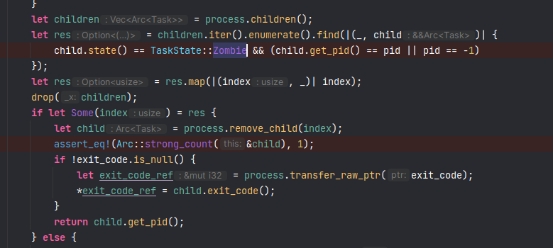
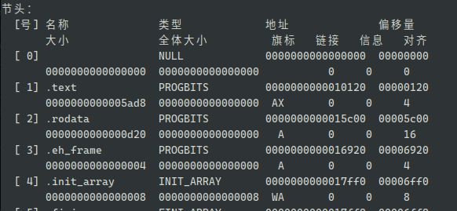
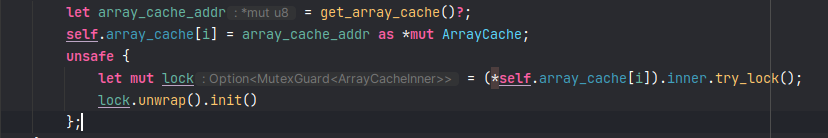
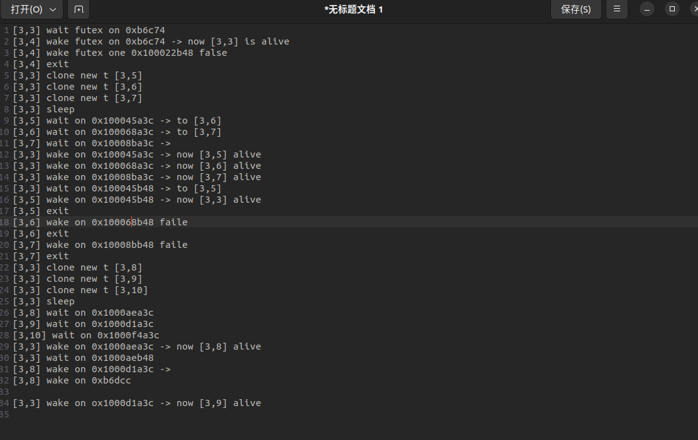
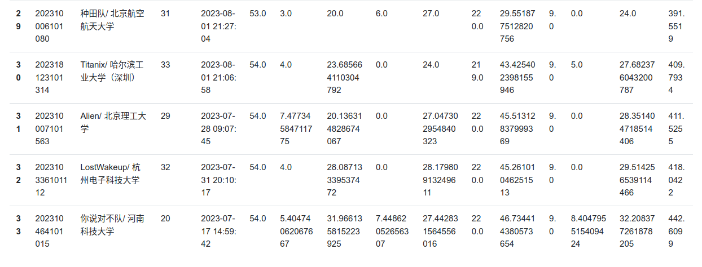
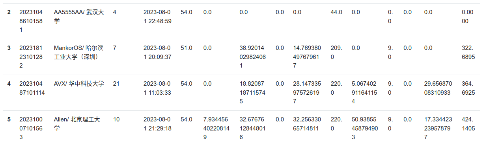
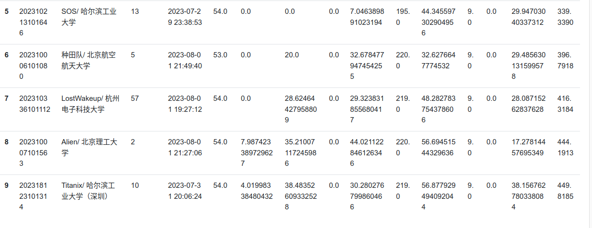

# 开发日志

记录开发过程

## 2023.6.9

1. 修该页帧分配器的测试，通过`trait`可以让`Bitmap`与`Budyy`使用同一套测试方法 。
2. 替换内核中的页帧分配器为`Buddy`，并修改相应的数据结构，由于slab会提供8MB大小的块分配，这会需要2048个页因此调高了页帧分配器的最大页数。

## 2023.6.10

1. 修复`rvfs`中关于mount的实现错误，现在一个文件系统可以挂载在多个目录上
2. 修复`dbfs`中关于`readdir`的实现以及mount相关的错误，修复了`fat32`中关于`readdir`的实现错误以及mount相关错误

## 2023.6.11

1. 实现`devfs`，加入`rvfs`框架中。
2. 在内核中添加设备文件系统支持，将`ramfs`重新挂载在`/tmp`目录上

## 2023.6.12

1. 添加多核启动的支持

内核中一些数据结构需要根据CPU数量进行初始化，但是直接在内核中指定CPU数量会导致改变qemu启动的CPU参数时也随之更改内核的参数，因此我们采取了在`build.rs`中根据命令行参数生成内核参数的方法，动态地修改正确的CPU数量。

同时在实验中我们发现，`opensbi`在进入到内核时，`sstatus`的`spp`字段居然是用户态，不知道是不是qemu版本的原因，目前的解决方案就是在主函数第一句手动修改回来。

```rust
pub fn main(hart_id: usize, device_tree_addr: usize) -> ! {
    unsafe {
        set_spp(SPP::Supervisor);
    }
}
```

## 2023.6.13

1. 学习`arceos`中页表实现，将之前的实现替换掉

## 2023.6.14

1. 为`clone`系统调用添加copy-on-write功能

page-table中存在父子进程共享同一个页面的情况，这时候如果父进程释放了这个页面，那么子进程的页面也会被释放，这时候子进程的页面就会被覆盖，这是不允许的，为了解决这个问题，我们需要管理物理内存的分配情况，在前面我们已经使用伙伴系统接管了物理内存的页分配，但是出现了一些物理页被重复使用的情况，因此需要一个管理机构来记录每个物理页的使用情况。

在进程进行`fork`时，子进程获得了父进程的页表的一份拷贝，这份拷贝包含了几个重要的信息

1. 页表根地址
2. 在建立页表时申请的物理页帧
3. 建立映射的虚拟地址

我们会根据第三个信息，将页表中所有包含写标志位的映射的`D`位置置为0，这样当父进程或者子进程进行写时就会触发异常，对这个异常，父子进程都会取消掉这段映射，并申请页面来重新映射这段虚拟地址，拷贝数据，设置相应的标志位。

由于父子进程同时拥有上面提到的第二个信息，而当进程退出时，页表会向内核回收这些申请的物理页帧，如果父进程提前退出，但是子进程仍然需要这些物理页，就会造成子进程在拷贝数据时出错，因为被回收的页面可能被清零或者被其它模块申请。

**物理页帧管理机构**的作用就是在物理页进行分配或者回收时记录物理页的持有情况：

1. 当物理页首次被分配时，其持有计数为1
2. 在需要共享物理页的位置，使用者需要手动添加其持有计数
3. 当物理页被回收时，管理机构首先递减持有计数，并在计数为0 时归还到伙伴系统中

WARN：这需要使用者小心物理页的共享情况

这个管理机构如何更高效管理这些信息呢？因为有时候其他模块会申请连续的多个页面，并在存在共享时递增这一个区间的持有计数。即我们需要记录单个物理页或者连续物理页的持有计数，为了简化，这里我们禁止出现将连续物理页拆分的情况，即不允许单独对连续区间中的子区间或者单个页面增加计数，毕竟既然作为一个整体被分配出去，就应该作为一个整体进行回收。

**物理页帧管理机构**的数据结构定义如下:

```rust
pub struct FrameRefManager {
    record: HashMap<usize, usize>,
}
```

其主要的成员函数有两个:

```rust
pub fn add_ref(&mut self, id: usize) -> usize {
        if let Some(count) = self.record.get_mut(&id) {
            *count += 1;
            *count
        } else {
            self.record.insert(id, 1);
            1
        }
    }
pub fn dec_ref(&mut self, id: usize) -> Option<usize> {
    if let Some(count) = self.record.get_mut(&id) {
        *count -= 1;
        if *count == 0 {
            self.record.remove(&id);
            let start_addr = id << FRAME_BITS;
            unsafe {
                core::ptr::write_bytes(start_addr as *mut u8, 0, FRAME_SIZE);
            }
            FRAME_ALLOCATOR.lock().free(id, 0).unwrap();
            return Some(id);
        }
    } else {
        panic!("dec {} ref error", id);
    }
    None
}
```

其职责就是为需要共享的物理页帧增加或减少引用计数，并在计数为0时回收到伙伴系统。

在执行fork时需要处理的一个细节是对于`trap_context`的处理，这被单独映射成了一页，并且里面存储了一个子进程独有信息，因此在进行COW时，这一页不能共享。

由于引入了物理页帧的引用计数，因此需要页表模块与内核部分一同处理页面的分配情况，这部分要小心处理，不然容易发生多释放的错误。


## 2023.6.15

1. 为内核添加`lazy page allocation` 功能

在进程进行`mmap`或者 `sbrk`操作时，由于应用程序不知道需要多大的空间，因此其可能会请求一个很大的内存区间，如果内核直接满足程序的要求，就会分配大量的内存，但是应用程序可能并不会使用所有分配的区域，因此一个方法就是延迟分配，内核在页表中建立一个无效的映射，当程序真正进行访问时，内核再进行实际的内存分配并建立有效映射。


## 2023.6.20

1. 修改`page-table`的实现，以更优雅的方式记录地址映射情况，减少手工管理物理页帧的麻烦
2. 添加`brk`和 `mmap` 的`lazy page allocation`功能

在处理`COW`时，需要考虑页表项无效的情况，这时候不需要共享页面，也不需要将写标志去除，只需要按照原样映射即可。


## 2023.6.21/6.24

1. 添加gui的支持，第一个测试程序`guitest`来自`rcore` ，主要使用的是**embedded-graphics** 库
2. 添加`slint` 框架的测试，显示一个简单的图形界面


由于包含图形界面的程序需要的栈空间较大，因此需要调高应用程序的栈大小。


## 2023.6.24

1. 添加内核同步原语`Mutex`， 来自https://gitee.com/chyyuu/kernel-sync?_from=gitee_search

此仓库包含了`spin_mutex`和`ticket_mutex`，但其限制了cpu数量为4,我们将定义cpu数量的代码在`build.rs`中重写。与多核启动的方式类似。

2. 修改内核使用的锁，替换成新的实现。只替换了部分。
3. 规范串口驱动的实现，思考如何将带等待队列的串口驱动独立出去。

由于串口内部使用了互斥锁，而这个锁一般被实现在内核中，这种外部模块依赖内核功能的情况是经常发生的，这里暂时想到的一个方法是看能不能使用接口来屏蔽掉这种依赖。


## 2023.6.25/26

1. 添加键盘/鼠标外设的支持
2. 添加睡眠锁，当进程获取锁时如果锁已经被其他进程获取，则当前进程被加入到等待队列中，当锁被释放，会唤醒队列中等待的进程。
3. 将rust编写的测试程序集中到一个单独的`tests`crate中，通过制定测试的名称运行相应的测试。
4. 为`slint` gui程序添加鼠标和键盘事件支持，现在计数器程序可以运行，但是鼠标的坐标处理需要进一步细化。


## 2023.6.27

1. 添加一个`memory-game` ，使用`slint`
2. 修复`page-table`中`unmap` 的错误

## 2023.6.29

1. 编译libc/busybox相关测例
2. 尝试运行测试，爆出许多错误

## 2023.6.30

1. 修复musl-libc中初始化失败的bug

原来内核中对`execv`参数的处理比较简单，没有按照libc的要求进行放置，导致进入到用户态总是发生`loadpage`异常，在按照libc的初始化过程重新放置参数和环境变量后，没有发生异常，但是程序会卡死。使用gdb单步调试后，发现其在获取hartid时发生了错误，在内核中，我们将hartid放置在tp寄存器中，但是用户态程序使用了这个寄存器，在之前的实现中，进程陷入内核时，我们不没有恢复tp的值，导致tp的值是用户态设置的值，而在异常处理和panic程序中，都会获取hartid，因此直接导致了内核处于panic的死循环中。


## 2023.7.1

1. 添加线程打初步支持

主要参考去年的作品`maturin`，将进程和线程使用同一个任务控制块进行抽象。

## 2023.7.2

1. 添加多核调度的支持

   1. 修复了获取当前cpuid失败的错误，在跳板页中回到用户态前，需要将当前hart id保存到指定位置，并在进入到内核态时恢复。

   2. 修复任务切换时出现打错误

      多核情况下，如果另外一个cpu正在从manager中获取task，而此时当前核正在保存这个task的context，在没有保存完整的情况下，另外一个cpu已经将这个task从manager中取出，并进行switch恢复context，这会带来问题。为了解决这个问题，我们将对当前任务的处理移到位于当前核的循环处理中。

      

   3. 修复任务退出时可能出现打错误

   在一个任务退出时我们会更改任务的状态标志，但是这时候可能在另一个核上运行的父进程在回收这些任务，他可能会发现任务状态变成了`Zombile`，然后就会尝试将其从列表中删除掉，但由于另外一个核上还没有退出完成，对退出的判断逻辑就会出错

   

​	这里对任务引用计数的判断会出错。这里的解决方法是为任务添加一个状态`Terminated`， 在任务调用`exit`时，它的状态是`Zombile`，在`wait pid`时，将判断条件修改为

```rust
child.state() == TaskState::Terminated && (child.get_pid() == pid || pid == -1)
```

而`exit`时会发生任务上下文切换，在这部分，通过修改判断逻辑，将处于`Zombile`的任务状态修改为`Terminated`。这样就可以防止任务被提前回收掉。

1. ​	修复有关物理页共享的bug

在进行COW拷贝时，需要在新的任务中记录共享了哪些页面，这样在exec时才能正确地将那些共享的页面的计数减一。

2. 修复有关进程栈大小打bug

原来我们给每个任务的栈大小为4k，但是下午一直跑发现总是会出现奇怪打错误，一会儿是卡住不动，一会儿是访问了一些奇怪的地址。最终折腾一下午，在晚上的时候在之前卡住的位置打印了一些数据，发现这些数据不正确，仔细一想，这应该是栈跑飞了，增加栈的大小后，运行成功了。

## 2023.7.3

1. 解决一个困扰了两天的bug：musl-libc初始化阶段访问0地址错误

libc中的


函数会读取`init_array_start`这个函数指针数组的值，并跳转去执行，从elf文件中可以看到




这个符号的位置就位于第二个加载段的起始位置，因此当libc读取这个位置时，理论上会读到一个正确的值，但是在解决这个问题前，我们对elf的文件加载时并没有按照正确的偏移去加载数据，导致了这个位置上的数据是错误的，在针对我们自己编写的rust测例没有问题是因为我们对链接脚本做了对其4k大小的操作，这样每次只需要把数据加载到页面开始的位置即可。

## 2023.7.4-7.5

1. 添加更多syscall支持，运行大多数lib-test测例
2. 修复文件系统相关的错误，并进一步对文件进行抽象

## 2023.7.6

1. 记录一次`visionfive2`debug

在将os运行到开发板时，之前运行良好的代码出现了错误，出现的第一个错误是一个地址访问错误，内核触发了`LoadFault`错误，查看具体的值发现是一个很大的地址值，并且错误发生在slab分配器的初始化过程中。由于无法使用gdb工具进行单步调试，因此只能在代码中插入一些打印的语句，通过打印发现：


在从内核获取页面后，进行slab块初始化时，会计算第一个对象的地址，而发生错误的原因是这里的`color next`值是一个错误值，在进一步查看cache的初始化代码，发现没有包含对其初始化，在加入一行初始化的代码后，解决了这个问题。

第一个问题解决后，发现程序还是卡在了紧接着的代码中



通过打印得知这里获取锁失败了，但理论上在初始化阶段不会出现竞争，因此获取锁判断值肯定出错了，仔细思考后，发现这些对象全部都从裸指针转换而来，而裸指针又是从内核的物理页面转换得到，因此当这些物理页在发配时没有经过清空的话，直接使用裸指针就会造成一些值出现错误，通过在分配物理页进行清空数据，这个问题得到了解决。


## 2023.7.7

1. 在cv1811h开发板启动os

bug1：启动后无法打印

解决方法：打印前先清空bss段，`.bss`段没clear干净，导致未初始化时的原子变量存在了随机值，持续死锁。

https://github.com/rcore-os/zCore/blob/cv1811/docs/README-C910.md 

bug2：建立好页表后开启mmu卡死

解决方法：根据上面网址给出的提示可以得知由于c906对页表项进行了扩展，由此需要设置页表项的高位才能正确地运行。第二种方法就是在sbi启动阶段将`mxstatus`的`maee`位关闭。

暂时放弃cv1911的启动

2. 添加线程和信号的完整支持

对于线程创建来说，其使用`clone`系统调用，通过控制其参数来达到一个创建线程的效果，具体来说，libc的线程库会使用`CLONE_VM` 、 `CLONE_FILE`等参数，使得新创建的子进程共享父进程的资源，这样这些子进程就变成了理论上的线程。

但由于前面我们只支持创建子进程，其会使用cow机制拷贝父进程的地址空间，并且可以分配子进程的`trap_contex` 页，


## 2023.7.8

1. 删除掉当`execv`无参数时额外增加的可执行程序名称的参数

在一般的shell中，输入命令后shell会向执行都命令传入参数，而一般来说，参数的第一个都是执行的命令的名称。之前我们是在内核的`execv`中手动判断是否参数为空并手动加入程序的名称，但在执行`busybox`的相关命令时，发现`busybox`会往第一个参数放置程序的名称，因此我们手动加入一个额外的就会造成错误。解决方法是我们在自己编写的简易`shell`中按照一般方法放置了参数。

1. 在自己编写的os中程序运行与qemu镜像不一致，因此需要根据运行的错误进行调整

在添加系统调用过程中，一般参考`debian`中程序的执行流程，但是实验发现，我们的os与其执行的系统调用并不完全一致，因为我们的os中缺少linux中一些功能或者说前置的系统调用结果与linux中不一样导致了这种情况发生。但总体而言关键的系统调用是一致的。

1. 增加对`FutexRequeuePrivate` 的处理
2. `sigtimewait`会使得任务睡眠，是否在必要的时候唤醒任务，因为子任务也许已经完成 

目前的处理是没有检查信号是否来了。


- [x] 无法连续运行这些测试，任务退出后有必要删除掉无用的内容

- [x] 任务栈上的数据被覆盖掉，无法进行正常的系统调用 ----> buddy allocater for page is error

检查发现使用伙伴算法的页面分配器有错，暂时换成位图算法后即可。后续需要检查伙伴算法的错误。

- [x] 保证任务退出状态更新与引用计数减少原子性。

在任务退出时，我们更新了任务的状态，同时父进程会等待子进程的退出，当在多核环境中时，如果子进程更新状态后父进程可能会立即监听到，但是由于此时子进程的引用计数还没有减少，那么父进程的判断就会出错。所以需要保证在更新状态结束时，引用计数也减少。


对于多线程程序，调试手段只能一步步观察各个线程发起的系统调用。





## 2022.7.10

1. `getdents`系统调用需要文件系统维护目录的偏移量，就像普通文件一样，在使用这个系统调用时，这个偏移量会变化，从而完成读取目录中文件的功能。需要注意的是，如果在读取过程中，这个目录下有文件被删除了，那么这个偏移量可能会出错。==这里为了简单不考虑这种情况==
   - [x] fat32
   - [x] devfs
   - [x] ramfs
   - [ ] dbfs


## 2022/7/11

- [x] 增加busybox的支持
- [x] 添加`ppoll`调用，需要对文件进一步处理

1. 在测试busybox时由于我们将测试程序放在了`/final`目录下，因此需要调整测试脚本的文件路径，或者后面直接将测试程序放到根目录下

## 2022/7/12

1. 处理测试程序的运行问题

2. 将程序放到根目录下，并在execv时处理sh文件
3. 添加lua的支持
4. 添加共享内存相关的系统调用，供iozone使用

## 2023/7/13

1. 添加iozone的支持  https://www.cnblogs.com/licheng/archive/2008/06/30/1232527.html

- [x] vfs中添加与`poll`   `pselect` 系统调用的支持

在`File`定义内部，我们扩展了几个功能，这些函数用来探测文件是否可读、是否可写、以及是否损坏等，需要为这个扩展功能提供默认实现。

- [x] 如何处理`/dev/tty`

tty回显问题：https://gitlab.eduxiji.net/2019301887/oskernel2022-npucore/-/blob/master/Doc/debug/TTY%E4%B8%8D%E5%9B%9E%E6%98%BEbug.md

不需要在内核中输出，bash会根据系统维护的值选择是否调用`writev`

## 2023/7/16

1. 添加网络的基本支持
2. 修复`pselect`中都bug，`pselect`会在参数中说明要监听的文件，因此判断时不能仅根据数量去查找，还需要从参数中拿到程序需要监听都文件。

## 2023/7/17

1. 添加网络相关的更多系统调用

## 2023/7/18

1. 添加动态链接的支持

动态链接的支持需要读取elf文件的`INTERP`段查找到动态库，并按照之前加载可执行文件的方式加载动态库到内存中，同时，针对动态库中的`.rela.dyn .rela.plt` 等段，需要对里面的符号进行重定位操作。

https://zhuanlan.zhihu.com/p/77264742

https://blog.csdn.net/dai_xiangjun/article/details/123629743

https://bbs.kanxue.com/thread-270935.htm

http://nicephil.blinkenshell.org/my_book/ch07.html 比较细致


动态链接器在加载真正的程序时，会使用mmap系统调用映射，而且要求内核为其分配的虚拟地址程序的相同，在之前，内核对用户的mmap系统调用会从一个固定的地址开始分配，因此这部分需要修改代码来适配，同时，动态链接器还会使用带`MAPFIXED`的mmap来对映射的地址空间进行重映射，这有可能导致一段连续的地址空间变成两部分或者三部分，同时如果映射了文件，文件的起始偏移量也会被修改。

在之前的实现中，我们忽略了指令页异常处理，在动态链接程序中，由于使用了mmap进行懒加载机制，因此代码段可能会发生缺页异常，需要新增代码处理。

## 2023/7/19-2023/7/21

1. 添加lmbench的支持

- [x] 修复内核于用户程序参数传递的问题：使用`copy_to/copy_from`系列
- [x] 在`trap`上下文保存浮点数
- [x] 增加用户栈大小


## 2023/7/22-7/23

1. 添加libc-bench的支持
1. 添加unixbench的支持

- [x] 修复`write`系统调用返回值错误
- [x] 添加未支持的系统调用`sigsuspend`
- [x] 正确处理task的`timer`， 需要在发生任务切换时以及内核态和用户态切换时检查是否超时，并发送信号
- [x] 处理时钟中断被忽略的问题 [unixbench.md](./unixbench.md)

## 2023/7/23-7/28

1. 进行联合测试

在前期我们对每个测试都单独进行了测试并独立通过了每个测试，但是最后我们需要将这些测试一起运行。由于对网络的支持不够完善，因此不能直接使用包含全部测试的测试脚本，在`init`程序中，我们手动运行已经支持的测例。


2. 增加不同的内存分配器

   - [x] buddy
   - [x] talloc
   - [x] slab

3. 修复一系列错误

   - [x] 增加堆空间大小
   - [x] 减小用户程序内核栈大小
   - [x] 减小内核栈大小
   - [x] 修复fat32删除文件失败的问题 [fat32删除文件](./fat32.md)

4. 改进

   - [x] 增加时间片大小
   - [x] 缺页异常重试

   在多线程测试中，有的测试程序会连续创建多个线程，但是线程可能什么也不做就立即退出，如果在主进程未完成线程初始化的情况下线程被调度得到运行，那么线程退出很可能会触发缺页异常而失败。

   在libc中的线程创建代码中：

   

​	这里会初始化线程描述符的相关字段

​	而在线程退出的代码中：


​	这里会访问上述的相关字段。如果线程先退出而访问了这些字段，就会出现错误。为了避免这种错误，我们在线程发生缺页异常时，先将其切换掉，换别的线程运行，在下一次被调度执行后，如果主进程完成了初始化，那么他就可以继续运行，否则其可以再尝试几次，当到达尝试上限后，内核会选择杀掉它。

而通过增加时间片大小，也可以一定程度上解决这个问题。==观察到线程创建前后有两行获取锁和释放锁的操作，目前不知道是否是内核处理不当导致，需要后续对这里进行处理==


## 2023/7/29-7/30

1. 在visionfive2上进行测试
2. 提交vf2和unmatched开发板评测

- [x] 修复内核栈赋值错误

- [x] 修复内核栈较小出现的bug

在qemu上进行测试时，由于物理内存有限，因此之前我们将其内核栈大小由64kb减小为8kb，但是

在物理板子上测试时，发现启动后内核会卡死不动，这种情况一般会怀疑栈错误，因此在卡死的函数内，我们打印了sp的值，并在内核启动时查看内核栈区间，发现确实是栈到了错误的位置，一开始怀疑栈小了，在把栈增大到64kb后，发现似乎还是不行，再检查栈指针的值，发现其位于bss段，明显比我们设置的大了一个栈大小，于是我们检查了启动代码，一看居然问题就在这里


在启动代码中，我们根据cpu的编号设置栈区间，但是在visionfive2上，其使用了sifive的ip核，这个ip核的第一个cpu是一个特殊的cpu，不会被主动启动，因此cpu的编号会从1开始，而qemu 的是0,因此如果要在板子上运行，我们就不需要上述代码中+1的操作。

在修改后，发现内核可以运行后，我们又将内核栈减小，发现运行到一半，又卡死了，于是老套路，我们打印了sp的值，发现其栈指针确实又不在区间内，我们之好将内核的栈增大。

- [x] 使用ramdisk

由于目前sdio驱动的实现没有完成，看到往年有选手直接内置了评测镜像，因此我们也参考这个方法，将评测镜像嵌入到内核中，作为一个内存disk实现，同时，由于线上评测不会使用mkimage制作镜像，因此我们不得不将设备树嵌入内核，因为内核初始化需要从设备树获取信息。

## 2023/8/1

1. 退出评测模式，恢复正常的os过程
2. 重构内核设备驱动管理部分的代码 [architecture](./architecture.md)
3. 添加visionfive2的串口驱动 [uart](./uart.md)
4. 更新plic驱动 [PLIC](./plic.md)

为了运行测试，我们修改了内核中部分代码，以获得更高的分数，在提交完评测后，我们将os恢复到之前的状态。为此，我们删除了一些将可执行文件包含到内核的代码。同时，对于init程序，其不再直接运行评测程序，而是直接启动bash。

qemu



starfive




unmatched




## 2023/8/2-8/4

1. 整理代码
2. 添加visionfive2的sdcard驱动支持


## 2023/8/5-8/9

1. 添加网络支持

```
[tid 3] TCP 
[tid 3] socket 3 bind to 127.0.0.1:12865
[tid 3] listening :: pselect

[tid 4] TCP 3   ---- 127.0.0.1:49152
[tid 4] socket 3 bind to 0.0.0.0:0
[tid 4] connect 127.0.0.1:12865
[tid 4] UDP 4
[4] socket 4 bind to 0.0.0.0:0
[4] getname 4 0.0.0.0:38181    ---- 0.0.0.0:49157
[4] socket 3 send to 127.0.0.1:12865  656bytes
[4] pselect 3 wait 
[4] recv from 127.0.0.1"12865 865bytes
[4] setitimer 1s
[4] socket 4 send to 1000bytes
.
.
.
.
[4] socket 4 send to 0 ....3
[4] close 4
[4] pselect 3 wait
[4] recv from 127.0.0.1:12865 656bytes
[4] shutdowm 3
[4] pselect 3 wait
[4] recv from 127.0.0.1:12865 0
[4] exit


[tid 3] accept 127.0.0.1:37947 -> new socket 4    127.0.0.1:49152
[tid 3] clone --> [tid 5]
[tid 3] close 4
[tid 3] listening :: pselect


[5] have socket 4 to connect with [tid 4]
[5] close socket 3
[5] pselect 4 wait
[5] recv from [tid 4] socket 3  656byte
[5] UDP 6
[5] bind to 0.0.0.0:0    
[5] getname 6 0.0.0.0:44004 ----0.0.0.0:49159
[5] socket 4 send to [tid 4] 656bytes
[5] setitimer 5s
[5] recv from 6 1000
.
.
.
[5] recv from 6 0
[5] close 6
[5] send to 6 fail ...3
[5] send to 4 [tid 4] 656 bytes
[5] pselect 4 wait
[5] recv from 4 0
....
```


## 2023/8/10-8/12

1. 添加`redis`应用支持 [redis](./redis.md)
2. 修复一些错误

- [x] `getrusage` 允许更多情况
- [x] `mmap`系统调用可能会操作堆区，因为目前对mmap区域和堆区域是分开管理，后续需要将两者统一抽象，一起管理，目前的做法是特殊判断一下
- [x] `fcntl`的实现不完整，redis会在socket连接时设置nonblock，开始接收数据后修改为block，这里处理了flag中不包含nonblock的情况。
