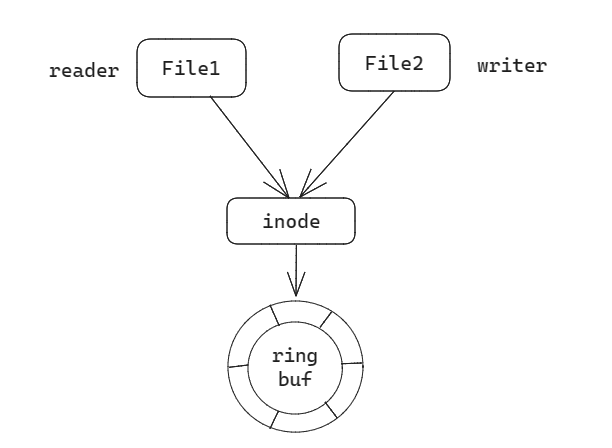

# Fs

## filesystem syscall support

Now the os supports the following system calls:

```rust
pub fn sys_openat(dirfd: isize, path: usize, flag: usize, mode: usize) -> isize
pub fn sys_close(fd: usize) -> isize
pub fn sys_read(fd: usize, buf: *mut u8, len: usize) -> isize
pub fn sys_write(fd: usize, buf: *const u8, len: usize) -> isize
pub fn sys_getcwd(buf: *mut u8, len: usize) -> isize 
pub fn sys_chdir(path: *const u8) -> isize
pub fn sys_mkdir(path: *const u8) -> isize
pub fn sys_list(path: *const u8) -> isize
pub fn sys_lseek(fd: usize, offset: isize, whence: usize) -> isize 
pub fn sys_fstat(fd: usize, stat: *mut u8) -> isize
pub fn sys_linkat(
    old_fd: isize,
    old_name: *const u8,
    new_fd: isize,
    new_name: *const u8,
    flag: usize,
) -> isize
pub fn sys_unlinkat(fd: isize, path: *const u8, flag: usize) -> isize
pub fn sys_symlinkat(old_name: *const u8, new_fd: isize, new_name: *const u8) -> isize
pub fn sys_readlinkat(fd: isize, path: *const u8, buf: *mut u8, size: usize) -> isize
pub fn sys_fstateat(dir_fd: isize, path: *const u8, stat: *mut u8, flag: usize) -> isize 
pub fn sys_fstatfs(fd: isize, buf: *mut u8) -> isize
pub fn sys_statfs(path: *const u8, statfs: *const u8) -> isize 
pub fn sys_renameat(
    old_dirfd: isize,
    old_path: *const u8,
    new_dirfd: isize,
    new_path: *const u8,
) -> isize
pub fn sys_mkdirat(dirfd: isize, path: *const u8, flag: usize) -> isize
pub fn sys_setxattr(
    path: *const u8,
    name: *const u8,
    value: *const u8,
    size: usize,
    flag: usize,
) -> isize
pub fn sys_getxattr(path: *const u8, name: *const u8, value: *const u8, size: usize) -> isize
pub fn sys_fgetxattr(fd: usize, name: *const u8, value: *const u8, size: usize) -> isize
pub fn sys_listxattr(path: *const u8, list: *const u8, size: usize) -> isize
pub fn sys_flistxattr(fd: usize, list: *const u8, size: usize) -> isize
pub fn sys_removexattr(path: *const u8, name: *const u8) -> isize
pub fn sys_fremovexattr(fd: usize, name: *const u8) -> isize
```

There are some applications in the `app` directory to test the system calls.


## /dev/shm

在Linux中，`/dev/shm` 目录是用来实现共享内存的，它允许多个进程之间共享内存段，以便它们可以相互交换数据而无需通过磁盘进行数据传输。这种共享内存的机制通常比其他进程间通信方法（如管道或套接字）更快，因为数据直接存储在内存中，而不需要进行磁盘 I/O 操作。

`/dev/shm` 是一个特殊的文件系统，通常挂载在内存中，而不是硬盘上。这意味着 `/dev/shm` 中的数据会存储在系统的物理内存中，而不是存储在磁盘上，因此速度更快。

通常，`/dev/shm` 目录被用于创建共享内存段，使不同的进程可以访问这些内存段以进行数据共享。这对于需要高性能数据传输的应用程序很有用，例如数据库管理系统、多线程应用程序、图形处理程序等。


## /dev/misc

在Linux系统中，`/dev/misc` 目录通常是一个特殊的设备目录，用于包含一些不属于特定设备类型的杂项设备文件。这些杂项设备文件通常不归类为块设备、字符设备或其他特定设备类型，而是一些不太常见的或不适合分类的设备。

`/dev/misc` 中的设备文件可能包括一些特殊的硬件接口或设备，例如温度传感器、风扇控制器、一些特殊的输入设备等。这些设备通常不符合标准的设备类别，因此它们被放在 `/dev/misc` 目录中以供用户或应用程序使用。

用户和应用程序可以通过访问 `/dev/misc` 中的设备文件来与这些特殊设备进行通信。通常，这些设备文件的权限设置会限制哪些用户或进程可以访问它们，以确保安全性。


## /dev/tty

`/dev/tty` 是一个特殊的设备文件，在Unix和Unix-like操作系统（包括Linux）中用于代表终端设备，允许与终端进行输入和输出交互。这个设备文件通常与标准输入（stdin）、标准输出（stdout）和标准错误（stderr）相关联，允许用户和应用程序在终端上进行文本输入和输出。

`/dev/tty` 文件通常是一个符号链接，它指向当前的终端设备文件，这使得在不同终端会话中使用时非常有用，因为它会自动适应当前正在使用的终端。


## /dev/random 和 /dev/urandom

`/dev/urandom` 是一个特殊的设备文件，它在Unix和Unix-like操作系统中用于生成伪随机数据。这个设备文件提供了高质量的熵（随机性），可以用于密码学、加密、随机数生成等应用。与 `/dev/random` 相比，`/dev/urandom` 通常更快，因为它会根据需要生成伪随机数据，而不会阻塞等待熵源。

- `/dev/random` 会尝试生成真正的随机数据，但如果系统的熵池（entropy pool）为空，它会阻塞等待更多的随机事件，这可能导致进程在等待期间被挂起。这是因为真正的随机数据需要足够的随机熵来源，而这些来源不一定一直可用。
- `/dev/urandom` 则会生成伪随机数据，使用一个伪随机数生成器（PRNG），它可以在没有足够熵的情况下生成数据，而不会阻塞等待。PRNG的输出通常足够随机以满足大多数应用的需求，但要注意，它的质量依赖于系统的熵池

`/dev/urandom` 和 `/dev/random` 这两个设备文件都是实现了读取（`read`）操作的，但它们通常不支持写入（`write`）操作。这是因为这些设备的主要目的是生成随机数据并提供给应用程序，而不是接受外部数据。

对这两个文件的处理：

- 实现`read`
- `write` is empty


## /var

`/var` 目录在Linux和Unix系统中具有重要的作用，主要用于存储经常变化的数据，包括：

1. **日志文件**：系统和应用程序生成的各种日志文件通常存储在 `/var/log` 中。这些日志文件包括系统日志、安全日志、应用程序日志等，以便系统管理员和开发人员可以查看和分析系统和应用程序的活动。
2. **运行时数据**： `/var/run` 或 `/run` 子目录用于存储正在运行的进程和服务的运行时信息。这包括进程标识号（PID）文件，以便其他进程可以查找并与它们通信。
3. **临时文件**： `/var/tmp` 子目录用于存储临时文件，这些文件不应在系统重启后被清除。相比之下，`/tmp` 目录通常用于存储临时文件，但其内容可以在系统重启时被清除。
4. **软件包数据**： `/var/lib` 子目录通常包含一些软件包管理工具（如APT或Yum）使用的数据，用于跟踪已安装软件包和它们的状态。
5. **邮件数据**：邮件服务器存储邮件和邮件队列数据在 `/var/mail` 和 `/var/spool/mail` 子目录中。
6. **数据库文件**：某些应用程序和服务（如数据库管理系统）可能使用 `/var` 子目录来存储数据库文件和数据。
7. **缓存数据**：某些应用程序和系统组件可能会使用 `/var` 目录中的子目录来存储缓存数据，以加速对数据的访问。


## /etc

`/etc` 目录在Linux和Unix系统中具有重要的作用，它通常用于存储系统的配置文件和配置数据。这个目录包含了各种应用程序和系统组件的配置文件，用于定义系统的行为和属性。

以下是 `/etc` 目录的一些常见用途：

1. **系统配置**：`/etc` 目录包含了与整个系统操作和配置相关的文件，包括网络设置、主机名、DNS解析、时区、日志配置等。例如，`/etc/hostname` 文件包含系统的主机名。

2. **软件包管理**：大多数Linux发行版使用`/etc`目录来存储软件包管理工具的配置文件，如APT的`/etc/apt`和Yum的`/etc/yum`。这些配置文件包括软件源的信息以及软件包的安装和更新规则。

3. **用户和组配置**：`/etc/passwd` 文件包含系统中用户的帐户信息，包括用户名、用户ID、家目录等。`/etc/group` 文件包含系统中的组信息。

4. **服务配置**：`/etc` 目录中包含了系统和服务的配置文件，如网络服务（`/etc/network`）、SSH服务（`/etc/ssh`）、Web服务器（`/etc/apache2` 或 `etc/nginx`）等。这些配置文件定义了服务的行为和属性。

5. **安全和权限配置**：`/etc` 目录包含一些用于安全性和权限的配置文件，如 `/etc/sudoers`，这是用于sudo权限管理的文件。`/etc/security` 子目录中存储了许多安全策略相关的配置文件。

6. **环境变量和全局脚本**：`/etc/profile` 和 `/etc/environment` 等文件包含全局的环境变量设置，影响所有用户的命令行环境。

总之，`/etc` 目录用于存储系统范围的配置文件，这些文件定义了系统的各种属性、服务和应用程序的行为。这些文件通常由管理员进行编辑和管理，以确保系统按照所需的方式运行。


## 命名管道与匿名管道

匿名管道最常见的形态就是我们在shell操作中最常用的”|”。它的特点是只能在父子进程中使用，父进程在产生子进程前必须打开一个管道文件，然后fork产生子进程，这样子进程通过拷贝父进程的进程地址空间获得同一个管道文件的描述符，以达到使用同一个管道通信的目的。此时除了父子进程外，没人知道这个管道文件的描述符，所以通过这个管道中的信息无法传递给其他进程。这保证了传输数据的安全性，当然也降低了管道了通用性，于是系统还提供了命名管道。

通常可以在命令行使用`mkfifo` 命令创建一个`pipe`文件, 或者在程序中使用`mknod` 系统调用来创建。

在具体实现中，我们遵守一切皆文件的原则，创建了一个内部的`pipefs`来管理所有的匿名管道文件，当然，而对于有名管道，则是各个文件系统来进行具体实现。

对于`pipe` 文件来说，其需要在读写的时候检查读者和写者的存在与否，因此相比普通的文件，需要在进行读写的时候处理这一需求。




## utimensat

```
int utimensat(int dirfd, const char *pathname,
                     const struct timespec times[_Nullable 2], int flags);
int futimens(int fd, const struct timespec times[_Nullable 2]);
```

时间戳可以按下列四种方式之一进行指定。

1. 如果times参数是一个空指针，则访问时间和修改时间两者都设置为当前时间。
2. 如果times参数指向两个timespec结构的数组，任一数组元素的tv_nsec字段的值为UTIME_NOW， 相应的时间戳就设置为当前时间，忽略相应的tv_sec字段。
3. 如果times参数指向两个timespec结构的数组， 任一数组元素的tv_nsec字段的值为UTIME_OMIT， 相应的时间戳保持不变，忽略相应的tv_sec字段。
4. 如果times参数指向两个timespec结构的数组，且tv_nsec字段的值既不是UTIME_NOW也不是UTIME_OMIT， 在这种情况下，相应的时间戳设置为相应的tv_sec和tv_nsec字段的值
