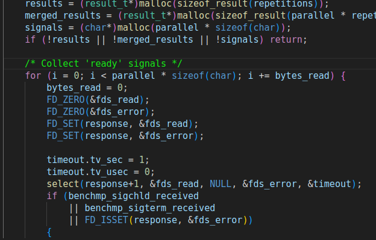

# lmbench

记录`lmbench`测试中出现的错误以及解决方法

## bug1

在进行第一个`lmbench_all lat_syscall -P 1 null`测试就发现程序的运行情况有误，通过查看系统调用以及返回值可以发现，当主进程使用`pselect`读取某个文件时，会等待子进程写入值，但查看结果发现，当主进程检查可以读取值后，其并没有使用`read`系统调用，而是使用`kill`杀掉了子线程。开始怀疑可能出现错误的原因有两个

1.  `pselect`的返回值可能出错
2. 未处理浮点数的问题

但当解决这两个问题后，发现bug依然存在。于是只能查看源代码看看在发出`pselect`以及`kill`之前程序都做了哪些事情，通过阅读源码发现了一个判断：

在父进程使用`pselect`设置后，其会检查fd是否出现错误，而内核唯一可能导致错误的也只有这一处，因此检查了内核的实现，发现在之前的实现中，在依次对读写错误进行检查后，对那些不可行的描述符我们并没有设置0,导致用户态检查时就发现了错误，因此对内核中`pselect`的实现进行了改进。

## bug2

运行测试`lmbench_all lat_pagefault -P 1 /var/tmp/XXX` 时，明明刚刚`map`的虚拟地址，`unmap`时居然说这个虚拟页没有映射。

疯狂debug了很久，在分配物理页与`unmap`实现中打印数据，仍然没有找到合理的解释。于是只能看看在运行过程中从`map`到`unmap`之间做了什么，发现这两者之间只有几个系统调用而已，难不成这几个系统调用篡改了物理页吗？但是刚才打印的时候这几个系统调用明明没有发生分配或者回收。那最可能会修改物理页的情况就是，程序参数拷贝!!!!

检查了这几个系统调用实现后，发现除了`sigaction`没有使用`copy_to_user/copy_from_user`系列函数外，其他都使用来了，于是乎，修改了这个实现，再运行测试，ok了。

鉴于此，我将其它系统调用也检查了一遍。

## bug3

在运行测试`lmbench_all lat_mmap -P 1 512k /var/tmp/XXX`时， 程序会发生`Loadpagefault`，通过其出错信息可以得到其出错地址以及`steval`的值，反汇编`lmbench`后，可以看到代码位于`libc_open`

这句代码是将数据保存在栈上，因此推测可能是用户栈的问题，但是之前的程序都没有出现错误，为什么这里就有了，再阅读了这个测试的源代码后，发现了问题所在：

在`lat_fs`中，可以看到这里出现了一个2MB大小的临时变量，我们知道c语言的临时变量都是保存在栈上的，但是此时内核为用户分配的栈空间只有16kb大小，增大栈空间后即可解决问题。
