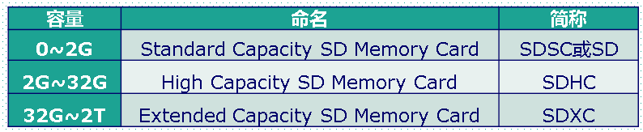
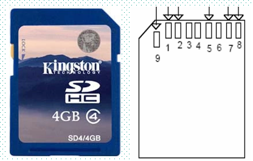
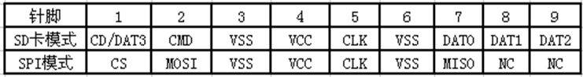
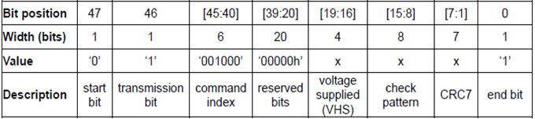
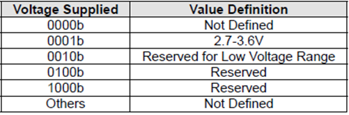
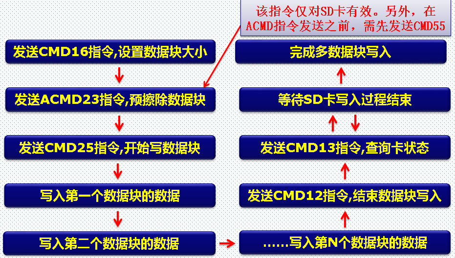
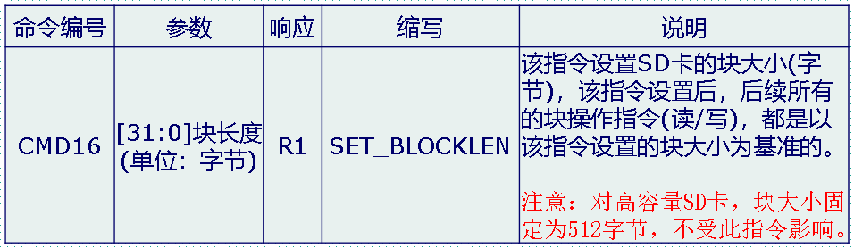
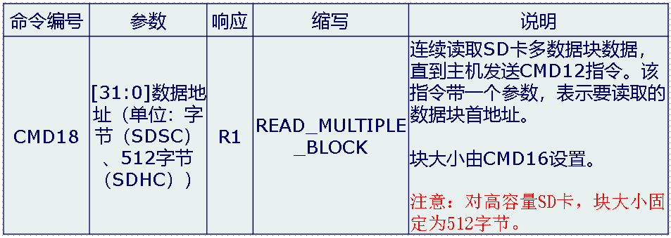
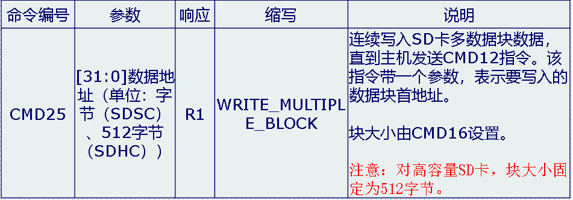

# SDCard

在visionfive2上，SD卡使用SDIO协议，大多数开发板使用spi协议进行数据传输，因此我们需要按照SDIO规范进行编程。但是规范是规范，在vf2上的sd却是一个大坑，因为如果按照标准的sdio协议进行初始化，然后进行数据传输，那么我们连初始化都不能完成。因为vf2上的SD卡来自另一个公司，而这个公司提供的SDIO实现加入了许多奇怪的寄存器，我们需要根据这些寄存器描述，才能完成设备的初始化和正确读写。

 SD卡（SecureDigital MemoryCard）即：安全数码卡，它是在MMC的基础上发展而来，是一种基于半导体快闪记忆器的新一代记忆设备，它被广泛地于便携式装置上使用，例如数码相机、个人数码助理(PDA)和多媒体播放器等。SD卡由日本松下、东芝及美国SanDisk公司于1999年8月共同开发研制。

 SD卡按容量分类，可以分为3类：SD卡、SDHC卡、SDXC卡，如下表所示：



一个常见的SD卡外观和阵脚如图所示:

 

SD卡由9个引脚与外部通信，支持SPI和SDIO两种模式，不同模式下，SD卡引脚功能描述如下表所示：



## 标准SDIO初始化与读写

参考stm32手册，使用标准SDIO协议的SD卡初始化过程一般如图所示：


上电后，主机需要持续在 sdclk 上发送时钟，频率在范围 100kHz~400kHz 内 (卡初始化阶段要求的时钟频率) 。在上图的流程走完之前都不能提高到 25MHz 。

1. 时钟稳定持续一段时间 (比如几毫秒) 后，host 发送 CMD0 命令，命令的 argument 字段取 `0x00000000` (填充位) 
2. host 发送 CMD8 命令并等待响应，命令的 argument 字段一般取 `0x000001AA` ，代表 VHS 字段=0x1 (2.7~3.6V) ，check pattern=0xAA 。如果 CMD8 超时没有响应，则要么提供的电压和 SD 卡要求的电压不匹配，要么是 SD 1.X 卡。如果有响应 (R7响应) ，则认为是 SD 2.0 卡。

cmd8命令的格式如下：



 在发送CMD8的时候，通过其带的参数我们可以设置VHS位，以告诉SD卡，主机的供电情况，让SD卡知道主机的供电范围。VHS位定义如下表所示：



这里我们使用参数0X1AA，即告诉SD卡，主机供电为2.7~3.6V之间，如果SD卡支持CMD8，且支持该电压范围，则会通过CMD8的响应（R7）将参数部分原本返回给主机，如果不支持CMD8，或者不支持这个电压范围，则不响应。

3. 发送CMD55下一命令是特定命令（参数0x0，命令0x37020000,响应0x120）
4. 发送 ACMD41 命令，命令的 argument 字段要取 `0x40100000`，其含义是 HCS=1 (代表主机支持大容量卡 SDHC) ，VDD Voltage Window (OCR[23:0]) = `0x100000`

ACMD41的格式如下:


 ACMD41指令响应(R3)，包含了SD卡OCR寄存器内容，其定义如下表所示：


host 需要检查 OCR[31] 是否位 `1` 。如果不为 `1` ，说明卡尚未上电，需要不断轮循发送 ACMD41 直到 OCR[31]=`1` 为止。当 OCR[31]=`1` 时，OCR[30] (CCS) 指示了卡是否为大容量卡。

结合之前 CMD8 的结果，可以区分出卡的三种类型：

- CMD8 无响应，ACMD41 响应的 OCR[30]=0 ：SD 1.X 卡。
- CMD8 有响应，ACMD41 响应的 OCR[30]=0 ：SD 2.0 非大容量卡。
- CMD8 有响应，ACMD41 响应的 OCR[30]=1 ：SDHC 2.0 大容量卡。

5. 发送 CMD2 : 获取CID寄存器

host 发送 CMD2 命令并等待响应，命令的 argument 字段取 `0x00000000` (填充位) 。card 会返回 R2 类响应，其中包含了 CID 寄存器 (如**图13**) ，是该卡的识别号，host 可以忽略 CID 的内容。

6. 发送CMD3通知所有卡发布新RCA

card 会返回 R6 类响应，其中包含了卡指定的 RCA (16bit) ，这是卡自荐的地址，host 需要保存下来以便后续使用 CMD7 来选中此卡。

到第6步SD卡的初始化就完成了，接下来就可以对sd卡进行读写操作

1. 发送CMD7设置所有卡到stand-by状态

host 发送 CMD7 命令并等待响应，其中命令的 argument 字段的高 16bit 应该取 RCA ，而低 16bit 取 `0x0000` (填充位) 。card 会响应 R1 。CMD7会让卡从 Standby State (未选中) 跳转到 Transfer State (选中) 。

2. sd卡单块读取


3. sd卡多块读取


4. sd卡单块写


5. sd卡多块写



CMD16的格式如下:



CMD17格式如下:


CMD18格式如下



CMD24格式如下:


CMD25格式如下:



SD卡的读写命令包括单块读 (CMD17), 多块读 (CMD18), 单块写 (CMD24), 多块写 (CMD25) 。它们的 argument 都是 32 位的要读/写的地址，分两种情况处理：

- **对于 SD 1.X 和 SD2.0 非大容量卡，argument 要填字节地址**。例如，要读/写第0个扇区，argument 应该填充 `0x00000000` ；要读/写第1个扇区，argument 应该填充 `0x00000200` ；要读/写第2个扇区，argument 应该填充 `0x00000400` ……
- **对于 SDHC 2.0 大容量卡，argument 要填扇区地址**。例如，要读/写第0个扇区，argument 应该填充 `0x00000000` ；要读/写第1个扇区，argument 应该填充 `0x00000001` ；要读/写第2个扇区，argument 应该填充 `0x00000002` 


## VF2的SD初始化与读写

为了完成SDIO的配置，我们需要得到vf2开发板SD卡使用的sdio地址空间，通过在uboot中查看sd卡信息可以知道其位于第二个SDIO地址空间上。通过查看vf2官网给出的寄存器手册，我们可以知道其使用的SD卡配置所涉及到的寄存器信息和功能。

这些寄存器每个都包含不同的功能，而每个寄存器上不同的bit位又代表不同含义，我们使用`bit-struct`这个库对使用到的寄存器做了抽象，方便后续对这些寄存器进行bit级别的操作，一个典型的例子是CMD寄存器:

```rust
pub struct CmdReg(u32){
    start_cmd:u1,
    reserved:u1,
    // Use Hold Register
    //
    // 0 - CMD and DATA sent to card bypassing HOLD Register
    //
    // 1 - CMD and DATA sent to card through the HOLD Register For more information,
    // refer to “Host Controller Output Path Timing” on page 320.
    use_hold_reg:u1,
    volt_switch:u1,
    boot_mode:u1,
    disable_boot:u1,
    expect_boot_ack:u1,
    enable_boot:u1,
    ccs_expected:u1,
    read_ceata_device:u1,
    // 0 - Normal command sequence
    // 1 - Do not send commands, just update clock register value into card clock domain
    update_clock_registers_only:u1,
    card_number:u5,
    send_initialization:u1,
    stop_abort_cmd:u1,
    //0 - Send command at once, even if previous data transfer has not completed
    //
    // 1 - Wait for previous data transfer completion before sending command
    //
    // The wait_prvdata_complete = 0 option typically used to query status of card
    // during data transfer or to stop current data transfer; card_number should be same as in previous command.
    wait_prvdata_complete:u1,
    //
    // 0 - No stop command sent at end of data transfer
    //
    // 1 - Send stop command at end of data transfer
    // Don't care if no data expected from card.
    send_auto_stop:u1,
    //
    // 0 - Block data transfer command
    //
    // 1 - Stream data transfer command Don’t care if no data expected.
    transfer_mode:u1,
    // 0 - Read from card
    //
    // 1 - Write to card
    //
    // Don’t care if no data expected from card.
    transfer_dir:u1,
    // 	0 - No data transfer expected (read/write) 1 - Data transfer expected (read/write)
    data_expected:u1,
    // 0 - Do not check response CRC
    //
    // 1 - Check response CRC
    //
    // Some of command responses do not return valid CRC bits.
    //
    // Software should disable CRC checks for those commands in order to disable CRC checking by controller.
    check_response_crc:u1,
    // 0 - Short response expected from card 1 - Long response expected from card
    response_length:u1,
    // 0 - No response expected from card 1 - Response expected from card
    response_expect:u1,
    // Command index
    cmd_index:u6,
}
```

对寄存器的读写按照4字节对齐，而读写FIFO寄存器可以按照具体要求读写，因此需要几个最基本的读写函数:

```rust
pub fn read_fifo<T>(addr:usize) ->T{
    let addr = addr as *mut T;
    unsafe{
        addr.read_volatile()
    }
}

pub fn write_fifo<T>(addr:usize,val:T){
    let addr = addr as *mut T;
    unsafe{
        addr.write_volatile(val);
    }
}

pub fn write_reg(addr:usize,val:u32){
    let addr = addr as *mut u32;
    unsafe{
        addr.write_volatile(val);
    }
}

pub fn read_reg(addr:usize)->u32{
    let addr = addr as *mut u32;
    unsafe{
        addr.read_volatile()
    }
}
```

### SD卡初始化

#### 重置时钟频率`rest_clock`

根据手册描述：

To avoid glitches in the card clock outputs (cclk_out), the software should use the following steps when
changing the card clock frequency:

1. Before disabling the clocks, ensure that the card is not busy due to any previous data command. To
   determine this, check for 0 in bit 9 of the STATUS register.

2. Update the Clock Enable register to disable all clocks. To ensure completion of any previous
   command before this update, send a command to the CIU to update the clock registers by setting:

   1. start_cmd bit
   2. update clock registers only  bits
   3. wait_previous data complete bit

   Wait for the CIU to take the command by polling for 0 on the start_cmd bit.

3. Set the start_cmd bit to update the Clock Divider and/or Clock Source registers, and send a
   command to the CIU in order to update the clock registers; wait for the CIU to take the command.

4. Set start_cmd to update the Clock Enable register in order to enable the required clocks and send a
   command to the CIU to update the clock registers; wait for the CIU to take the command.

代码实现为：

```rust
fn reset_clock(){
    // disable clock
    let mut clock_enable = ClockEnableReg::new(0,0);
    // write to CLOCK_ENABLE_REG
    write_reg(CLOCK_ENABLE_REG,clock_enable.raw());
    // send reset clock command
    let mut clock_cmd = CmdReg::try_from(0).unwrap();
    clock_cmd.start_cmd().set(u1!(1));
    clock_cmd.wait_prvdata_complete().set(u1!(1));
    clock_cmd.update_clock_registers_only().set(u1!(1));
    send_cmd(Cmd::ResetClock, clock_cmd, CmdArg::new(0),DataTransType::None);
    // set clock divider to 400kHz (low)
    let clock_divider = ClockDividerReg::new(0,0,0,4);
    write_reg(CLK_DIVIDER_REG,clock_divider.raw());
    // send_cmd(Cmd::ResetClock,clock_disable_cmd,CmdArg::new(0));
    // enable clock
    clock_enable.clk_enable().set(1);
    write_reg(CLOCK_ENABLE_REG,clock_enable.raw());
    // send reset clock command
    send_cmd(Cmd::ResetClock, clock_cmd, CmdArg::new(0),DataTransType::None);
    info!("now clk enable {:#?}",ClockEnableReg::try_from(read_reg(CLOCK_ENABLE_REG)).unwrap());
    pprintln!("reset clock success");
}
```

1. 关闭时钟中断，通过设置寄存器`ClockEnableReg`为0完成
2. 发送`reset clock`命令，通过设置CMD寄存器的update_clock_registers_only位完成
3. 设置时钟分频系数，通过设置寄存器ClockDividerReg的clk_divider0字节为4完成
4. 再次发送`reset clock`命令，将分频系数写入，完成频率设置
5. 开启时钟中断，设置寄存器ClockEnableReg的clk_enable位完成

#### 设置数据传输位宽

控制数据传输位宽的寄存器为CardType寄存器

```rust
pub struct CardTypeReg(u32){
    // One bit per card indicates if card is 8-bit:
    // 0 - Non 8-bit mode
    //
    // 1 - 8-bit mode
    //
    // Bit[31] corresponds to card[15]; bit[16] corresponds to card[0].
    card_width8:u16,
    // One bit per card indicates if card is 1-bit or 4-bit:
    // 0 - 1-bit mode
    //
    // 1 - 4-bit mode
    //
    // Bit[15] corresponds to card[15], bit[0] corresponds to card[0].
    //
    // Only NUM_CARDS*2 number of bits are implemented.
    card_width4_1:u16,
}
```

通过设置此寄存器为0，就可以设置数据传输位宽为1

#### 重置DMA

为避免uboot启用了dma模式，这里将其关闭掉

```rust
fn reset_dma(){
    let mut buf_mode_reg = BusModeReg::try_from(read_reg(BUS_MODE_REG)).unwrap();
    buf_mode_reg.de().set(u1!(0));
    buf_mode_reg.swr().set(u1!(1));
    write_reg(BUS_MODE_REG,buf_mode_reg.raw());
    let mut ctrl = ControlReg::try_from(read_reg(CTRL_REG)).unwrap();
    // ctrl.dma_enable().set(u1!(0));
    ctrl.dma_reset().set(u1!(1));
    ctrl.use_internal_dmac().set(u1!(0));
    write_reg(CTRL_REG,ctrl.raw());
    pprintln!("reset dma success");
}
```

1. 关闭DMA，通过设置Busmode寄存器的de位完成
2. 设置软件重置标志，通过设置busmode的swr位完成
3. 写入busmode寄存器
4. 重置DMA，通过设置Control寄存器的dma_reset位完成
5. 关闭内部的DMA传输，通过设置control寄存器的use_internal_dmac位完成

#### 发送CMD0命令使得SD卡复位

根据手册说明:

Send CMD0 with an initialization sequence of 80 cycles – This sequence is required toaccommodate ramp-up time after power-on to all cards. To achieve this, set send_initialization(bit 15) in the CMD register.

```rust
// go idle state
let cmd0 = CmdReg::from(Cmd::GoIdleState);
// cmd0.response_expect().set(u1!(0));
send_cmd(Cmd::GoIdleState,cmd0,CmdArg::new(0),DataTransType::None);
pprintln!("card is in idle state");
```

1. 设置命令索引为0，同时设置CMD寄存器的send_initialization为1，发送命令

#### 判断SD卡版本

```rust
fn check_version()->u8{
    // check voltage
    let cmd8 = CmdReg::from(Cmd::SendIfCond);
    let cmd8_arg = CmdArg::new(0x1aa);
    let resp = send_cmd(Cmd::SendIfCond,cmd8,cmd8_arg,DataTransType::None).unwrap();
    if (resp[0] & 0xaa) == 0 {
        error!("card {} unusable", 0);
        pprintln!("card version: 1.0");
        return 1;
    }
    pprintln!("card voltage: {:#x?}", resp[0]);
    pprintln!("card version: 2.0");
    2
}
```

1. 发送cmd8命令，并检查返回值

#### 判断容量

```rust
fn check_big_support(sleep:fn(usize))->bool{
    loop {
        // send cmd55
        let cmd55 = CmdReg::from(Cmd::AppCmd);
        send_cmd(Cmd::AppCmd,cmd55,CmdArg::new(0),DataTransType::None);
        let cmd41 = CmdReg::from(Cmd::SdSendOpCond);
        let cmd41_arg = CmdArg::new((1<<30)|(1<<24)|0xFF8000);
        let resp = send_cmd(Cmd::SdSendOpCond,cmd41,cmd41_arg,DataTransType::None).unwrap();
        info!("ocr: {:#x?}", resp[0]);
        let ocr = resp[0];
        if ocr.get_bit(31) {
            pprintln!("card is ready");
            if ocr.get_bit(30) {
                pprintln!("card is high capacity");
            } else {
                pprintln!("card is standard capacity");
            }
            break
        }
        sleep(100);
    }
    true
}
```

1. 发送CMD55命令，提示下一个命令是APP类命令
2. 发送ACMD41命令
3. 读取返回值，判断OCR寄存器的31位是否为1，说明SD卡是否准备好
4. 如果卡未准备好，则睡眠100ms

#### 读取SD卡信息

```rust
fn check_cid(){
    let cmd2 = CmdReg::from(Cmd::AllSendCid);
    let resp = send_cmd(Cmd::AllSendCid,cmd2,CmdArg::new(0),DataTransType::None);
    if let Some(resp) = resp{
        // to 128 bit
        let resp = unsafe { core::mem::transmute::<[u32; 4],u128>(resp) };
        let cid = Cid::new(resp);
        pprintln!("cid: {}",cid.fmt());
    }
}
```

1. 发送CMD2命令，sd卡会返回一个长响应
2. 从长响应中可以得到生产日期，oid等信息

#### 指定RCA

```rust
fn check_rca()->u32{
    let cmd3 = CmdReg::from(Cmd::SendRelativeAddr);
    let resp = send_cmd(Cmd::SendRelativeAddr,cmd3,CmdArg::new(0),DataTransType::None).unwrap();
    let rca = resp[0] >> 16;
    info!("rca: {:#x}",rca);
    info!("card status: {:b}",resp[0] & 0xffff);
    rca
}
```

1. 发送CMD3命令，返回值的高16位是我们需要的RCA信息

#### 选中SD卡

```rust
fn select_card(rca:u32){
    let cmd7 = CmdReg::from(Cmd::SelectCard);
    let cmd_arg = CmdArg::new(rca<<16);
    let resp = send_cmd(Cmd::SelectCard,cmd7,cmd_arg,DataTransType::None).unwrap();
    let r1 = resp[0];
    info!("status: {:b}",r1);
}
```

1. 发送CMD7命令，其参数为我们之前得到的RCA

#### 清空已有的中断信息

```rust
let raw_int_status = RawInterruptStatusReg::try_from(read_reg(RAW_INT_STATUS_REG)).unwrap();
info!("RAW_INT_STATUS_REG: {:#?}", raw_int_status);
// Clear interrupt by writing 1
write_reg(RAW_INT_STATUS_REG,raw_int_status.raw());
```

### SD卡读写

#### 单块读

根据手册描述:

Steps involved in a single-block or multiple-block read are:

1. Write the data size in bytes in the BYTCNT register @0x20.

2. Write the block size in bytes in the BLKSIZ register @0x1C. The DWC_mobile_storage expects data
   from the card in blocks of size BLKSIZ each.

3. For cards that have a round trip delay of more than 0.5 cclk_in period, program the Card Read
   Threshold to ensure that the card clock does not stop in the middle of a block of data being
   transferred from the card to the Host; for programming guidelines, refer to “Card Read Threshold”
   on page 199.
   If the Card Read Threshold feature is not enabled for such cards, then the Host system should ensure
   that the Rx FIFO does not become full during a Read Data transfer by ensuring that the Rx FIFO is
   drained out at a rate faster than that at which data is pushed into the FIFO; alternatively, a
   sufficiently large FIFO can be provided. For more details, refer to “FIFO Size Requirements” on
   page 277.

4. Program the CMDARG register @0x28 with the data address of the beginning of a data read.
   Program the Command register with the parameters listed in Table 7-2. For SD and MMC cards, use
   CMD17 for a single-block read and CMD18 for a multiple-block read. For SDIO cards, use CMD53
   for both single-block and multiple-block transfers

   After writing to the CMD register, the DWC_mobile_storage starts executing the command; when
   the command is sent to the bus, the command_done interrupt is generated.

5. Software should look for data error interrupts; that is, bits 7, 9, 13, and 15 of the RINTSTS register. If
   required, software can terminate the data transfer by sending a STOP command.
6. Software should look for Receive_FIFO_Data_request and/or data starvation by host timeout
   conditions. In both cases, the software should read data from the FIFO and make space in the FIFO
   for receiving more data.
7. When a Data_Transfer_Over interrupt is received, the software should read the remaining data from
   the FIFO.

```rust
fn set_transaction_size(blk_size:u32,byte_count:u32){
    let val = blk_size as u16;
    let mut blk_size = BlkSizeReg::try_from(0).unwrap();
    blk_size.block_size().set(val);
    write_reg(BLK_SIZE_REG,blk_size.raw());
    let value = byte_count;
    let mut byte_count = ByteCountReg::try_from(0).unwrap();
    byte_count.byte_count().set(value);
    write_reg(BYTE_CNT_REG,byte_count.raw());
}
fn read_block(block:usize,buf:&mut[u8])->Result<usize>{
    let mut buf = unsafe{
        let ptr = buf.as_mut_ptr() as *mut usize;
        core::slice::from_raw_parts_mut(ptr, 64)
    };
    assert_eq!(buf.len(), 64);
    set_transaction_size(512,512);
    let cmd17 = CmdReg::from(Cmd::ReadSingleBlock);
    let arg = CmdArg::new(block as u32);
    let _resp = send_cmd(Cmd::ReadSingleBlock,cmd17,arg,DataTransType::Read(&mut buf)).unwrap();
    info!("Current FIFO count: {}", fifo_filled_cnt());
    Ok(buf.len())
}
```

1. 设置传输的块大小，通过设置BlkSize寄存器完成
2. 设置传输的块数，通过设置ByteCount寄存器完成
3. 发送CMD17命令，开始接收数据
4. 从FIFIO寄存器中读取数据

#### 单块写

```rust
fn write_block(block:usize,buf:&[u8])->Result<usize>{
    let buf = unsafe{
        let ptr = buf.as_ptr() as *mut usize;
        core::slice::from_raw_parts(ptr, 64)
    };
    assert_eq!(buf.len(), 64);
    set_transaction_size(512,512);
    let cmd24 = CmdReg::from(Cmd::WriteSingleBlock);
    let arg = CmdArg::new(block as u32);
    let _resp = send_cmd(Cmd::WriteSingleBlock,cmd24,arg,DataTransType::Write(buf)).unwrap();
    info!("Current FIFO count: {}", fifo_filled_cnt());
    Ok(buf.len())
}
```

写需要往FIFO寄存器写入数据。

## Refence

[37. SDIO—SD卡读写测试 — [野火\]STM32库开发实战指南——基于野火霸道开发板 文档 (embedfire.com)](https://doc.embedfire.com/mcu/stm32/f103badao/std/zh/latest/book/SDIO.html)

[[SDIO\] SD card 初始化及常用命令解析（附波形，uboot代码）_sdio波形_Lenz's law的博客-CSDN博客](https://blog.csdn.net/u010443710/article/details/107014873)

[SDIO初始化及读写_sdio初始化流程_凉城~的博客-CSDN博客](https://blog.csdn.net/weixin_45640197/article/details/127692400)
