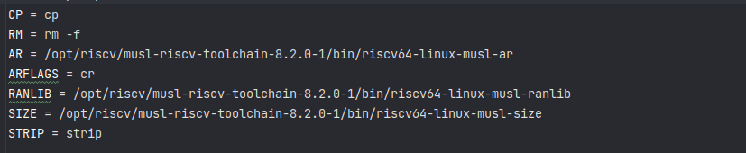

# Bash编译

为了更好地支持命令行，添加bash的支持是有效手段之一。

## 步骤

1. 下载源码
2. 安装`riscv64-linux-musl-gcc`以及其它工具
3. `./configure`后会生成makefile
4. 修改项目下的各个makefile文件，将那些`gcc` 设置换成`riscv`版本的。

这包括`ar`  `ranlib` `size`等等，由于`riscv64-linux-musl-gcc`工具链加入环境变量无效，这里可能需要使用绝对路径。

可以使用全局搜索替换功能将这些工具替换掉。

5. 使用make编译

## 可能出现的问题
