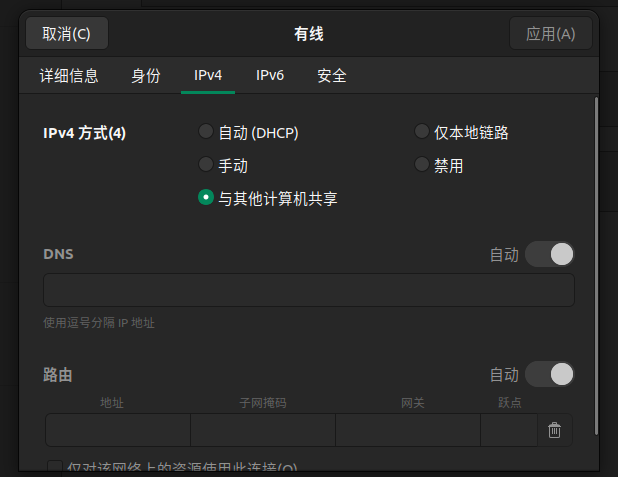
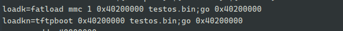

# 开发板启动流程

## 工具安装

1. mkimage 

```
sudo apt-get install uboot-mkimage
```


## visionfive2启动OS

### tftpboot

在uboot阶段使用`tftpboot`加载内核。

内核编译：

1. 修改链接脚本将起始地址修改为0x40200000（uboot也位于这个位置）
2. 可以将dtb文件硬编码到os中，从里面解析一些硬件信息
3. 按照正常流程编译出elf文件，再去掉无用信息变成bin文件。
4. 将得到的os.bin文件放到tftp服务器配置的目录下。

准备工作:

1. 将网络线连接开发板与ubuntu，设置ipv4为与其他计算机共享




在详细信息处可以看到IPv4地址，这个地址稍后会用到。

2. 在开发板停在uboot阶段，并设置正确的IP地址、网关、和服务器地址相关的环境变量，假设上一步得到的地址为`10.42.0.1`
   1. setenv ipaddr `10.42.0.10` ： 设置uboot的ip地址
   2. setenv serverip `10.42.0.1`： 设置服务器地址为ubuntu地址
   3. setenv gateway `10.42.0.1`： 设置网关，确保两者在同一局域网下
3. ping `10.42.0.1`检查是否可以ping通ubuntu
4. 在ubuntu上配置tftp服务器
   1. https://www.jianshu.com/p/c2a6ef7c1311   https://www.cnblogs.com/jalynfang/p/9450528.html
5. 在开发板中使用命令`tftpboot 0x40200000 testos.bin`加载os到指定地址处。
6. 使用`go 0x40200000`跳转到制定地址开始运行
7. 可以使用uboot中的`setenv`和`saaveenv`将上述两个命令写入到固件中，这样下次只需要运行定义一个命令即可完成这两步。




8. 使用`run loadkn` 即可


### 使用SD卡加载OS

1. 将编译完成的os二进制文件放到sd卡中
2. 在uboot阶段使用`fatls`或其他命令查看卡中的文件
3. 使用`fatload`命令加载文件到指定地址处


### 使用FIT系统镜像格式加载

1. 制作os的方法与前面的一致，但不需要将设备树文件包含在内核中
2. 准备一个its配置，填入正确的信息
3. 使用mkimage制作镜像
4. 使用tftpboot和bootm命令启动


## cv1811h启动os

制作镜像的流程与上面的一致。


## minicom: cannot open /dev/ttyUSB0: No such file or directory 解决

remove any packages on your system with `brltty` in name 

## 参考资料

[Adventures in RISC-V | writes (matrix89.github.io)](https://matrix89.github.io/writes/writes/experiments-in-riscv/)

[[迅为RK3568开发板在u-boot中通过网络启动](https://www.cnblogs.com/liyue3/p/16291533.html)] (https://www.cnblogs.com/liyue3/p/16291533.html)

https://github.com/orgs/rcore-os/discussions/24  

https://www.cnblogs.com/elect-fans/archive/2012/05/03/2481001.html 解决开发板连接后无法输入的问题
