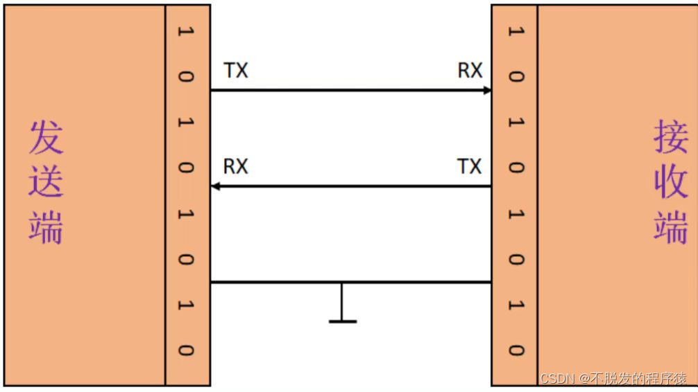

# Uart

UART（Universal Asynchronous Receiver/Transmitter，通用异步收发器）是一种双向、串行、异步的通信总线，仅用一根数据接收线和一根数据发送线就能实现全双工通信。典型的串口通信使用3根线完成，分别是：发送线（TX）、接收线（RX）和地线（GND），通信时必须将双方的TX和RX交叉连接并且GND相连才可正常通信，如下图所示：



串口是与机器相关的，因此不同的机器串口的配置不同，一般来说，串口的各个寄存器位宽都是1,但是在vf2上，位宽为4,但是读出来的数据仍然按照1个字节处理。

UART 接口不使用时钟信号来同步发送器和接收器设备，而是以异步方式传输数据。发送器根据其时钟信号生成的位流取代了时钟信号，接收器使用其内部时钟信号对输入数据进行采样。

同步点是通过两个设备的相同波特率（UART和大多数串行通信一样，发送和接收设备需要将波特率（波特率是指信息传输到信道的速率）设置为相同的值。对于串行端口，设定的波特率将用作每秒传输的最大位数）来管理的。

如果波特率不同，发送和接收数据的时序可能会受影响，导致数据处理过程出现不一致。允许的波特率差异最大值为10%，超过此值，位的时序就会脱节。

常见的串口设备寄存器布局如下所示:

| Base Address | DLAB | I/O Access | Abbrv. | Register Name                     |
| ------------ | ---- | ---------- | ------ | --------------------------------- |
| +0           | 0    | Write      | THR    | Transmitter Holding Buffer        |
| +0           | 0    | Read       | RBR    | Receiver Buffer                   |
| +0           | 1    | Read/Write | DLL    | Divisor Latch Low Byte            |
| +1           | 0    | Read/Write | IER    | Interrupt Enable Register         |
| +1           | 1    | Read/Write | DLH    | Divisor Latch High Byte           |
| +2           | x    | Read       | IIR    | Interrupt Identification Register |
| +2           | x    | Write      | FCR    | FIFO Control Register             |
| +3           | x    | Read/Write | LCR    | Line Control Register             |
| +4           | x    | Read/Write | MCR    | Modem Control Register            |
| +5           | x    | Read       | LSR    | Line Status Register              |
| +6           | x    | Read       | MSR    | Modem Status Register             |
| +7           | x    | Read/Write | SR     | Scratch Register                  |

UART芯片共有12个不同的寄存器，映射到8个不同的端口I / O位置。12 个功能对应8个寄存器，这意味着有多个寄存器使用相同的端口 I/O 位置，并影响 UART 的配置方式。实际上，其中两个寄存器实际上是相同的。在寄存器中写入0/1，用户触发的读取/写入是两种不同的操作，可以被系统感知到。

中断配置寄存器**Interrupt Enable Register (IER)**布局如下：	

| Bit  | Notes                                               |
| ---- | --------------------------------------------------- |
| 7    | Reserved                                            |
| 6    | Reserved                                            |
| 5    | Enables Low Power Mode (16750)                      |
| 4    | Enables Sleep Mode (16750)                          |
| 3    | Enable Modem Status Interrupt                       |
| 2    | Enable Receiver Line Status Interrupt               |
| 1    | Enable Transmitter Holding Register Empty Interrupt |
| 0    | Enable Received Data Available Interrupt            |

通常我们只会开启接收数据中断。

线路状态寄存器**Line Status Register (LSR)**的布局如下：

| Bit  | Notes                              |
| ---- | ---------------------------------- |
| 7    | Error in Received FIFO             |
| 6    | Empty Data Holding Registers       |
| 5    | Empty Transmitter Holding Register |
| 4    | Break Interrupt                    |
| 3    | Framing Error                      |
| 2    | Parity Error                       |
| 1    | Overrun Error                      |
| 0    | Data Ready                         |

此寄存器主要用于根据收到的数据提供有关UART中可能存在的错误。通常，我们会关注  Empty Data Holding Registers和  Data Ready两个位以判断是否可以读取/写入数据。

在大多数机器中，串口设备已经在BIOS/SBI中被初始化完成，如果没有必要，我们在OS中将没有必要再次对其进行初始化，因此在内核代码中，我们只需要打开uart的中断即可。当然不排除一些OS会直接运行在无SBI/BIOS的环境中，这种情况下，确实需要对串口设备进行初始化。

在不同的设备上，可能附带着不同的串口设备，一般来说，主要的差一点在于寄存器的宽度不一样，但即使宽度不一样，在读取或者写入时我们仍然按照单个字节有效进行编程，这些不同的寄存器宽度一般是为了读写对齐而已。

| 平台        | 串口设备  | 寄存器宽度 |
| ----------- | --------- | ---------- |
| qemu        | uart16550 | 1          |
| visionfive2 | uart8250  | 4          |
| unmatched   | uart16550 | 1          |

为了完成各个平台的串口初始化，我们实现了两个uart驱动：对于uart8250，我们可以设置寄存器宽度。

```rust
/// The UART 8250 driver.
pub struct Uart8250Raw<const W: usize> {
    base: usize,
}
/// The UART 16550 driver.
pub struct Uart16550Raw(usize);
```

对于两种驱动，都实现了相同的函数:

```rust
impl Uart {
    /// Initialize the UART.
    ///
    /// It will enable receive interrupts.
    pub fn init(&self) {}
    /// Write a byte to the UART.
    pub fn put(&mut self, c: u8);
    /// Read a byte from the UART. If there is no data, return `None`.
    pub fn read(&mut self) -> Option<u8>;
}

```

- `init` 用于用户开启接收中断，方便在内核实现异步串口输入输出
- `put` 会向串口输出一个字符，我们不会开启输出中断，因此这里会轮询是否可以输出
- `read` 会读取一个字符，当串口中没有数据可以读取时，返回`None`


在内核中，我们需要实现任务的异步等待机制，要做到模块化，上面实现的这两个驱动就无法完成任务等待的功能，因为驱动如果想获取内核的任务定义，调度函数等会变得麻烦并且增大了耦合性，因此我们将上面这两个驱动定位为低级驱动，我们将在内核中通过更高级的抽象，完成任务异步等待机制。

由于这两个驱动没有使用trait进行约束(后续修改掉，很简单)，但是它们两的函数又是一样的，因此在内核中我们定义了一个trait将其进行统一:

```rust
pub trait LowUartDriver: Send + Sync {
    fn _init(&mut self);
    fn _put(&mut self, c: u8);
    fn _read(&mut self) -> Option<u8>;
}
```

而为这两个底层驱动实现这个trait只需要调用相同后缀的函数即可。

为了完成任务异步等待，我们在高级驱动中定义了任务队列:

```rust
pub struct Uart {
    inner: Mutex<(Box<dyn LowUartDriver>, UartInner)>,
}

struct UartInner {
    rx_buf: VecDeque<u8>,
    wait_queue: VecDeque<Arc<Task>>,
}
```

为串口设备定义的trait为：

```rust
pub trait UartDevice: Send + Sync + DeviceBase {
    fn put(&self, c: u8);
    fn get(&self) -> Option<u8>;
    fn put_bytes(&self, bytes: &[u8]);
    fn have_data_to_get(&self) -> bool;
    fn have_space_to_put(&self) -> bool;
}
```

- `put` 与底层驱动的put功能相同
- `get`与底层驱动的get功能相同，但是当没有字符时，任务会被放入等待队列中
- `put_bytes`用于一次输出多个字符
- `have_data_to_get`  `have_space_to_put`用于实现文件的poll/select机制

串口设备最终会被封装为`stdio` `stdin`文件用于输入和输出。