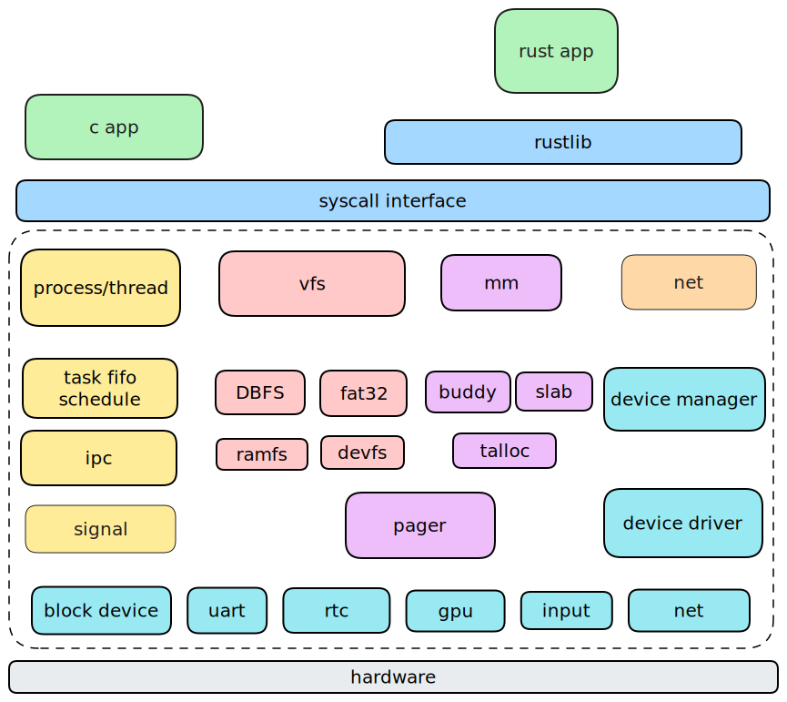
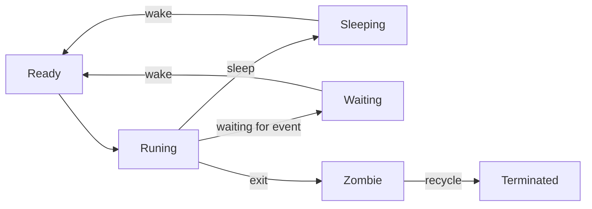
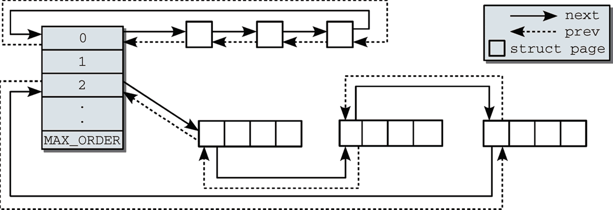
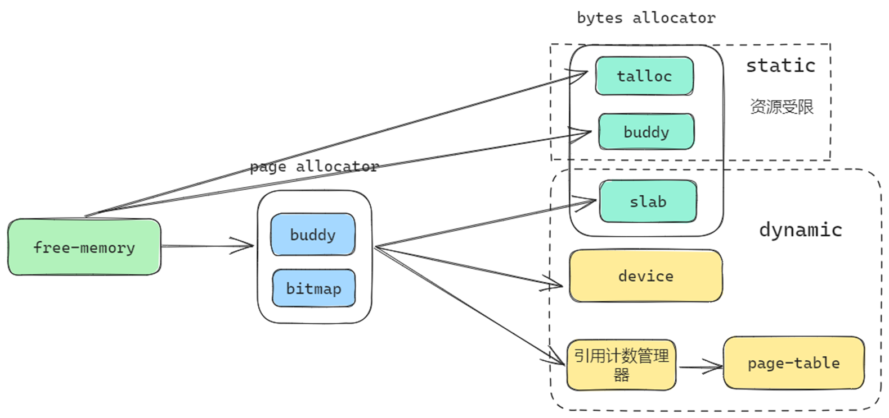
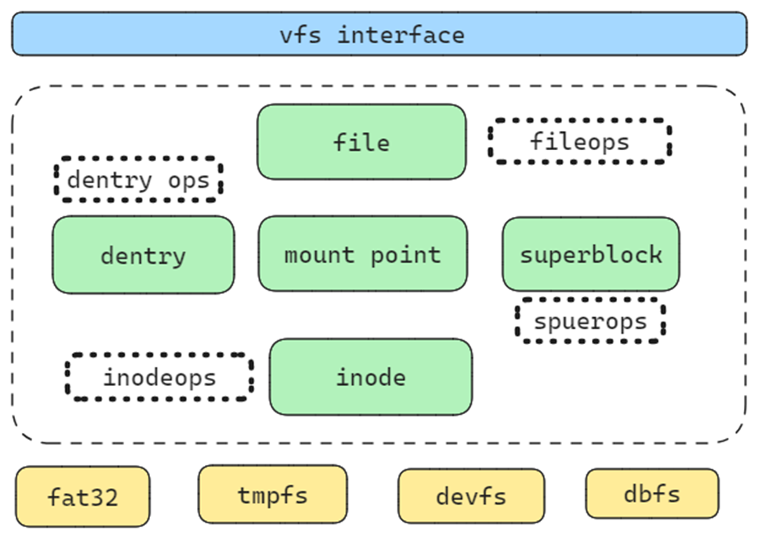
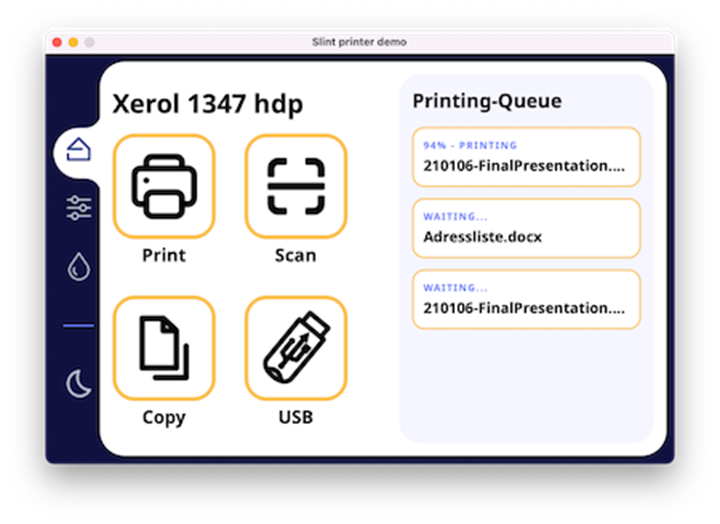
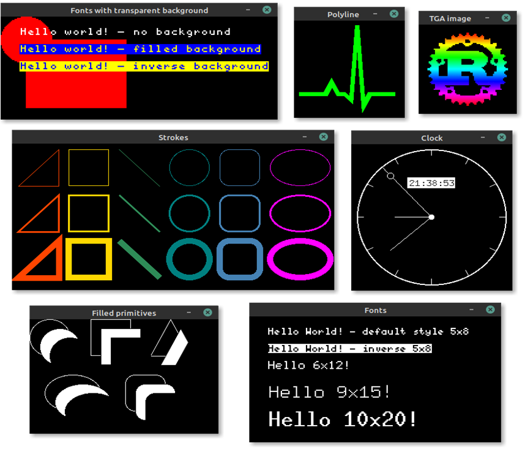

# Architecture

整个内核的架构如下图所示



内核主要包含的核心模块：

- 进程/线程管理
  - 进程创建/销毁
  - 线程创建/调度/销毁
  - 进程间通信
  - 信号机制
- 内存管理
  - 物理内存管理
  - 虚拟内存管理
  - 各种优化措施
- 文件系统
  - 虚拟文件系统
  - fat32
  - devfs/rootfs/tmpfs
  - dbfs
- 网络
  - smoltcp
- 设备驱动
  - 块设备
  - gpu
  - 网络设备
  - uart
  - rtc
  - input

内核之上是一个系统调用层，作为用户程序和内核的交互接口。我们根据系统调用接口编写了一个简单的rust lib库，供rust程序使用，同时，也可以为后续移植rust标准库做准备。

## 模块化实现

内核中的大多数子模块代码并不位于内核中，而是由外部的模块构成，这些模块有的完全自己实现，有的来自社区实现但是被修改以适配内核，有的直接使用社区实现。

### 自己实现的模块

- [os-module/page-table](https://github.com/os-module/page-table)  		**页表管理**
- [os-module/rtrace](https://github.com/os-module/rtrace)  			     **堆栈跟踪**
- [os-module/visionfive2-sd](https://github.com/os-module/visionfive2-sd)     **visionfive2开发板sd驱动**
- [os-module/elfinfo](https://github.com/os-module/elfinfo)                  **elf符号信息获取格式化输出**
- [os-module/rtc](https://github.com/os-module/rtc)                         **rtc驱动，适配qemu**
- [Godones/rvfs](https://github.com/Godones/rvfs)                          **rust实现的虚拟文件系统框架**
- [Godones/fat32-vfs](https://github.com/Godones/fat32-vfs)                 **接入rvfs的fat32实现**
- [Godones/slab](https://github.com/Godones/rslab)                         **slab分配器**
- [Godones/preprint](https://github.com/Godones/preprint)                  **no_std外部模块打印**
- [Godones/doubly-linked-list](https://github.com/Godones/doubly-linked-list)  **侵入式双向链表**
- [Godones/dbfs2](https://github.com/Godones/dbfs2)                      **高性能数据库文件系统**
- [module/basemachine](../../dep/basemachine)           **设备树机器基本信息**
- [module/gmanager](../../subsystems/gmanager)                 **最小索引分配管理**
- [module/Input2event](../../dep/input2event)             **virtio输入事件转换**
- [module/pager](../modules/pager)                         **物理页管理**
- [module/plic](../modules/plic)                             **riscv平台控制器驱动**
- [module/simplegui](../modules/simplegui)                  **embedded graphics部件支持**
- [module/simplenet](../modules/simplenet)                 **smoltcp支持**
- [module/syscall-table](../modules/syscall-table)             **系统调用表生成**
- [module/syscall](../modules/syscall)                       **系统调用数据结构**
- [module/uart](../modules/uart)                           **串口设备驱动**
- [moudle/schedule](../modules/smpscheduler)                  **多核任务调度**

### 社区实现+被修改

- [Godones/jammdb](https://github.com/Godones/jammdb)                **key-value数据库** 
- [rust-fatfs](https://github.com/os-module/rust-fatfs)                                **fat系列文件系统**

- [kernel-sync](../modules/kernel-sync)                            **内核同步原语**
- [pci-rs](../modules/pci-rs)                                      **pci驱动**
- [virtio-input-decoder](../modules/)            **virtio事件处理**

### 完全社区实现

- [buddy-system-allocator](https://crates.io/crates/buddy_system_allocator)      **伙伴系统**
- [talloc](https://crates.io/crates/talc)                                       **talloc**
- [riscv]()                                        **riscv**
- [virtio-deiver](https://github.com/rcore-os/virtio-drivers)                           **virtio系统设备驱动**
- ……

## 进程/线程管理

参考linux的做法。我们将进程和线程用同一个数据结构来表示，这意味着线程此时被当作了一种**轻量级进程**来看待。内核中只有线程被进行调度。只有在线程退出时我们才考虑进程。通过clone的参数，可以控制线程与其所属进程的资源所属关系，使用rust的引用计数数据结构，可以很好地做到资源共享，而且两者共用同一个数据结构，还可以大大减少内存使用量。为了更好的描述，我们将这两者统称为任务，其具有父任务，也有子任务，子任务根据不同的clone参数被分为特殊子任务(线程)/普通子任务(fork)。

这个数据结构如下所示:

```rust
#[derive(Debug)]
pub struct Task {
    /// 任务的唯一标识号
    pub tid: TidHandle,
    /// 任务所属父任务标识号
    pub pid: usize,
    /// 当退出时是否向父任务发送信号 SIGCHLD。
    /// 如果创建时带 CLONE_THREAD 选项，则不发送信号，除非它是线程组(即拥有相同pid的所有线程)中最后一个退出的线程；
    /// 否则发送信号
    pub send_sigchld_when_exit: bool,
    /// 任务内核栈
    pub kernel_stack: Stack,
    inner: Mutex<TaskInner>,
}

#[derive(Debug)]
pub struct TaskInner {
    /// 任务名称
    pub name: String,
    /// 线程分配情况
    pub threads: MinimalManager<()>,
    /// 线程编号
    /// 这个编号不同与tid，tid是唯一的，这个thread_number表示这个任务是一个进程还是一个线程
    pub thread_number: usize,
    /// 地址空间
    pub address_space: Arc<Mutex<Sv39PageTable<PageAllocator>>>,
    /// 任务状态
    pub state: TaskState,
    /// 所属的父任务
    pub parent: Option<Weak<Task>>,
    /// 子任务
    pub children: Vec<Arc<Task>>,
    /// 文件描述符表
    pub fd_table: Arc<Mutex<FdManager>>,
    /// 任务切换上下文
    pub context: Context,
    /// 当前所在目录信息
    pub fs_info: FsContext,
    /// 任务运行信息
    pub statistical_data: StatisticalData,
    /// 计时器
    pub timer: TaskTimer,
    /// 退出码
    pub exit_code: i32,
    /// 堆分配信息
    pub heap: Arc<Mutex<HeapInfo>>,
    /// mmap映射信息
    pub mmap: MMapInfo,
    /// 信号量对应的一组处理函数。
    /// 发送信号是通过 tid 查找的
    pub signal_handlers: Arc<Mutex<SignalHandlers>>,
    /// 接收信号的结构。每个线程中一定是独特的，而上面的 handler 可能是共享的
    pub signal_receivers: Arc<Mutex<SignalReceivers>>,
    /// 子线程初始化时，存放 tid 的地址。当且仅当创建时包含 CLONE_CHILD_SETTID 才非0
    pub set_child_tid: usize,
    /// 子线程初始化时，将这个地址清空；子线程退出时，触发这里的 futex。
    /// 在创建时包含 CLONE_CHILD_SETTID 时才非0，但可以被 sys_set_tid_address 修改
    pub clear_child_tid: usize,
    /// 处理信号时，保存的之前的用户线程的上下文信息
    trap_cx_before_signal: Option<TrapFrame>,
    /// 保存信息时，处理函数是否设置了 SIGINFO 选项
    /// 如果设置了，说明信号触发前的上下文信息通过 ucontext 传递给了用户，
    /// 此时用户可能修改其中的 pc 信息(如musl-libc 的 pthread_cancel 函数)。
    /// 在这种情况下，需要手动在 sigreturn 时更新已保存的上下文信息
    pub signal_set_siginfo: bool,
    /// robust信息
    pub robust: RobustList,
    /// 共享内存
    pub shm: BTreeMap<usize, ShmInfo>,
    /// cpu亲核性
    pub cpu_affinity: usize,
    /// process's file mode creation mask
    pub unmask: usize,
    /// 任务的用户栈区间
    pub stack: Range<usize>,
    pub need_wait: u8,
}
```

### 任务创建

任务被创建可能由3种方式

1. fork
2. clone
3. exec

`fork` 其实是`clone`的一种特殊形式，这里只是更好描述，调用`fork` 会产生与父任务相同一份拷贝，它们具有相同的代码段/数据段，以及各种资源。在使用fork时，任务控制块中各种有Arc<Mutex<>>保护的数据的复制方式为:

```
Arc::new(Mutex::new(data))
```

这意味着在子任务中，这些资源虽然存在，但是和父任务是不进行共享的，典型的比如堆分配，mmap区域映射，地址空间映射，以及信号资源等（对于文件描述符比较特殊）。同时，fork出来的任务

1. threads：MinimalManager被初始化
2. thread_number ==0 

这说明我们产生了一个传统意义上的子进程。

当使用clone产生新的任务时，所有使用Arc<Mutex<>>保护的数据的复制方式都是直接复制，这意味着父任务和子任务共享这些资源，如果父任务修改了这些资源的情况，那么子任务也能立即观察到。同时，这种方式产生的子任务

1. threads：MinimalManager被初始化
2. thread_number  > 0 

这说明我们产生了一个传统意义上的线程。

exec是fork的延续，这个操作会将绝大部分的资源重置，比如地址空间、堆分配、mmap映射等。但它使用的还是fork出来的任务控制块

我们不希望这样的情况发生：

1. 一个任务调用fork后，紧接着又调用clone
2. 一个任务调用clone后，在产生的子任务中调用fork
3. 一个任务调用clone后，在产生的子任务调用exec

我们希望的情况：

1. 一个任务调用fork后，在子任务中调用exec
2. 一个任务调用fork后，在子任务中调用clone/fork
3. 一个任务调用clone后，子任务不调用fork/clone/exec，任务可以继续调用clone但不调用fork

### 任务状态

任务有6个合法的状态：

```
pub enum TaskState {
    Ready,
    Running,
    // waiting for some time
    Sleeping,
    // waiting some event
    Waiting,
    // waiting for parent to recycle
    Zombie,
    // terminated
    Terminated,
}
```



### 任务调度器


- 每个cpu有一个任务队列
- 每个cpu有一个正在运行的任务
- 一个全局任务队列
- cpu从自己的队列取任务，如果队列中没有任务或者任务全部处于非就绪状态，那么到全局队列查找
- cpu将任务放回自己的队列，当队列已满，放回全局队列中。
- 局部队列与全局队列采用FIFO方式
- 采用时间片轮转进行任务调度


## 内存管理

内存管理主要包含两部分内容

1. 物理页的分配与回收
2. 小内存的分配与回收

针对两部分内容，我们均提供不同的分配器使用

### 物理页管理

对于物理页的分配和回收：有两种分配器

1. bitmap
2. buddy




位图分配器需要多余的空间来存储物理页的使用情况，而伙伴系统不需要。

位图分配器可以分配更紧凑的物理页，而伙伴系统可能存在浪费(2的幂次)

通过使用rust的trait系统，约束物理页分配器需要实现的功能：

```rust
/// The trait of page allocator
pub trait PageAllocator {
    /// init the allocator according to the memory range
    fn init(&mut self, memory: Range<usize>) -> BuddyResult<()>;
    /// allocate 2^order pages
    /// # Return
    /// * `OK(usize)` - the start page
    fn alloc(&mut self, order: usize) -> BuddyResult<usize>;
    /// free 2^order pages
    /// # Params
    /// * `page` - the start page
    /// * `order` - the order of pages
    fn free(&mut self, page: usize, order: usize) -> BuddyResult<()>;
}

/// The trait of page allocator
///
/// It allows to allocate continuous pages
pub trait PageAllocatorExt {
    /// allocate pages
    /// # Params
    /// * `pages` - the number of pages, it may not be 2^order
    fn alloc_pages(&mut self, pages: usize, align: usize) -> BuddyResult<usize>;
    /// free pages
    /// # Params
    /// * `page` - the start page
    /// * `pages` - the number of pages, it may not be 2^order
    fn free_pages(&mut self, page: usize, pages: usize) -> BuddyResult<()>;
}
```

### 小内存管理

所谓小内存管理，即C语言中使用kallco/kfree进行分配和释放的内存。在rust中，即从全局分配器中分配的内存。由于物理页单个单位会分配4kb大小，而内核中绝大部分数据结构都没有这么大，因此直接使用页分配器来分配堆内存是不合适的，我们需要更细粒度的分配器。我们提供3中不同的选择

1. buddy
2. slab
3. talloc

|          | slab             | buddy                     | talloc                 |
| -------- | ---------------- | ------------------------- | ---------------------- |
| 多核支持 | 支持8核          | 无                        | 无                     |
| 分配速度 | 3                | 1                         | 2                      |
| 缓存友好 | 1                | 2                         | 2                      |
| 伸缩性   | 可动态增长和减少 | 动态增长有bug，不可以减少 | 可动态增长，但要求连续 |

在内核中，可以根据需要选择使用不同的分配器，对于内存紧张的设备，可以使用buddy/talloc，因为slab需要一些物理页来维护元数据。

### 内存管理一条龙



物理页分配器分配的物理页会流向slab分配器以及设备驱动和页表中，而talloc/buddy一般由静态分配的数据段构成。除了流向页表的物理页需要经过引用计数管理器外其它的都不需要。

### 优化措施

1. **Lazy Allocation**

   对于应用程序的栈、堆、mmap区域的分配推迟到访问时，大大减少不必要的内存分配。

   例: 大多数测试对栈的需求不高，但是有几个程序需要数MB的栈空间 

2. **COW**

   使用引用计数管理page-table的物理页使用情况，可以在父子进程之间共享物理页，并在发生写操作时进行复制

3. **条件编译**

   针对不同平台设置不同的参数，对于内存有限的qemu，减少设备缓存的上限值，对于starfive2/unmatched调高设备缓存的上限以获得更好的性能

4. **页面回收**

   在使用slab做分配器时，当物理页紧缺时，可以向分配器回收空闲页


## 文件系统



参考linux，我们实现了一个通用的vfs框架，其包含绝大多数文件系统的功能。其包含五个主要的对象以及其关联的操作

```rust
pub struct InodeOps {
    /// the fs should fill the symlink_names in lookup_data using the content of the symlink
    pub follow_link: fn(dentry: Arc<DirEntry>, lookup_data: &mut LookUpData) -> StrResult<()>,
    /// read the content of a symlink
    pub readlink: fn(dentry: Arc<DirEntry>, buf: &mut [u8]) -> StrResult<usize>,
    pub lookup: fn(dir: Arc<Inode>, dentry: Arc<DirEntry>) -> StrResult<()>,
    /// 在某一目录下，为与目录项对象相关的普通文件创建一个新的磁盘索引节点。
    pub create: fn(dir: Arc<Inode>, dentry: Arc<DirEntry>, mode: FileMode) -> StrResult<()>,
    /// mkdir(dir, dentry, mode)  在某个目录下，为与目录项对应的目录创建一个新的索引节点
    pub mkdir: fn(dir: Arc<Inode>, dentry: Arc<DirEntry>, mode: FileMode) -> StrResult<()>,
    pub rmdir: fn(dir: Arc<Inode>, dentry: Arc<DirEntry>) -> StrResult<()>,
    pub mknod: fn(
        dir: Arc<Inode>,
        dentry: Arc<DirEntry>,
        type_: InodeMode,
        mode: FileMode,
        dev: u32,
    ) -> StrResult<()>,
    /// 在某个目录下，创建一个硬链接
    pub link:
        fn(old_dentry: Arc<DirEntry>, dir: Arc<Inode>, new_dentry: Arc<DirEntry>) -> StrResult<()>,
    /// 在某个目录下，删除一个硬链接
    pub unlink: fn(dir: Arc<Inode>, dentry: Arc<DirEntry>) -> StrResult<()>,
    /// 修改索引节点 inode 所指文件的长度。在调用该方法之前，必须将
    /// inode 对象的 i_size 域设置为需要的新长度值
    pub truncate: fn(inode: Arc<Inode>) -> StrResult<()>,
    pub get_attr: fn(dentry: Arc<DirEntry>, key: &str, val: &mut [u8]) -> StrResult<usize>,
    pub set_attr: fn(dentry: Arc<DirEntry>, key: &str, val: &[u8]) -> StrResult<()>,
    pub remove_attr: fn(dentry: Arc<DirEntry>, key: &str) -> StrResult<()>,
    pub list_attr: fn(dentry: Arc<DirEntry>, buf: &mut [u8]) -> StrResult<usize>,
    pub symlink: fn(dir: Arc<Inode>, dentry: Arc<DirEntry>, target: &str) -> StrResult<()>,
    pub rename: fn(
        old_dir: Arc<Inode>,
        old_dentry: Arc<DirEntry>,
        new_dir: Arc<Inode>,
        new_dentry: Arc<DirEntry>,
    ) -> StrResult<()>,
}
```


```rust
pub struct SuperBlockOps {
    pub alloc_inode: fn(super_blk: Arc<SuperBlock>) -> StrResult<Arc<Inode>>,
    /// Writes the given inode to disk
    pub write_inode: fn(inode: Arc<Inode>, flag: u32) -> StrResult<()>,
    /// Makes the given inode dirty
    pub dirty_inode: fn(inode: Arc<Inode>) -> StrResult<()>,
    /// Deletes the given inode from the disk
    pub delete_inode: fn(inode: Arc<Inode>) -> StrResult<()>,
    /// Writes the given SuperBlock to disk
    pub write_super: fn(super_blk: Arc<SuperBlock>) -> StrResult<()>,
    /// Synchronizes filesystem metadata with the on-disk filesystem
    pub sync_fs: fn(super_blk: Arc<SuperBlock>) -> StrResult<()>,
    /// lock the fs
    pub freeze_fs: fn(super_blk: Arc<SuperBlock>) -> StrResult<()>,
    /// unlock the fs
    pub unfreeze_fs: fn(super_blk: Arc<SuperBlock>) -> StrResult<()>,
    /// Called by the VFS to obtain filesystem statistics
    pub stat_fs: fn(super_blk: Arc<SuperBlock>) -> StrResult<StatFs>,
}
```


```rust
#[derive(Clone)]
pub struct FileOps {
    pub llseek: fn(file: Arc<File>, whence: SeekFrom) -> StrResult<u64>,
    pub read: fn(file: Arc<File>, buf: &mut [u8], offset: u64) -> StrResult<usize>,
    pub write: fn(file: Arc<File>, buf: &[u8], offset: u64) -> StrResult<usize>,
    pub readdir: fn(file: Arc<File>, dirents: &mut [u8]) -> StrResult<usize>,
    /// 系统调用ioctl提供了一种执行设备特殊命令的方法(如格式化软盘的某个磁道，这既不是读也不是写操作)。
    /// 另外，内核还能识别一部分ioctl命令，而不必调用fops表中的ioctl。如果设备不提供ioctl入口点，
    /// 则对于任何内核未预先定义的请求，ioctl系统调用将返回错误(-ENOTYY)
    pub ioctl: fn(dentry: Arc<Inode>, file: Arc<File>, cmd: u32, arg: u64) -> StrResult<isize>,
    pub mmap: fn(file: Arc<File>, vma: VmArea) -> StrResult<()>,
    pub open: fn(file: Arc<File>) -> StrResult<()>,
    pub flush: fn(file: Arc<File>) -> StrResult<()>,
    /// 该方法是fsync系统调用的后端实现
    /// 用户调用它来刷新待处理的数据。
    /// 如果驱动程序没有实现这一方法，fsync系统调用将返回-EINVAL。
    pub fsync: fn(file: Arc<File>, datasync: bool) -> StrResult<()>,
    pub release: fn(file: Arc<File>) -> StrResult<()>,
}
```

```rust
#[derive(Clone)]
pub struct DirEntryOps {
    pub d_hash: fn(dentry: Arc<DirEntry>, name: &str) -> usize,
    pub d_compare: fn(dentry: Arc<DirEntry>, name1: &str, name2: &str) -> bool,
    pub d_delete: fn(dentry: Arc<DirEntry>),
    /// 默认什么都不做
    pub d_release: fn(dentry: Arc<DirEntry>),
    /// 丢弃目录项对应的索引节点
    pub d_iput: fn(dentry: Arc<DirEntry>, inode: Arc<Inode>),
}
```


- 完整的vfs实现，包含绝大部分linux中vfs的功能(4000行以上代码)
- 独立模块可复用
- File/Dentry会被缓存，不需要重复磁盘查找
- 允许重复挂载
- 多个文件系统支持
  - Fat32
  - Dbfs
  - Tmpfs
  - Devfs
  - Rootfs
- LRU缓存
- 多块读写(4096/512)

除了标准的fat32文件系统支持外，我们还添加了一个性能更好的数据库文件系统dbfs。


## 网络

网络一直是往届选手想做而没有做成的事情，这一次我们打算尽可能添加网络的支持，通过两个网络的测试iperf/netperf。

对于网络支持，我们有两个选择

1. smoltcp
2. 从零开始

鉴于时间有限，而且社区已有很好的实现，从零开始实现网络栈带来的收益并不明显。因此我们打算直接支持smoltcp来完成网络支持。参考Arceos的基本实现，我们移植了其实现的axnet模块，并针对需求做了一些修改，添加了回环设备的支持。


## 设备驱动

在qemu上，riscv平台的设备大多数都是virtio设备，而社区中已经存在crate为这些设备实现了驱动，因此在qemu上，我们不需要编写太多驱动代码，只需要添加逻辑功能即可。

目前在qemu上，我们使用的设备有：

1. block device
2. gpu device
3. input device
4. uart
5. rtc

其中rtc设备的驱动由我们自己实现。

而对于其它涉及到物理开发板的驱动，比如SD卡驱动，PLIC控制器驱动、串口驱动社区中则没有很好的可参考的实现或者已有实现不符合设备要求。

SD卡：

1. Starfive2的sd卡使用sdio协议，与qemu/unmatched 协议不一样
2. 开发板不提供手册，寄存器资料也不全
3. 网络上只能从linux/uboot中查看源代码，无有效的实现可供参考

PLIC：

1. 各厂商可以根据规范调整
2. Unmatched/starfive2的第一个核只有M态
3. Qemu模拟的所有核都具有M/S态
4. 寄存器分布不均匀

UART：

- 使用S态驱动，不需要进入SBI，减少特权级切换
- 异步读写(中断+读写缓冲区+等待队列)
- 多平台支持
- Qemu/unmatched的寄存器位宽为1byte
- Starfive2是四字节

为了解决这些问题，这些设备的驱动都被重新实现。这里感谢哈工大Mankos提供的visionfive2 sd卡的手册和基础实现。


## GUI支持

### slint


处理键盘/鼠标的输入

- 增加slint嵌入式gui的支持
- 尽可能高效地传递事件
- 一次从内核读取尽可能多的事件
- 内核只存储规定数量的事件，事件频繁将被丢弃


## embedded graphic



- Embedded graphic 中只包含了基本的图形绘制功能，不提供任何窗口部件和管理
- 自由度更高，但需要使用者自定义大多数控件
- 实现了一些基础部件
- 窗口
- 按钮
- 状态栏
- 文本框
- 由基础部件构成的复杂控件
- 终端
- 桌面
- 游戏

## 应用程序支持

在区域赛阶段，本次比赛添加了更多的测试，里面就包含了lua核busybox两个应用，在后期，我们对busybox的子命令做了更多支持，同时也支持了一些其它实际应用。

- lua
- busybox
- bash
- redis
- sqlite3

