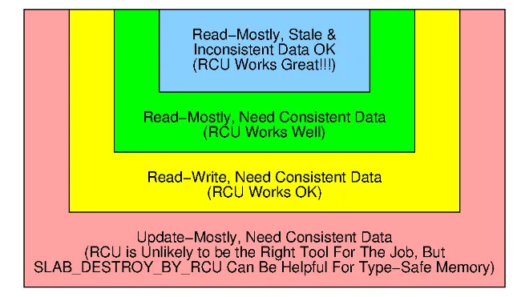
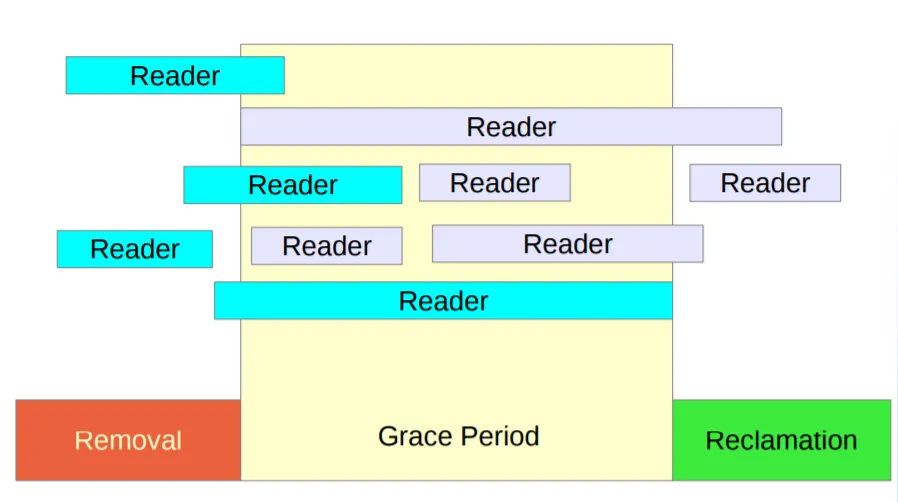
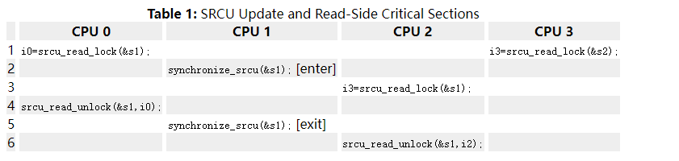

# RCU

同步、RCU、调研、

### 幻灯片

[Unraveling RCU-Usage Mysteries (Additional Use Cases)](https://events.linuxfoundation.org/wp-content/uploads/2022/02/RCUusageAdditional.2022.02.22b.LF-1.pdf)：这个幻灯片讲解的主要还是RCU在内核中的各种应用

[Mentorship Session - Unraveling RCU-Usage Mysteries (Fundamentals)](https://www.bilibili.com/video/BV1iU4y1d7jz/)

Mentorship Session: Unraveling RCU-Usage Mysteries (Fundamentals) > Intro | [Class Central Classroom](https://www.classcentral.com/classroom/youtube-mentorship-session-unraveling-rcu-usage-mysteries-fundamentals-157518)

[Mentorship Session - Unraveling RCU-Usage Mysteries (Fundamentals)_哔哩哔哩_bilibili](https://www.bilibili.com/video/BV1iU4y1d7jz/)

[what is RCU 2013 Paul McKenny_哔哩哔哩_bilibili](https://www.bilibili.com/video/BV1yv4y1u7kq/)

[What is RCU, Fundamentally?](https://www.slideserve.com/jena-garrison/what-is-rcu-fundamentally-powerpoint-ppt-presentation)（nice）：这一个比较好的RCU讲解幻灯片。

Jonathan Walpole: [Read-Copy Update \(RCU\)](https://web.cecs.pdx.edu/~theod/walpole/class/cs510/winter2018/slides/12.pdf) ：57页的幻灯片；

[(Download PPTX Powerpoint) What is RCU, Fundamentally?](https://dokumen.tips/download/link/what-is-rcu-fundamentally.html)：这个版本是可以下载的。这个幻灯片的难度与我想要的类似，是我上课的主要参考。

[What is RCU?](http://www2.rdrop.com/users/paulmck/RCU/RCU.2018.11.21c.PSU-full.pdf)：这是一个有241页的幻灯片。

[Read-Copy Update (RCU)](https://www.cs.unc.edu/~porter/courses/cse506/f12/slides/rcu.pdf)：这是一个课程中关于RCU的幻灯片，长度为18页。它只在说RCU的用法，没有说RCU的实现方法。

[Read-copy-update - HandWiki](https://handwiki.org/wiki/Read-copy-update)：这里的RCU介绍比较简洁。

### papers

M. Desnoyers, P. E. McKenney, A. S. Stern, M. R. Dagenais, and J. Walpole. User-level implementations of read-copy update. IEEE Trans. Parallel Distrib. Syst., 23(2):375–382, 2012.

[Introducing technology into the Linux kernel: A case study](https://www.researchgate.net/profile/Paul-Mckenney/publication/220624239_Introducing_technology_into_the_Linux_kernel_A_case_study/links/02bfe5141f77c79d4a000000/Introducing-technology-into-the-Linux-kernel-A-case-study.pdf)：这是一篇介绍RCU的历史的文章。有时间，可以好好看看。

[Is Parallel Programming Hard, And, If So, What Can You Do About It?](https://mirrors.edge.kernel.org/pub/linux/kernel/people/paulmck/perfbook/perfbook.html)：这是一个开源的电子书。其中的附录B给出10种不同的RCU实现方法；

### RCU in Rust

[Userspace RCU](http://liburcu.org)

[urcu](https://docs.rs/urcu/latest/urcu/): Safe wrapper of the memb variant of the userspace RCU library.

### 插图

[深入理解RCU|核心原理](https://mp.weixin.qq.com/s/2ie-fnUabSfuvAbPl_Aaww)：这里的插图很不错。

[深入理解RCU | RCU源码剖析](https://blog.csdn.net/lianhunqianr1/article/details/119259755)：这里在有很详细的流程图。

[一文带你深入解析Linux内核-RCU机制（超详细~）](https://zhuanlan.zhihu.com/p/516304206)：这里也有一些插图可用。

### 代码分析

[linux RCU详细教程](https://zhuanlan.zhihu.com/p/376541044)：这里有对应代码的RCU分析。

Linux中的RCU机制[一] - [原理与使用方法](https://zhuanlan.zhihu.com/p/89439043)

Linux中的RCU机制[二] - [GP的处理](https://zhuanlan.zhihu.com/p/104581361)

Linux中的RCU机制[三] - [性能与实时性](https://zhuanlan.zhihu.com/p/90223380)

[RCU Concepts — The Linux Kernel documentation](https://www.kernel.org/doc/html/latest/RCU/rcu.html)

[more information on RCU](https://docs.google.com/document/d/1GCdQC8SDbb54W1shjEXqGZ0Rq8a6kIeYutdSIajfpLA/edit?usp=sharing)

[RCU Usage In the Linux Kernel: One Decade Later](https://pdos.csail.mit.edu/6.828/2017/readings/rcu-decade-later.pdf)

[爆肝三天整理的RCU同步机制最全介绍](https://zhuanlan.zhihu.com/p/538261127)

### LWN.net

[What is RCU? -- "Read, Copy, Update" — The Linux Kernel documentation](https://www.kernel.org/doc/html/latest/RCU/whatisRCU.html)

[What is RCU, Fundamentally?](https://lwn.net/Articles/262464/)

[What is RCU? Part 2: Usage](https://lwn.net/Articles/263130/)

[RCU part 3: the RCU API](https://lwn.net/Articles/264090/)

[The RCU API, 2019 edition](https://lwn.net/Articles/777036/)

[RCU: The Bloatwatch Edition](https://lwn.net/Articles/323929/)

[Simplifying RCU](https://lwn.net/Articles/541037/)

[The design of preemptible read-copy-update](https://lwn.net/Articles/253651/): a preemptible RCU implementation with two waitlist stages per grace period

[Sleepable RCU](https://lwn.net/Articles/202847/)

[Hierarchical RCU](https://lwn.net/Articles/305782/)

[User-space RCU](https://lwn.net/Articles/573424/)

### RCU测试

[Using Promela and Spin to verify parallel algorithms [LWN.net]](https://lwn.net/Articles/243851/)

[Stupid RCU Tricks: A tour through rcutorture](https://paulmck.livejournal.com/61432.html)：rcutorture是一个RCU测试工具。

### 代码

#### 与RCU相关的Linux补丁

[Kernel index [LWN.net]](https://lwn.net/Kernel/Index/#Read-copy-update)

#### Patch for QRCU

[QRCU with lockless fastpath [LWN.net]](https://lwn.net/Articles/223752/)

### URCU

[User-space RCU [LWN.net]](https://lwn.net/Articles/573424/)

[Userspace RCU](https://liburcu.org/)

[GitHub - urcu/userspace-rcu: This repo is a mirror of the official userspace-rcu git found at git://git.lttng.org/userspace-rcu.git. liburcu is a LGPLv2.1 userspace RCU (read-copy-update) library. This data synchronization library provides read-side access which scales linearly with the number of cores.](https://github.com/urcu/userspace-rcu)

[urcu - Rust](https://docs.rs/urcu/latest/urcu/)

[userspace-rcu](https://github.com/urcu/userspace-rcu)

User-Level Implementations of Read-Copy Update

[http://www.rdrop.com/users/paulmck/RCU/urcu-main-accepted.2011.08.30a.pdf](http://www.rdrop.com/users/paulmck/RCU/urcu-main-accepted.2011.08.30a.pdf)

[Userspace RCU原理](https://blog.csdn.net/chenmo187j3x1/article/details/80992945)

URCU的代码分析；

Enabling Fast Per-CPU User-Space Algorithms with Restartable Sequences

[https://blog.linuxplumbersconf.org/2016/ocw/system/presentations/3873/original/presentation-rseq-lpc2016.pdf](https://blog.linuxplumbersconf.org/2016/ocw/system/presentations/3873/original/presentation-rseq-lpc2016.pdf)

#### QSBR

[Quiescent-State and Epoch based reclamation](https://github.com/rmind/libqsbr)

[Practical lock-freedom](https://www.cl.cam.ac.uk/techreports/UCAM-CL-TR-579.pdf)

Making Lockless Synchronization Fast: Performance Implications of Memory Reclamation

[http://csng.cs.toronto.edu/publication_files/0000/0165/ipdps06.pdf](http://csng.cs.toronto.edu/publication_files/0000/0165/ipdps06.pdf)

[Making Lockless Synchronization Fast Performance Implications of Memory](https://slidetodoc.com/making-lockless-synchronization-fast-performance-implications-of-memory/)

对应的幻灯片；本地下载：rcu_pengyuan.ppt

### 存储一致性模型

[计算机体系结构——多核处理器——存储一致性模型_fence 多核_KGback的博客-CSDN博客](https://blog.csdn.net/qq_39815222/article/details/107029271)

[内存屏障（Memory Barrier）究竟是个什么鬼？](https://zhuanlan.zhihu.com/p/125737864)

1. 顺序一致性模型SC：对memory的访问时原子化的，串行化的。
2. 完全存储定序模型TSO：
   1. **store操作**在store buffer中顺序执行
   2. **load**同样按顺序执行，但可穿插到多人store执行过程中
3. 部分存储定序模型PSO：
   1. 同一core中地址不相关的store->store指令可以互相穿插执行
   2. **load**按顺序执行，但可穿插到多个store执行过程中
4. 处理器一致性模型PC：
   1. 在某**取数操作load**执行之前，所有在同一处理器中先于该条load指令的取数操作（load）都已完成。
   2. 在某**存数操作store**执行之前，所有在同一处理器中先于该条store的访存操作（load和store）都已完成。
5. 弱一致性模型WO
   1. **同步操作**的执行满足顺序一致性条件
   2. 在任意普通**访存操作**执行之前，所有在同一core中先于该操作的同司步操作都已执行完成
   3. 在任一同步操作执行之前，所有在同一core中先于该操作的普通访存操作都已执行完成
6. 释放一致性模型RC
   1. 同步操作的执行满足顺序一致性条件
   2. 在任意普通访存操作执行之前，所有在同一core中先于该操作的**acquire操作**都已完成
   3. 在任**意release操作**执行之前，所有在同一core中先于该操作的普通访存操作都已完成
7. 松散一致性模型RMO
   1. 只要是地址无关的指令在读写访存时都可以打乱访存顺序；
   2. 允许多核结构中的每个单核改变memory访问指令（不同访问地址）的执行顺序；

RISC-V的fence指令

[RISC-V fence指令](https://zhuanlan.zhihu.com/p/372433134)


# Linux RCU

**原始的RCU思想**

在多线程场景下，经常我们需要并发访问一个数据结构，为了保证线程安全我们会考虑使用互斥设施来进行同步，更进一步我们会根据对这个数据结构的读写比例而选用读写锁进行优化。但是读写锁不是唯一的方式，我们可以借助于COW技术来做到写操作不需要加锁，也就是在读的时候正常读，写的时候，先加锁拷贝一份，然后进行写，写完就原子的更新回去，使用COW实现避免了频繁加读写锁本身的性能开销。

**优缺点**

由于 RCU 旨在最小化读取端开销，因此仅在以更高速率使用同步逻辑进行读取操作时才使用它。如果更新操作超过10%，性能反而会变差，所以应该选择另一种同步方式而不是RCU。

- 好处
  - 几乎没有读取端开销。零等待，零开销
  - 没有死锁问题
  - 没有优先级倒置问题（优先级倒置和优先级继承）
  - 无限制延迟没有问题
  - 无内存泄漏风险问题
- 缺点
  - 使用起来有点复杂
  - 对于写操作，它比其他同步技术稍慢
- 适用场景



基于 RCU 的更新程序通常利用这样一个事实，即在现代 CPU 上写入单个对齐指针是原子的，允许在链接结构中原子插入、删除和替换数据，而不会中断读取器。然后，并发 RCU 读取器可以继续访问旧版本，并且可以省去原子读-修改-写指令、内存屏障和高速缓存未命中，这些在现代[SMP](https://en.wikipedia.org/wiki/Symmetric_multiprocessing)计算机系统上非常昂贵，即使在没有锁争用的情况下也是如此


实现方式：QSBR算法

这个算法的核心思想就是识别出线程的不活动(quiescent)状态



- **Removal**：在写端临界区部分，读取（Read()），进行复制（Copy），并执行更改（Update）操作；

- **Grace Period**：这是一个等待期，以确保所有与执行删除的数据相关的reader访问完毕；

- **Reclamation**：回收旧数据；


**静止状态QS(Quiescent State):** CPU发生了上下文切换称为经历一个quiescent state

**宽限期GP(Grace Period):** grace period就是所有CPU都经历一次quiescent state所需要的等待的时间，也即系统中所有的读者完成对共享临界区的访问；

**读侧临界部分RCS(Read-Side Critical Section):** 保护禁止其他CPU修改的代码区域，但允许多个CPU同时读；


**读者reader**：

- 安全访问临界区资源；
- 负责标识进出临界区；

**写者updater**：

- 复制一份数据，然后更新数据；
- 用新数据覆盖旧数据，然后进入grace period；

**回收者reclaimer**：

- 等待在grace period之前的读者退出临界区；
- 在宽限期结束后，负责回收旧资源；


## RCU实现方式

**针对非抢占系统**

```c
1 void wait_for_rcu(void)
2 {
3 	unsigned long cpus_allowed;
4 	unsigned long policy;
5 	unsigned long rt_priority;
6 	/* Save current state */
7 	cpus_allowed = current->cpus_allowed;
8 	policy = current->policy;
9 	rt_priority = current->rt_priority;
10	 /* Create an unreal time task. */
11 	current->policy = SCHED_FIFO;
12 	current->rt_priority = 1001 +
13 	sys_sched_get_priority_max(SCHED_FIFO);
14 	/* Make us schedulable on all CPUs. */
15 	current->cpus_allowed =
16	(1UL<<smp_num_cpus)-1;
17
18 	/* Eliminate current cpu, reschedule */
19 	while ((current->cpus_allowed &= ~(1 <<
20	cpu_number_map(
21	smp_processor_id()))) != 0)
22	schedule();
23 	/* Back to normal. */
24 	current->cpus_allowed = cpus_allowed;
25 	current->policy = policy;
26 	current->rt_priority = rt_priority;
27 }
```


1. 第 7 行到第 13 行保存当前的调度状态，并设置具有足够优先级的 FIFO 调度策略来抢占所有其他任务。 
2. 第 15 行和第 16 行创建一个掩码，允许任务在任何 CPU 上运行。
3.  第 19 行到第 22 行的循环反复从允许运行此任务的集合中删除当前 CPU，然后释放该 CPU。
4.  因此，循环完成后，任务将在每个 CPU 上运行，这意味着每个 CPU 将完成在调用等待 rcu() 时正在执行的任何操作。 

在图 9 中的读复制删除算法的情况下，这又意味着现在可以安全地释放传递给 kfree rcu() 的内存。 第 24 行到第 26 行恢复调度状态。


**缺陷**：

1. 在可抢占内核无法工作，除非在读临界区关闭抢占
2. 不能从中断处理程序调用 (使用schedule_task()间接调用)？
3. 在持有自旋锁时，或中断被禁用时，也不能调用 (使用schedule_task)间接调用
4. 速度慢


## SRCU实现

Sleepable Read-copy update (SRCU)要解决这个问题：RCU提供了宽限期异步等待的接口call_rcu，读者在临界区中睡眠，会使得宽限期被无限延长，这段时间内可能会有新的写者更新临界区，注册回调，然后调用call_rcu直接返回，如果读者睡眠时间无限延长，那被注册的回调就会无限多，消耗的内存会无限增多，最后导致系统崩溃。为了解决这个问题，SRCU在实现中提出了两个设计原则：

- 不提供宽限期等待的异步接口，这样就可以杜绝进程不断注册宽限期回调的现象，限制内存的无限消耗
- 将宽限期检查的隔离到一个子系统中，这样即使一个读者的睡眠时间无限延长，那么也只有处于这个子系统中的写者受到影响
  - 给定子系统的设计者负责：
    - 确保 SRCU 读端休眠是有界的，
    -  限制等待 Synchronize_srcu() 的内存量

```c
int init_srcu_struct(struct srcu_struct *sp);
void cleanup_srcu_struct(struct srcu_struct *sp)
int srcu_read_lock(struct srcu_struct *sp);
void srcu_read_unlock(struct srcu_struct *sp, int idx);
void synchronize_srcu(struct srcu_struct *sp);
long srcu_batches_completed(struct srcu_struct *sp);
```


读临界区的使用方法：

The read-side srcu_read_lock() and srcu_read_unlock() primitives are used as shown:

```c
1 idx = srcu_read_lock(&ss);
2 /* read-side critical section. */
3 srcu_read_unlock(&ss, idx);
```

写端的使用方法：

The `synchronize_srcu()` primitives may be used as shown below:

```
    1 list_del_rcu(p);
    2 synchronize_srcu(&ss);
    3 kfree(p);
```




数据结构：

```
 1 struct srcu_struct_array {
 2     int c[2];
 3 };
 4 struct srcu_struct {
 5     int completed;
 6     struct srcu_struct_array *per_cpu_ref;
 7     struct mutex mutex;
 8 };
```

- The `completed` field is a count of the number of grace periods since the struct `srcu` was initialized

初始化：

```
1 int init_srcu_struct(struct srcu_struct *sp)
2 {
3     sp->completed = 0;
4     mutex_init(&sp->mutex);
5     sp->per_cpu_ref =
6         alloc_percpu(struct srcu_struct_array);
7     return (sp->per_cpu_ref ? 0 : -ENOMEM);
8 }
```

清除srcu资源：

```
1  int srcu_readers_active_idx(struct srcu_struct *sp,
2         int idx)
3  {
4      int cpu;
5	   int sum;
6
7      sum = 0;
8	   for_each_possible_cpu(cpu)
9	       sum += per_cpu_ptr(sp->per_cpu_ref, cpu)->c[idx];
10     return sum;
11 }
12
13 int srcu_readers_active(struct srcu_struct *sp)
14 {
15     return srcu_readers_active_idx(sp, 0) +
16                 srcu_readers_active_idx(sp, 1);
17 }
18
19 void cleanup_srcu_struct(struct srcu_struct *sp)
20 {
21     int sum;
22
23     sum = srcu_readers_active(sp);
24	   WARN_ON(sum);
25	   if (sum != 0)
26	       return;
27     free_percpu(sp->per_cpu_ref);
28     sp->per_cpu_ref = NULL;
29 }
```

- `srcu_readers_active` 函数计算进入临界区的数量
- `cleanup_srcu_struct` 判断进入临界区的数量是否为0，并释放资源


读端实现：

```
1  int srcu_read_lock(struct srcu_struct *sp)
2  {
3      int idx;
4
5      preempt_disable();
6	   idx = sp->completed & 0x1;
7	   barrier();
8	   per_cpu_ptr(sp->per_cpu_ref,
9	   smp_processor_id())->c[idx]++;
10	   srcu_barrier();
11	   preempt_enable();
12	   return idx;
13 }
```

这段函数经过仔细构造以避免额外的内存屏障和原子指令。

1. 第 6 行获取宽限期计数器的底部位，该计数器将用于选择用于此 SRCU 读端关键部分的每 CPU 计数器的rank ?
2. Barrier() 调用是对编译器的一条指令，确保仅获取索引一次
3. 第 8-9 行增加当前 CPU 的选定计数器


```
1 void srcu_read_unlock(struct srcu_struct *sp, int idx)
2 {
3     preempt_disable();
4	  srcu_barrier();
5	  per_cpu_ptr(sp->per_cpu_ref,
6                 smp_processor_id())->c[idx]--;
7     preempt_enable();
8 }
```

1. 第 5 行和第 6 行减少了该 CPU 的计数器，但索引与相应的 srcu_read_lock() 使用的索引相同


写端实现：

SRCU 背后的关键点是，synchronize_sched() 会阻塞，直到所有当前执行的禁止抢占的代码区域完成

```
1  void synchronize_srcu(struct srcu_struct *sp)
2  {
3      int idx;
4
5      idx = sp->completed;
6	   mutex_lock(&sp->mutex);
7	   if ((sp->completed - idx) >= 2) {
8          mutex_unlock(&sp->mutex);
9	       return;
10     }
11     synchronize_sched();
12	   idx = sp->completed & 0x1;
13	   sp->completed++;
14	   synchronize_sched();
15	   while (srcu_readers_active_idx(sp, idx))
16         schedule_timeout_interruptible(1);
17     synchronize_sched();
18	   mutex_unlock(&sp->mutex);
19 }
```

1. 第 5 行获取宽限期计数器的快照。
2. 第 6 行获取互斥体，第 7-10 行检查自快照以来是否至少已经过去了两个宽限期，如果是，则释放锁并返回 - 在这种情况下，其他人已经为我们完成了工作
   1. <font color = red> 为什么过去两个宽限期意味着已经完成了同步呢？</font>
3. 第 11 行保证任何其他在` srcu_read_lock()` 中看到宽限期计数器递增值的 CPU 也会看到该 CPU 在进入 `Synchronize_srcu()` 之前所做的任何更改。
4. 第 12 行获取宽限期计数器的底部位，以供以后用作每个 CPU 计数器数组的索引，然后第 13 行递增宽限期计数器。
5. **第 14 行然后等待任何当前正在执行的 srcu_read_lock() 完成，以便当我们到达第 15 行时，srcu_read_lock() 的所有现有实例都将使用 sp->completed 中的更新值**
6. 第 15 行 srcu_readers_active_idx() 采样的计数器保证单调递减，因此一旦它们的总和达到零，就保证保持不变。


`synchronize_sched`负责其他方面的功能（本质是等待系统中所有CPU退出不可抢占区）【】

