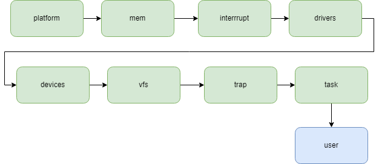

# Subsystem

这一阶段，我们将原来的内核划分为一些较为松耦合的子系统。子系统与我们之前的模块化工作有相似之处，但是目标不一样。简单来说，之前的模块化是将内核中可独立的部分脱离内核，从而可被其它内核使用，而现在我们将内核继续划分，这些划分的子系统有点类似linux中的各个子系统，比如内存管理子系统、平台相关子系统、任务子系统等，这些子系统只是对原来的内核的交互进行了梳理，使得各个子系统之间的依赖关系，信息交互更加合理，这些子系统与我们的内核紧密相关，因此大多数是不能被其它内核所使用。

目前系统被划分为几个简单的子系统：

1. `config`：提供内核的相关配置，比如启动栈大小、用户程序栈大小，缓冲区大小等
2. `arch` : 提供体系结构相关的功能，我们的内核目前只运行在riscv平台上，所以这里只是简单提供一下开关中断/激活页表的功能
3. `platform` : 平台相关的部分，我们的内核可以跑在几个不同的开发板上，这部分主要负责系统的启动和初始输出初始化
4. `constants`: 提供内核子系统直接都会使用的数据结构定义
5. `device_interface`: 提供各种设备的接口定义，这在设备管理子系统和驱动子系统实现中被引用
6. `devices`: 设备管理子系统，负责扫描、注册所有的设备，其会引用任务管理子系统的功能
7. `drivers`: 驱动子系统，包含了支持的设备的驱动程序，这些驱动程序会引用任务管理子系统的功能
8. `interrupt`: 负责管理和分发外部中断处理
9. `ksync`: 只是对内核锁的简单封装
10. `mem` : 建立内核的映射，并负责管理整个系统的内存分配
11. `timer`: 负责获取时间
12. `vfs`: 负责注册内核支持的文件系统，并建立文件系统树
13. `unwinder`： 内核崩溃处理
14. `kernel`: 这部分包含了内核的所有系统调用实现，负责进行进程/线程的管理，以及中断/异常处理，其会协调其它子系统的初始化，然后使用其它子系统的数据和功能


系统的启动流程大致如下所示




这里我们对几个比较核心且未来可能作为隔离域存在的子系统进行讨论。

`drivers` 子系统是不同设备的驱动实现集合，目前我们将其放在一个`crate`中，在未来驱动被作为一个隔离域实现时，需要将其拆分出来形成不同的`crate`。

块设备驱动`GenericBlockDevice`:

1. 如果是一个virtio 设备，其会需要依赖一块设备地址空间。
2. 如果是一个sdio设备，其会需要依赖一块设备地址空间。

向上，块设备驱动使用一个接口暴露功能

```rust
pub trait BlockDevice: Send + Sync + DeviceBase {
    fn read(&self, buf: &mut [u8], offset: usize) -> AlienResult<usize>;
    fn write(&self, buf: &[u8], offset: usize) -> AlienResult<usize>;
    fn size(&self) -> usize;
    fn flush(&self) -> AlienResult<()>;
}
```

在设备管理子系统中，扫描程序会使用驱动程序实例化一个设备，并再次使用其提供的接口功能实现文件系统相关的接口。

因此，如果需要将其作为一个隔离域，这个隔离域向外暴露的功能就应该与其接口类似，而对于依赖，根据不同的设备，我们可能会传递一个`MmioTransport` 结构体或者 `SDIo`结构体。


串口设备驱动`Uart`:

1. 其依赖由几个寄存器构成的设备地址空间

向上，其使用一个接口暴露功能:

```rust
pub trait UartDevice: Send + Sync + DeviceBase {
    fn put(&self, c: u8);
    fn get(&self) -> Option<u8>;
    fn put_bytes(&self, bytes: &[u8]);
    fn have_data_to_get(&self) -> bool;
    fn have_space_to_put(&self) -> bool;
}
```

如果将其作为一个隔离域，其可能的形式应该如下:

```rust
pub struct Registers<R: Register + Copy> {
    pub thr_rbr_dll: RwReg<R>,
    pub ier_dlh: RwReg<R>,
    pub iir_fcr: RwReg<R>,
    pub lcr: RwReg<R>,
    pub mcr: RwReg<R>,
    pub lsr: RoReg<R>,
    pub msr: RoReg<R>,
    pub scratch: RwReg<R>,
}

fn main(regs:Box<Registers>)->Box<dyn UartDomain>{
    //
}

pub trait UartDomain{
    fn put(&self, c: u8);
    fn get(&self,[u8]) -> RpcResult<[u8]>;
    fn put_bytes(&self, [u8;128]);
    fn have_data_to_get(&self) -> RpcResult<()>;
    fn have_space_to_put(&self) -> RpcResult<()>;
}
```

