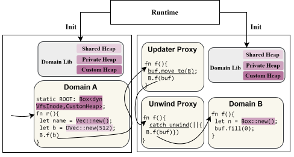
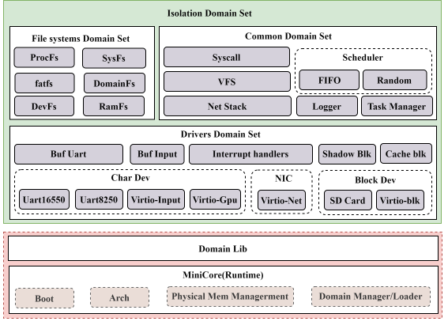
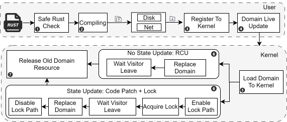
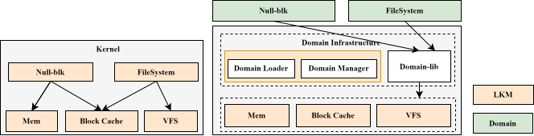
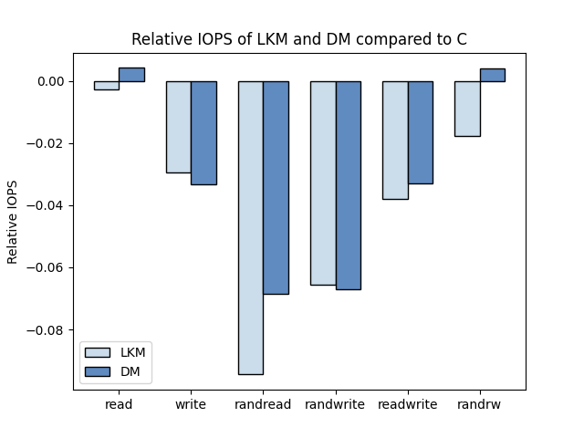

# 技术报告


## 概述

现代主流操作系统由内核和用户程序两部分构成，而内核又由诸多复杂的子系统构成，例如文件子系统，网络子系统，以及许多驱动模块。内核不断增加的代码以及使用不安全的编程语言使得内核的安全性面临严峻挑战。为了让内核更加安全，内核引入了许多技术和工具来防止用户利用漏洞攻击和窃取内核信息。内核的这些子系统与其它代码都位于内核空间当中，互相之间包含了复杂的依赖关系，这导致了单个模块出现的漏洞也会造成其它模块崩溃，内核子系统缺乏隔离是导致这个现象的主要原因。目前的许多工作开始利用一些先进的硬件手段来实施内核子系统的隔离，但这些硬件手段缺乏灵活性同时可能会造成较大的性能损失，不能广泛应用在内核开发当中。随着编程语言的发展，一些兼顾性能和内存安全的语言被提出(例如rust)，这让我们可以利用现代编程语言来实现实用的、轻量级的、细粒度的隔离以及一系列机制。我们开发一个完全使用Rust语言的操作系统，并利用语言机制对内核各个子系统进行隔离(内存隔离/故障隔离)，在此基础上，我们探索了内核子系统的动态加载和更新机制。

## 背景

> 1. redleaf工作的贡献和不足
> 2. thesues工作的贡献和不足

在大多数云服务器上运行的Linux系统是一个传统意义上的单片操作系统，内核的所有功能都运行在单个特权级和单个地址空间当中, 模块之间可以任意地调用彼此的函数并操作关键的内存数据，其中一个模块触发的错误将会发生连锁反应，导致其它模块出现错误并最终导致系统panic。内核中引入了大量的机制和方法来缓解这个问题(比如ASLR，stack canaries，shadow stack )等,但这些方法都不能解决所有bug,其根本原因在于内核子系统缺乏隔离。已有的工作尝试构建隔离的子系统，主要分为两种方法：

1. 基于特定的硬件机制
2. 基于软件的机制

基于硬件机制的方法利用MMU、虚拟化、处理器特定功能为内核子系统带来更强的隔离，但这些强隔离性带来的直接后果就是性能的急速下降，那些具有较高性能的方法又通常局限于硬件特定功能，不能被广泛采用。基于软件机制的隔离方法不需要绑定到硬件特征上，并且具有更高的性能。许多工作使用内存安全的语言开发了实用的操作系统[redleaf]，这些系统在不同的方面利用和扩展了语言的能力。redleaf使用 Rust 语言的类型系统和内存安全性实现轻量级细粒度隔离。

redleaf的工作给我们利用语言机制实现内核子系统隔离开了一个好头，但其仍然有许多问题没有回答：

1. 为什么基于语言的方法可以做到隔离？基于语言的方法如何做到与基于硬件机制的方法一样的效果？
2. 如何减小内核的TCB，并将安全的职责更多的由语言机制保证？
3. 如何将基于语言的隔离机制推广到实用的操作系统内核当中(linux)？

Theseus通过减少一个组件对另一个组件的状态依赖来重新设计和改进操作系统模块化，并利用安全的编程语言Rust将尽可能多的操作系统责任转移到编译器上。Theseus的结构、语言内设计和状态管理以超越现有作品的方式实现了核心操作系统组件的实时进化和故障恢复。尽管Theseus实现了内核组件的动态更新机制，但这种机制是建立在一个理想化的设计之上，像Linux这样商用的内核是庞大而又错综复杂的，即使是一个较小的子系统，其中也包含了大量的状态数据，无法轻松实现Theseus中所推崇的无状态设计。我们观察到，在对内核子系统进行隔离的基础上，可以实现更加简单且通用的动态更新机制而无需将内核转换为Theseus一样的结构。

总而言之，本文所作出的贡献概括为以下几条：

- [x] 回答了基于语言的方法如何做到与基于硬件机制的方法一样的效果
- [x] 我们将内核TCB限制在一个较小的范围，将对安全的保证更多转移到内核子系统的实现上。
- [x] 我们实现了一个基于语言机制进行隔离的操作系统Alien，在实现内核子系统的隔离基础上，我们实现了子系统的动态加载和更新机制。我们区分了有状态子系统与无状态子系统，并针对不同类别的子系统实施不同的同步机制，以最大限度减少子系统更新对其它子系统的影响。
- [x] 我们将Alien的成果移植到Linux系统中，使得这些方法具有更好的实用性


## Rust

> 对rust的介绍：为什么选择rust？


## 威胁模型

> 描述我们相信什么，不相信什么？我们提供对哪些攻击的安全保证，不提供哪些攻击的保证？我们的假设是什么？

安全语言rust提供了四个对于在软件中提供内存隔离至关重要的保证:

1. 它们不允许指针算术，并要求代码获取的任何引用要么是由于分配或函数调用而生成的； 
2. 它们检查数组访问的边界，从而防止由于缓冲区溢出（和下溢）而导致的杂散内存访问； 
3. 它们不允许访问空对象，从而防止应用程序使用未定义的行为来访问应隔离的内存； 
4. 它们确保所有类型转换都是安全的（并且在兼容对象之间）


## 设计

> 相当于回答上面列出的问题？
>
> - 为什么基于语言的方法可以做到隔离？
> - 基于语言的方法如何做到与基于硬件机制的方法一样的效果？
> - 如何减小内核的TCB，并将安全的职责更多的由语言机制保证？
> - 如何实现子系统的动态加载和更新机制？
> - 如何将基于语言的隔离机制推广到实用的操作系统内核当中(linux)？


本文设计和实现的内核由隔离的子系统构成，这些子系统向下依赖于操作系统提供的基础设施与其它的子系统，向上为其它子系统与和操作系统提供功能。每个子系统被限制在一个独立的空间，只能通过公开的接口进行调用。为了进行各个子系统的协作，每个隔离子系统公开的接口都包含了不同的参数，我们需要支持这些隔离子系统的通信，并保证隔离性，因此引入了共享堆对参数进行了限制。虽然这些隔离子系统比较独立，但他们都会依赖一组操作系统提供的功能，为了最小化这个依赖，我们尽量保持一组最小的操作系统原语，并在此基础上构建其它隔离子系统。

### 为什么基于语言的方法可以做到隔离？

操作系统的可靠性研究已有数十年的历史，现在也仍然是主要的关注点。系统发生错误的位置可能位于硬件，也可能位于软件中。早期操作系统设计将隔离内核子系统的能力确定为提高整个系统可靠性和安全性的关键机制。对内存的隔离是隔离的主要方面，因为绝大多数的错误和攻击都是由内存引起的，在进行内存隔离的基础上，操作系统需要进一步提高故障隔离的能力，以确保子系统在发生故障时不会影响其它子系统，并且不会导致服务中断。

在回答基于语言的方法如何做到内存隔离和故障隔离之前，我们需要阐述如何基于语言方法实现隔离。

Alien是一个类似Linux的宏内核，但采用了基于语言的域方法实现隔离。在Alien中，内核被切分为隔离的子系统，每一个子系统都是一个功能完整的整体。下文我们称这些子系统为域。这些域全部由safe rust代码进行编写，并在编译前通过自动化工具进行检查。域是信息隐藏、故障隔离和可组合的基本单元，包括任务管理、任务调度、驱动程序、文件系统等传统的内核子系统都作为一个域被动态加载到内核。



#### [TCB ](https://en.wikipedia.org/wiki/Trusted_computing_base)（Trusted computing base）：mini-core

在系统启动初期，我们需要访问低级硬件并管理硬件资源，这不得不使用一些不安全的汇编代码。我们将系统中负责与硬件交互的部分浓缩为一个最小的系统，除此之外，mini-core还会为域提供一些必要的功能接口，比如分配物理页、进行上下文切换。在完成资源的初始化后，mini-core会将核心的域加载到内核地址空间中，开始向外提供服务。我们保证mini-core只包含最小功能集，并将大部分内核功能转移到域的实现当中，这可以降低mini-core中unsafe code带来的风险。域的初始状态和资源的初始化由mini-core完成，这意味着域的开发者只需要将域的实现看作一个库的实现，而不需要关心隔离的细节。

<font color= red> 明确的定义 </font>

- 系统的整体结构


#### 私有堆与共享堆

<font color = red> 私有堆/共享堆的使用规则 </font>

系统中的每个域都会实现一组特定的接口，不同的域之间通过域的接口访问域的功能。在域的内部，除了少部分域之外，其它的都需要进行堆内存分配，我们通过为每个域建立一个私有堆来隔离域对堆的访问，因此域永远不会存在指向其它域的私有堆的指针。

上文已经提到，每个域都是一个功能完整的整体，与C语言的堆分配不同，Rust的堆分配由一个全局的堆分配器进行管理，而每个被独立编译的域都需要声明其堆分配器，我们将这个分配器视作域的私有堆。mini-core为域提供的功能接口之一是分配较大的物理页，并记录页的域所属权。在域内部，我们管理这些物理页并创建分配较小对象的全局堆分配器。采用两级的分配器有助于mini-core在系统运行期间快速为域分配内存资源，并且在对域进行更新期间可以安全且快速地回收这些资源。

由于单个域并不能完成所有的功能，因此需要访问其它域。如果在访问期间使用私有堆则破坏了对堆访问的隔离。为此，我们为所有域提供一个共享堆，域之间的通信通过共享堆来完成。单靠共享堆无法约束域之间传递数据的方式，因此，我们引入了特殊的共享堆基本数据类型`RRef<T>`，并在此基本类型上构建复杂的数据类型。域在共享堆上分配数据结构与在私有堆上分配rust内置的数据结构类似。`RRef<T>`与rust的内置类型`Box<T>` 类似，但引入了一个额外的字段来记录其所属的域。这些数据类型静态保证了共享堆上分配的对象不能包含指向私有堆的指针，但可以引用共享堆上的其他对象。

`RRef<T>` 所能包含的数据类型定义为以下集合：

- RRef 本身
- Rust 原始 Copy类型的子集，如 u32 、u64，但不允许指针和引用
- 由RRef 构建的匿名（元组、数组）和命名（枚举、结构体）复合类型

`RRef<T>`以及由其组合而成的复合结构并不能涵盖全部的数据类型，但在我们定义的所有域接口类型中，这些数据结构已经足以表达所有的需求。(内核子系统的边界通常会使用简单的数据类型) 我们在域的接口上强制使用这些数据类型，因为域接口是域的唯一入口。

共享堆上的数据类型具有唯一性，即任意时刻这个数据只属于某个域。 当对象在域之间传递时，我们会根据它是在域之间移动还是在只读访问中借用来更新其所有权。 Rust 的所有权规则可以让我们在编译时就实施单一所属原则。因为所有的域间通信都会被可信域代理进行中转，因此我们可以通过代理安全地更新对象的所有者标识符。

> 1. 共享堆限制了在域间通信时传递的数据，避免隔离域拥有其它域的数据
> 2. 利用rust的所有权机制，使得传递的数据只能有一个所有者，这可以避免数据传递后被原来的域所修改
> 3. 通过移动数据的所有权，或者使用不可变数据，我们可以避免对数据的额外拷贝

#### 域代理

域之间的通信并不会直接在域对象上进行，我们引入了两层域代理，第一层域代理只是简单地对域对象的包装，其会实现域接口，但在直接调用域对象的接口上，其引入了rust的unwind机制，以确保域故障被正确地捕捉并处理掉。

```rust
pub struct UnwindWrap(BlkDomain);
impl BlkDeviceDomain for UnwindWrap {
    fn read_block(&self, block: u32, data: RRefVec<u8>) -> AlienResult<RRefVec<u8>> { 
        basic::catch_unwind(|| { self.0.read_block(block, data) }) 
    }
}
```

第二层代理是第一层代理的包装，位于TCB中。其会记录域间通信的对象的所有权关系，为进行域更新时数据的传输提供支持，同时，其也对域的动态升级实施不同的不同的同步策略。这两层代理直接由rust的宏生成而不会产生开销。	

域代理对象暴露的接口与其所中转域接口完全相同。因此，代理对接口的中转对用户来说是透明的。与redleaf的实现不同，代理对象不会在调用域接口时检查域是否存活，也不会为线程在域接口创建一个continuation(延续)，redleaf依靠状态保存和恢复来实现域的故障隔离，并且粗暴地在域发生故障时直接中断域的服务。我们依靠rust的unwind机制实现故障隔离，并且不中断域的服务。


#### 故障隔离

由于计算机系统的复杂性，消除操作系统和应用程序中的所有错误是不现实的。许多工作研究用户态应用程序的故障隔离方法，从而防止由于一个应用程序发生故障而导致操作系统或其他应用程序也发生故障，但对操作系统内部子系统的故障隔离却缺乏实际有效的措施，一方面，操作系统内核为了极致的性能使得各个子系统之间的关系变得错综复杂，数据在多个子系统之间共享，另一方面，内核子系统缺乏有效的划分和隔离措施。

Alien完全使用Rust开发，Rust清晰的模块边界以及对原始指针操作的限制在一定程度上提高了内核的可靠性。比如一个域只能通过域对象的接口访问另一个域的功能，安全的 Rust 代码不允许通过原始指针取消引用访问任意地址，Rust的编译器在编译时可以检测出许多数据竞争问题，在运行时提供对数组的越界检查以避免缓冲区溢出漏洞。

在上文中。我们还利用语言机制为内核子系统提供了细粒度的内存隔离，虽然内存隔离可以停止跨域的故障传播，但故障仍可能发生在域的内部或由于硬件环境而发生。因此，还需要容错来实现系统的高可靠性，其包括错误检测、错误恢复和故障处理。软件和硬件都可以检测到错误，诸如内存访问错误，中断异常等被处理器捕捉并交由操作系统进行处理，而软件错误通常会导致执行流被破坏，分配的资源不能被正确回收。一些硬件错误不会被硬件所检测，但会导致软件错误，比如块设备由于糟糕的环境而导致内部状态发生改变，这会导致后续的数据读写发生错误。本文的工作关注那些由于软件错误或者由硬件错误引起的软件错误。

在Rust中，panic是主要的软件错误类型。当发生panic时，根据编译时配置，我们可以决定是直接终止(abort)域的执行还是对执行流进行展开(unwind)。使用unwind策略，域的panic处理代码会展开执行流的堆栈并在 panic调用链中查找最近的 catch_unwind 函数 。在`unwind`配置下，Rust 编译器生成类似于try-catch的代码。 try区域称为调用站点代码区域，而catch区域称为着陆垫代码区域， 在该区域中，Rust编译器会生成代码来调用相应内存对象的析构函数从而执行内存清理例程。对执行流进行展开后，其在域内分配的资源将会被释放，并且执行流将会回退到域的入口处，并返回一个Error错误，以表明此次对域的调用失败。

Rust的展开有助于在展开堆栈例程中删除（释放）局部变量。通过为所有内核资源结构实现了Drop trait，我们可以在控制流的展开过程中自动释放这些资源，因此在展开过程中不会泄露内核的资源，这种异常处理在C语言内核中要困难的多。利用Rust的unwind机制，我们可以完成故障处理和恢复。

对执行流的展开不会影响域的功能，其它位于域中的执行流仍然正常执行。由于执行流在域内部触发了错误，我们有理由怀疑域的实现出现了错误，为了表达这一特征，我们为每一个域记录域发生崩溃的次数。系统维护者可以决定是否对域进行重启或者升级，比如对于由于硬件错误引起的软件错误，维护者可以简单地重启域，而对于那些重启之后仍然经常发生崩溃的域进行升级以消除存在的错误。

故障隔离是操作系统设计中不可或缺的部分，它通过一系列技术手段来确保系统的健壮性和可靠性。在现代操作系统中，故障隔离机制的不断发展和完善，极大地提升了系统在复杂和多变的环境下的生存能力。这不仅对提升用户体验至关重要，也为构建高可用性和高可靠性的系统奠定了基础。


|          | MPK                                                          | rust                                                         |                            优缺点                            |
| :------: | :----------------------------------------------------------- | :----------------------------------------------------------- | :----------------------------------------------------------: |
| 内存隔离 | 对不同的子系统的内存设置不同的权限                           | 域拥有私有堆                                                 | 硬件提供的内存隔离机制理论上具有更强的隔离性，但是现有的硬件机制缺乏灵活性，并且可能存在其它的硬件攻击手段。语言机制提供的内存隔离需要使用形式化验证技术进一步验证，但其不存在硬件限制，并且可以使用硬件手段进一步加强 |
| 域间访问 | 由跨域中介协调域间调用，对一块特定的区域赋予所有子系统都可以访问的权限，并从特定区域分配资源，在进入和退出子系统的时候需要进行权限的修改 | 通过域接口访问其它域功能，域间通信使用共享堆分配数据，进入和退出域没有权限修改 | 与对子系统的内存隔离一样，基于语言的方法可以使用形式化验证的方法证明其有效性，因为域的实现不存在unsafe的代码， 可以降低证明的难度 |
| 故障隔离 | 故障检测：内存访问异常被硬件捕获、子系统内部的软件错误也可以被捕获<br />故障处理：使用rust技术也可以实现unwind机制<br />故障恢复:  缺乏对子系统资源的管理，盲目重启将会导致资源泄露 | 故障检测：由safe rust保证没有方法的内存访问<br />故障处理：使用unwnd机制完成执行流的展开和资源释放<br />故障恢复：基于语言实现的隔离机制就是建立在对资源的有效管理之上 | 故障隔离建立在内存隔离的基础上，如果要实现故障重启，单纯的硬件隔离并不能做到，其也需要语言机制实现的隔离的那样的细致的资源管理。 |


### 如何减小内核的TCB，并将安全的职责更多的由语言机制保证？

redleaf中对域的要求虽然也不允许出现不安全的Rust代码，但是其仍然将许多代码库视作TCB的一部分，而域实现部分只占了系统的小部分。我们认为这会破坏我们对rust的安全假设。因此，我们不仅要求所有的内核子系统都由独立的域构成，使用safe的Rust编写，同时我们的TCB只包含最小的功能集，并处理整个系统中不安全的部分。

极小的mini-core不仅可以占用更少的空间，同时也有助于加强对域的隔离的保证。如果我们选择相信安全的Rust实现的域，那么在极端情况下，我们只需要验证这个最小的mini-core就可以建立整个系统的安全保证。

我们使用Rust的trait来定义域的接口，这意味着，我们可以对系统进行合理的划分，并定义出良好的接口。这些接口是灵活的、可组合的，因此系统中的某个域可能会实现多个接口，也可能引用多个隔离域。我们可以将系统划分为许多较小的隔离域，这有助于子系统的功能划分，通过给域赋予较小的功能，可以减小域的大小，减小域内部发生错误的可能性，同时也减少了域所需要保存的状态，而较少的状态可以加快域热升级的速度，这还允许我们更加灵活的选择要加载到系统中的域。为了性能的考虑，我们也可以划分出较大的隔离域。域间通信是有开销的，如果域之间的交互成为了成为了性能瓶颈，我们可以将较小的域划分到同一个域中，此时这些较小的域之间的交互变为原始的函数调用，但较大的域降低了子系统之间的隔离。

基于域的动态加载和热更新机制，我们可以在系统运行过程中调整域的大小，具体来说，当我们想要多个域合并为一个时，我们可以逐步卸载需要合并的域，并加载新的较大的域，在完成域升级后，新的域将替换原始的多个域提供服务。

> 例子：
>
> VFS和具体的文件系统

> 域功能从简单到复杂的示例？：一开始功能比较少，再逐步替换为功能复杂的


### 如何实现域的动态加载和更新机制？

操作系统的实时更新技术（Live Patching 或 Hot Patching）是一种能够在系统运行时应用更新而不需要重新启动或中断服务的技术。该技术的主要目的是提高系统的可用性，特别是在关键任务系统或高可用性环境中，如服务器、金融系统、医疗设备等，任何停机都可能带来重大损失或风险。

实时更新通过对内核的特定部分进行替换或修补，来修复安全漏洞、提升性能或添加新功能。操作系统在运行过程中通常会加载多个内核模块，这些模块可能涉及设备驱动、文件系统、网络协议等。实时更新技术允许开发者只替换有问题的部分，而无需替换整个内核。

已经提出的几种内核实时更新解决方案在不破坏服务器（例如重新启动）的情况下将内核代码更新到最新的安全版本。其中大部分的补丁工具都是函数级别的解决方案(live patch, kpatch, ksplice), 这些工具被部署在商用的Linux服务器上，它们专注于处理小型安全补丁，而这些补丁的代码修改通常很小，值得注意的是，这些工具缺乏对数据状态迁移的考虑。虽然这些工具对于大多数场景来说是已经足够通用，但它们的表达能力较差，并且无法支持更新那些具有大量代码修改和数据结构增删的子系统。部分解决方案支持组件级别的更新，但通常需要特殊的系统或者硬件支持，比如curios、proteos依赖微内核系统架构，Orthus依赖KVM和虚拟化，ghOSt 将内核功能转移到用户空间实施。这些方案不仅缺乏通用性，并且可能会带来严重的性能和时间开销。

在对内核子系统进行隔离的基础上，我们发现，隔离带来了一些更有用的特性，首先是这些域本身是被独立编译并加载到内核中的，这意味着我们可以在启动启动后在逐步加载域，也可以在运行期间加载域。其次，域隔离代理了数据状态的独立性。在像Linux这样的内核做动态升级是困难的，其中最重要的原因就是内核数据状态的复杂性，内核子系统之间互相交织，一个子系统的状态被多个子系统共享和修改。状态溢出导致对内核子系统进行模块化和隔离变得复杂，并且需要大量的手工工作，这阻碍了可演化性和可用性等理想计算目标的实现。

基于语言机制实施的隔离有效地为我们完成了大部分的数据状态隔离，对于堆，域的私有堆专属于一个特定的域，并且其它域永远无法访问。对于域间通信，我们提供了共享堆，所有共享堆分配的数据在进行域调用时被我们的域代理所记录。域之间通过接口提供功能，因此域不会共享特殊的全局状态，每个域是独立的，它们的数据状态也是独立的，只要数据状态是正确的，那域向外提供服务时就是正确的，当一个域在替换前后依然拥有相同正确的状态，我们就认为这次域更新是有效的。

当我们再深入地考察域更新前后所发生的变化，我们发现，对一些域的更新实际上并没有任何的数据状态的保持和恢复，我们把这种域称为**无状态域**。对于一些逻辑算法来说，只有明确的输入和明确的输出，这种程序是无状态的。但是对操作系统内核来说，不存在只有逻辑的子系统，每个子系统内部都有自己的数据。对于无状态域，这里的无状态指的是域内部的数据是无关紧要的，不需要在更新的时候考虑。这样的域可能来自一些系统中介层，或者不使用实际物理设备的驱动程序。对于其它的域，我们称为**有状态域**，有状态包含两层含义

1. 这些域内部确实保存了需要在更新前后保持一致的数据状态，比如任务管理、任务调度、虚拟文件系统等等
2. 这些域更新后可以从一个初始状态重新开始运行，但是这些域可能会独占机器的硬件资源，这通常是那些使用实际物理设备的驱动程序

对于那些需要在更新前后保持一致的数据状态的有状态域，我们发现，这些数据状态仅仅占据了这个域的数据的一小部分，并且通常被分配在域的私有堆上。虽然对私有堆的迁移是可行的，但这需要开发者维护一组接口，以在更新旧的域时移出所有数据状态，并在新的域中移入所有数据状态，这是一项繁杂的手工工作。Rust的自定义堆分配器给了我们一种更简单的数据状态存储方法。自定义堆分配器允许我们对分配的对象指定一个特定的堆进行存储，我们为每一个域引入了一个自定义堆分配器，而域中需要保持更新前后一致的数据被分配在自定义堆上。自定义堆分配器暴露了一个分配和索引接口，分配接口用于域进行对象分配，我们尽量保持接口与使用私有堆时一致以降低开发负担，索引接口用于在域更新后索引保存的数据状态。在更新期间，域的资源被正确回收，包括其使用的私有堆资源，代码段、数据段等，而其在自定义堆中保存的数据则被保留下来，更新之后的域将直接继承这些数据而没有任何开销。虽然自定义堆的引入带来了一点对象分配上的改变，但这个改变相对与带来的性能改进是合理的。

之所以对域区分有状态和无状态，是因为针对这两种情况，我们可以应用不同的状态同步机制，我们知道，在更新内核子系统时，花费过多的时间会影响系统提供的服务。最理想的情况是在更新时保持服务而不中断，而对无状态的划分可以让我们实现这一目标。既然域是无状态的，说明域对外提供服务时并不依赖自身存储的数据，这也就允许我们在进行域升级时进行以下操作：

1. 旧的域仍然向外提供服务，并不会在更新时立即被卸载
2. 新的域被加载到内核中，在被使能后，如果有新的线程需要这个域所提供的功能，那么将会调用新的域
3. 等到在旧的域中活动的线程全部离开后，我们卸载旧的域，此后所有的功能由新的域提供

我们使用Linux内核中流行的RCU机制来完成无状态域的升级，RCU的性质完美符合了这种需求，即所有访问无状态域的线程都作为读者而不会有任何的同步开销，对域进行更新的线程作为写者完成域的同步，因为对域的升级并不是一个频繁的操作，通常的更新时间可能在月以上，因此这点同步开销几乎可以忽略。

RCU在更新期间允许读者继续使用旧数据，也就是允许线程在新旧状态同时运行。对于有状态域，我们无法直接套用RCU机制。因为位于旧的域中线程可能会修改域的数据状态，导致写者在更新域时所获取的并不是最新的状态。**其根本就是有状态的域应该保证在域更新前后状态的一致性**。

这里我们不可避免引入了锁来进行同步，从而确保在更新期间没有任何线程处于域中。域的接口是域的入口，当在每一个接口上都用锁时带来的性能开销是巨大的，为了解决这个问题，我们采用一种折衷的方法，具体来说，我们增加了一个全局标记，在有状态域的正常运行期间，对域的调用将会走一条没有锁的代码路径，当对域更新时，更新任务将全局标记使能，后续的任务因为全局标记被使能而选择有锁的路径。为了在更新前等待当前位于域中的任务离开，无锁路径上还会统计任务的进入和离开。 


### 如何将基于语言的隔离机制推广到实用的操作系统内核当中(linux)？

Rust 是一种相对较新的编程语言，近年来在系统编程领域引起了广泛关注，特别是在操作系统开发方面。Linux 社区对 Rust 的兴趣主要源于其内存安全性和现代编程特性。首先，Rust 的内存安全模型是其最大的优势之一。传统的系统编程语言如 C 和 C++，虽然功能强大，但容易出现内存管理问题，如缓冲区溢出、空指针解引用和双重释放等，这些问题往往会导致严重的安全漏洞。而 Rust 的所有权系统和借用检查器在编译时强制执行内存安全规则，有效地防止了这类问题，从而大大提高了代码的安全性和稳定性。

在 Linux 内核中引入 Rust 被视为一种在不牺牲性能的前提下增强内核安全性的方式。虽然 C 语言仍然是内核开发的主要语言，但 Rust 提供了一种潜在的途径，使开发人员能够编写更加健壮和安全的代码。特别是对于那些与用户交互较多的模块，使用 Rust 可以显著减少由内存错误引发的攻击面。Rust 还支持现代编程特性，如模式匹配、泛型和 trait，这些特性有助于编写简洁、易于维护的代码。对于 Linux 内核的开发者来说，这意味着可以用更少的代码实现相同的功能，同时保持代码的可读性和可维护性。此外，Rust 的生态系统也在快速发展，Cargo 包管理器和丰富的第三方库使得开发过程更加高效。 

#### 如何对接linux的回调接口和域的接口

在Linux中，内核可加载模块的常用做法是通过向内核注入相关设备驱动程序或者文件系统的回调函数来实现扩展内核的功能。同时，这些模块可以使用内核导出的符号，向内核申请资源或者释放资源。内核模块的加载由相关的系统调用完成，加载程序通过调用LKM定义的`init`函数， 而LKM在`init`函数中向内核注册功能，在模块卸载时，通过调用LKM的`exit`把之前LKM注册的功能删除。

为了将一个LKM改造成域的实现，需要对LKM与内核的交互方式进行分析。首先，一个域是只依赖domain-lib或者其它域的以及其它不包含unsafe代码的依赖。在Alien中，一个最小的mini-core作为TCB提供最核心的功能，而domain-lib通过对TCB提供的功能完成所有unsafe代码的封装和检查(Page,TaskContext)，因此系统中的unsafe代码只会来自TCB和domain-lib。

当将域的设计应用到Linux kernel时，因为整个kernel是作为一个整体存在的，并不存在类似Alien中的mini-core。当前在kernel中使用Rust重写模块处在初步阶段，我们也无法做到脱离kernel的C代码。为此，我们需要把kernel整体作为一个TCB来看待。此时kernel导出的符号就等价于TCB提供的核心功能。

> 此时我们把kernel当作可信基，意味着我们相信kernel提供的功能

在domain-lib中，我们会把这些接口进行安全封装，将像当前RFL项目所做的那样。

这里存在两个问题：

1. 许多接口用于向kernel申请和释放资源(除了堆之外的资源)
2. 扩展内核功能是通过注册回调函数来完成的

在Alien中，TCB提供的资源是用于构建私有堆的物理页，这些资源可以在域被卸载时安全地释放掉。当Linux kernel成为TCB，其还提供了许多系统资源，这些系统资源需要手动地进行回收，这意味着如果域使用了这些资源，那当域卸载时，并不是简单地就能把域的资源全部回收掉。

如果域也通过注册回调函数来扩展kernel的功能，那么当域被卸载时，这些回调函数也需要被正确地删除。在Alien中，整个系统被划分为多个域，这些域并不是向其它域注入回调函数来扩展域的功能的。同时如果域使用注册回调函数的话，那域的接口就被简化了，因为这个时候Linux kernel不是通过调用域的接口完成功能而是域内部的回调函数。这种方法会导致无法对域进行热更新操作，因为调用域提供的功能时并不是从域的接口进入，域代理无法感知域是否正在被使用，就不能正确同步。

解决第一个问题的方法是在域接口上增加一个`exit` ，在域被替换回收资源时调用。因为domain-lib对kernel资源已经做了抽象，域内部只需要调用`Drop`就能释放这些资源。

> 通过逐渐将更多kernel中的功能变成域实现，我们可以逐步过渡到更好的实现上

为了解决第二个问题，我们需要禁止域去注册回调函数，而是**通过创建内核功能到域功能的中介来间接地使用域功能**，但是这种方式需要对内核的功能逐个做封装，并且需要仔细设计域的接口形式。在域的接口上，我们只能使用`RRef<T>` 相应的共享堆上的数据结构来进行通信，而内核中的大多数数据结构包含了裸指针，因此它们之间的对应关系也需要进行转换。

到现在为止，可以看到这些域的实现和当前用Rust实现的内核模块是很相似的，但它们又存在一些区别:

|          | LKM                                                 | Domain                                  |
| -------- | --------------------------------------------------- | --------------------------------------- |
| 编译运行 | 独立编译，kernel对其引用的符号进行重定位处理        | 独立编译，不需要对符号重定位处理(trait) |
| 内核资源 | 手动分配，手动回收                                  | 自动分配回收和释放(资源抽象/Drop)       |
| 热更新   | 不支持，kernel没有提供相关的状态管理和同步措施      | 支持                                    |
| safe     | 不强制safe code实现， LKM之间没有界限(符号互相引用) | 强制safe code实现， 域之间通过接口      |

原理上来说，Linux的内核模块在C语言也可以实现域的所有性质，但一些语言特性可能无法达到。

**接口限定**

把LKM使用的所有kernel导出的符号集中在一个结构体中 等价于 kernel作为TCB提供功能(trait)，这样可以限定LKM所能使用的kernel接口，使得LKM不会访问kernel的任意函数。

> 在C语言需要额外的工具进行检查，因为C语言不限制对指针的任意转换。而当使用safe的Rust语言实现的时候，在编译时就可以阻止这种行为

可以将LKM提供的接口集中在一个结构体中，等价于域的接口。这样不管是kernel使用LKM还是其它LKM依赖都可以明确LKM提供的功能。

> 在当前的kernel形态下，这就需要在LKM提供的接口和内核回调函数之间实现中介层

**私有堆/共享堆/自定义堆**

LKM也可以应用私有堆和共享堆，这个是显然的。但应用共享堆的前提是LKM实现了功能限定。

> LKM需要工具检查是否违反规定。Rust可以在语言层面定义规则

**内存隔离**

有了上述两个性质还不够使得使用C实现的LKM就具备了域的隔离性质，因为在实现域时还有一个重要的保证是域只能使用安全的Rust实现(内存安全)。在C中，需要使用工具检查这个性质

**故障隔离**

C代码中不提供unwind的支持，无法使用语言方法来进行故障隔离。

**热升级**

通过为LKM提供状态保存恢复和域更新同步机制，LKM也可以实现热升级。


## 实现

> 描述一些实现细节
>
> 1. 尽可能小的TCB，灵活的域实现
> 2. Live Evolution
>    1. 无状态的RCU更新机制
>    2. 有状态的static keys更新机制
> 3. Fault Recovery



### 细粒度隔离

我们将kernel分为位于TCB的mini-core与其余的内核子系统，对于内核子系统，我们划分了几个不同的集合：通用域集合、文件系统域集合、驱动域集合，不同的集合仅仅代表常见的功能划分而没有附加其它要求。每个集合都由多个不同的域构成，这些域对应着传统的宏内核中的较大或较小的子系统。我们为所有的域定义了一系列接口，这些接口描述了域需要具备的功能，常见的块设备域接口如下:

```rust
#[proxy(BlkDomainProxy,RwLock,Range<usize>)]
pub trait BlkDeviceDomain: DeviceBase + Basic + DowncastSync {
    fn init(&self, device_info: &Range<usize>) -> AlienResult<()>;
    fn read_block(&self, block: u32, data: RRefVec<u8>) -> AlienResult<RRefVec<u8>>;
    fn write_block(&self, block: u32, data: &RRefVec<u8>) -> AlienResult<usize>;
    fn get_capacity(&self) -> AlienResult<u64>;
    fn flush(&self) -> AlienResult<()>;
}
```

开发者像开发库一样提供域的实现，但不同的是，库不向外暴露公共的接口，相反，库需要定义一个虚拟的`main()` 函数，函数的返回值是实现了域接口的域对象：

```rust
pub fn main() -> Box<dyn BlkDeviceDomain> {
    Box::new(UnwindWrap::new(BlkDomain::new()))
}
```

稍后，我们的自动化工具会根据域接口生成一个构建可执行文件的包并引用这个库，包的入口是也是一个虚拟的`main()`函数， 与库`main()`相比，包的入口`main()` 将由域加载器查找并调用，库的`main()`则由包调用。包的入口除了原样返回库实现的域对象外，还会额外执行域的初始化工作。

> 可以把这个行为类比于一个可执行文件的执行，在main函数执行前，libc库做了必要的初始化。

```rust
#[domain_main]
fn main(
    sys: &'static dyn CoreFunction,
    domain_id: u64,
    shared_heap: &'static dyn SharedHeapAlloc,
    storage_arg: StorageArg,
) -> Box<dyn BlkDeviceDomain> {
    // init basic
    corelib::init(sys);
    // init rref's shared heap
    rref::init(shared_heap, domain_id);
    basic::logging::init_logger();
    // init storage
    let StorageArg { allocator, storage } = storage_arg;
    storage::init_database(storage);
    storage::init_data_allocator(allocator);
    // activate the domain
    interface::activate_domain();
    // call the real blk driver
    virtio_mmio_block::main()
}
```

1. `corelib::init(sys)` 初始化TCB提供的功能，比如物理页分配，任务上下文切换，并初始化域的私有堆
2. `rref::init(shared_heap, domain_id)` 初始化域的共享堆
3. `storage::init_database(storage)` 初始化域的自定义堆

这些过程对域的开发者是透明的，因此开发者并不接触这些不安全的实现。

每个域都是被独立编译的，域被编译为位置无关的可执行文件，mini-core的域加载器解析域的文件信息，将域加载到内核地址空间中，并在代码段的起始处找到并调用域的入口函数，因此当一个域被加载到内核中，mini-core就拥有了一个域对象。

在系统启动初期，必要的域被首先加载到内核中，以支持基本的内核功能，其余的域被存放在磁盘中。在系统运行期间，管理者可以发出命令卸载或更新域，新的域可能来自磁盘，也可从网络下载。

在域的内部，开发者可以从私有堆上自由地分配对象，就像编写普通的Rust程序。一个域可能会依赖另一个域的功能，因此定义域接口时，每个接口都包含了`init()`，域负责在`init`的实现中获取其依赖的域对象。不同的域之间只能通过接口进行通信，为了禁止域的私有堆被其它域所引用，我们对接口做了进一步的限制，所有的参数被限定为共享堆上分配的数据结构，如`RRef<T>` `RVec<T>`, 在进行域间调用时，域首先从共享堆上分配数据结构，并调用另一个域的接口。

在域间调用的内部，并不是直接就调用了另一个域对象的接口实现，为了实现域的故障管理和热更新，我们为域实现两个代理，对于第一个代理称为**Unwind Proxy**, 这个代理的功能只是在每一个域接口处增加一层封装，从而为故障隔离建立一个返回点。

```rust
impl BlkDeviceDomain for UnwindWrap {
    fn init(&self, device_info: &Range<usize>) -> AlienResult<()> {
        self.0.init(device_info)
    }
    fn read_block(&self, block: u32, data: RRefVec<u8>) -> AlienResult<RRefVec<u8>> {
        unwind::catch::catch_unwind(|| self.0.read_block(block, data)).unwrap()
    }
    fn write_block(&self, block: u32, data: &RRefVec<u8>) -> AlienResult<usize> {
        unwind::catch::catch_unwind(|| self.0.write_block(block, data)).unwrap()
    }
    fn get_capacity(&self) -> AlienResult<u64> {
        unwind::catch::catch_unwind(|| self.0.get_capacity()).unwrap()
    }
    fn flush(&self) -> AlienResult<()> {
        unwind::catch::catch_unwind(|| self.0.flush()).unwrap()
    }
}
```

第二个域代理称为**Updater Proxy**，这个代理会记录共享堆数据的所有权转移，以确保在域更新后恢复对共享堆数据的所属权。同时，其采用不同的策略完成域更新期间的数据同步。

故障隔离的能力是Rust的unwind机制赋予的，我们在下一节讨论unwind的功能。与大多数现有工作不同，【】【】他们将Rust的unwind机制应用在SAS的系统中，从而支持可重启的任务。【】【】在宏内核架构中应用故障隔离机制，但通常需要保存任务执行流的状态并在故障时恢复，这是类似于检查点的机制，并且其不能将故障隔离在单个子系统中。我们在隔离的基础上引入故障隔离，这使得故障可以被限制在单个域中而不会向上传递到所有域中。更进一步的，我们提供故障恢复的能力，我们将其与域的热更新统一为同一个概念，我们在[热更新]()一节讨论。


### Unwind

传统的故障隔离方法通过额外记录所有资源的分配并配合其释放函数来在故障恢复期间正确地释放子系统的资源，这带来了昂贵的开销。Rust语言给我们提供了一个更高级的工具帮助解决这个问题。Alien通过

1. 为内核资源实现`drop handlers`来在其离开其作用范围后被正确清理，这是一种无损语言级方法，编译器会确定何时可以安全地触发资源清理例程
2. 利用unwind机制进行执行流的堆栈展开，从而确保无论是正常执行还是异常执行，资源都被释放

当Rust程序出现错误时，会导致程序进入 `panic` 状态，此时会触发 `unwind` 过程。在 `unwind` 过程中，Rust 会沿着调用栈向上遍历并逐步清理每个栈帧。这包括调用每个栈帧中的 `Drop` 实现，以确保已分配的资源（如内存、文件句柄等）能够被正确释放。具体来说，这主要包括以下步骤：

1. **展开栈帧：** Rust 的 `unwind` 机制类似于 C++ 的异常处理机制，它会沿着栈帧向上展开，即从当前的栈帧逐步退回到调用方的栈帧。在每一个栈帧中，Rust 会调用所有需要执行的 `Drop` 实现，以确保资源被正确释放。这个过程会一直持续到找到一个能够处理 `panic` 的上下文（即捕获 `panic` 的代码块）或到达栈顶为止
2. **资源清理：** 在展开栈帧的过程中，Rust 会依次调用栈中每个活跃对象的 `Drop` 方法。这对于安全性至关重要，因为即使程序发生了严重错误，仍然需要确保不会有资源泄漏。例如，如果一个对象持有一个文件句柄，在 `unwind` 过程中，Rust 会确保这个文件句柄被正确关闭。
3. **捕获或终止：** 如果程序中有代码显式捕获了 `panic`，比如通过使用 `catch_unwind`，那么 `unwind` 过程在捕获点停止，程序可以在捕获 `panic` 后执行特定的逻辑（如记录日志或恢复执行）。如果没有捕获到 `panic`，那么 `unwind` 过程最终会导致程序终止，并输出错误信息到标准输出或错误日志中。


DWARF是一种调试信息格式，提供了关于代码如何映射到源代码的信息，特别是用于跟踪栈帧的信息。在执行unwind时，特别是在处理异常时，系统需要回溯调用栈，以便找到异常处理器或终止程序。为了正确地展开栈，程序必须知道每个栈帧的返回地址、寄存器状态以及如何恢复到前一个栈帧的状态。DWARF中有一种称为Call Frame Information（CFI）的结构，它记录了每个函数调用点的信息，用于帮助编译器和调试器知道如何展开栈。这些信息通常存储在`.eh_frame`或`.debug_frame`节中，包含了关于栈帧的布局和如何恢复上下文的信息。我们修改Rust的编译目标以生成相关的信息，在加载域到内核时，这些信息也被映射到内核地址空间当中。

我们在每一个域的入口处捕获域的`panic`, 这是通过上文提到的第一层域代理实施的。当域发生故障并且故障被捕获，执行流将在入口处向上返回一个`DOMAINCRASH`错误而不会继续在上一层域进行展开。调用这个域的域可以针对这个错误进行处理，或者继续向上传递这个错误直到用户程序进行处理。除此之外，域的故障记录计数器将会在故障恢复期间递增。在用户态，我们暴露一个`domainfs`，向管理者展示当前系统中已经注册和加载的所有域信息，同时也包括域的故障计数。故障计数代表着域出现问题的概率，计数器越大，说明域中发生的故障次数越多，急需管理者对域进行修正。


### 热更新



对于宏内核来说，各个子系统可能包含了大量的状态信息或数据。造成状态溢出。要想对一个子系统进行更新，除了完成新旧模块的更新之外，其内部的数据也要正确进行迁移，否则其对用户程序提供的服务就会被中断。

之前的研究工作主要有几种方案：

1. 对微内核的用户态服务进行重启，但简单的重启导致内部的状态全部丢失，无法继续恢复之前的服务
2. [CuriOS: improving reliability through operating system structure](https://dl.acm.org/doi/10.5555/1855741.1855746) 对第一种方案更近一步，提出在服务端一个单独的内存区域存储客户端的相关信息，并保持这个区域对客户端的不可见性，当服务端被重启，其可以重新使用这个内存区域的内容。 这种方案的一个缺点是需要对服务端进行较大的侵入式修改，因为数据需要存放在新的区域了
3. Thesues对状态保存的见解则是将状态全部存放在客户端任务中，也就是说，由任务保存所有的状态。这种方案只适用于单一地址空间，单一特权级架构下，因为宏内核中，用户任务只能通过syscall来交互，这个接口并不允许传递意义丰富的数据，内核不得不维护这些数据和用户任务的关系。

#### Allocator API

rust的堆数据结构在默认情况下向全局的堆分配器分配内存空间。同时也为这些数据结构提供了第二种选择，也就是自定义堆分配器。在指定自定义堆分配器的情况下，堆数据结构从这个堆上分配内存空间而不是全局堆。

我们可以利用这个性质，将有状态域中需要传输到新的域中的数据保存在自定义堆中，而其它非更新数据依然使用正常的全局堆分配器进行分配。在更新期间，域的资源被正确回收，包括其使用的全局堆资源，而其在自定义堆中保存的数据则被保留下来，更新之后的域将直接继承这些数据。

allocator api的使用方式如下所示:

```rust
#[derive(Clone)]
struct MyAllocator;

unsafe impl Allocator for MyAllocator{
    fn allocate(&self, layout: Layout) -> Result<NonNull<[u8]>, AllocError> {
        println!("allocate from MyAllocator, size: {}",layout.size());
        System.allocate(layout)
    }

    unsafe fn deallocate(&self, ptr: NonNull<u8>, layout: Layout) {
        println!("deallocate from MyAllocator, size: {}",layout.size());
        System.deallocate(ptr, layout)
    }
}
let mut v = Vec::new_in(MyAllocator);
v.push(1);
v.reserve(100);
```

有了存储数据的方式和位置，还需要解决的一个问题是新的域如何找到旧的域存放的数据。**这里我们的解决方案很简单: 用一个键值对表存储这个数据结构的引用**。这个表提供的接口如下所示:

```rust
pub trait DomainDataStorage: Send + Sync {
    fn insert(
        &self,
        key: &str,
        value: Box<Arc<dyn Any + Send + Sync, DataStorageHeap>, DataStorageHeap>,
    ) -> Option<Box<Arc<dyn Any + Send + Sync, DataStorageHeap>, DataStorageHeap>>;
    fn get(&self, key: &str) -> Option<Arc<dyn Any + Send + Sync, DataStorageHeap>>;
}
```

对于域实现这来说，其通过下面三个接口创建和索引数据:

1. 域在内部创建需要更新同步的数据时，数据需要保存在自定义堆上
2. 域通过一个键值对将数据保存在表中，同时会返回一个引用
3. 域通过引用操作这个数据，而对数据的增删改查都发生在自定义堆上

这里的一个前提是： **我们认为对实施域更新的开发者来说，其知晓旧的域保存数据所用的索引，从而可以在新的域中索引之前的数据**。

由于每个域都是独立编译的，而这个存储表应该是统一的，持久性的。为了做到这一点，由TCB在加载域的时候的时候注入这个表，同时注入的还有自定义分配器。因为这两个数据结构都由接口定义，因此其做法基本与之前的私有堆和共享堆的实现是类似的。我们只需要在域初始化时注入这些资源即可。

我们为域提供了**自定义堆**保存域在更新后需要同步的状态数据。为了确保状态数据的正确同步，同时不会因为同步数据造成性能开销，我们划分了无状态域和有状态域，对无状态域，我们使用类似RCU的机制进行同步，对于有状态域，我们使用static-keys计数和读写锁完成域更新期间的数据同步。对域更新的实施使用了第二层域代理。

#### RCU

RCU（Read-Copy-Update）是一种同步机制，常用于在多线程或多处理器环境中实现高效的并发数据结构访问。它允许读者在不加锁的情况下读取共享数据，同时确保写者能够安全地更新数据，而不会影响正在进行的读操作。RCU的核心思想是将数据更新分为两步：复制和更新，然后让读者继续访问旧版本的数据，直到它们安全地完成读操作，之后再进行旧数据的回收。

RCU的功能在于提供了一种非常高效的读路径，因为在读者线程中不需要任何锁操作，这避免了锁竞争的开销。写者线程虽然需要付出一些额外的代价来管理数据更新和回收，但这种代价在RCU设计中被最小化，并且写操作相对较少时，RCU的性能优势尤为显著。

我们把无状态域视为需要并发访问的数据，域的普通访问者作为读者，域的更新者作为写者。这样一来就可以把RCU的优势完美应用到域的设计中。对于无状态域，因为其提供的功能不依赖内部的状态数据，因此当新的域加载到内核中时，旧的读者可以继续使用旧的域提供的功能，而新的读者使用新的域提供的功能。RCU同步原语确保所有的旧读者离开旧域，稍后删除旧域所有的资源。

我们提供了最简单版本的RCU实现：当写者线程在所有核心上经历一次上下文切换并且所有核心上的读者计数为0时到达宽限期。

```rust
pub fn synchronize_rcu() {
    let task = current_task();
    if task.is_none() {
        return;
    }
    let task = task.expect("no current task");
    let mut guard = task.lock();
    let old_cpus_allowed = guard.scheduling_info.as_ref().unwrap().cpus_allowed;
    guard.scheduling_info.as_mut().unwrap().cpus_allowed = (1 << CPU_NUM) - 1;
    println!("set cpus_allowed to {}", (1 << CPU_NUM) - 1);
    drop(guard);
    loop {
        let mut guard = task.lock();
        let cpu_id = hart_id();
        let mut cpus_allowed = guard.scheduling_info.as_ref().unwrap().cpus_allowed;
        cpus_allowed &= !(1 << cpu_id);
        if cpus_allowed == CPU_OK {
            println!("synchronize_rcu done");
            guard.scheduling_info.as_mut().unwrap().cpus_allowed = old_cpus_allowed;
            break;
        }
        guard.scheduling_info.as_mut().unwrap().cpus_allowed = cpus_allowed;
        println!("synchronize_rcu cpus_allowed: {}", cpus_allowed);
        drop(guard);
        yield_now();
    }
}
```

#### 运行时code patch

在linux系统中，static key通过gcc的feature和代码修补技术，可以在内核性能敏感路径上包含很少执行的函数，同时不影响性能。产生static key的动机是内核的trace point功能，这个功能使用条件分支进行判断，虽然判断的开销很小，但是因为trace point需要检查全局变量，这些全局变量需要在多核之间同步，当这些全局变量增多时，会给缓存带来较大的压力。这些trace point通常是不会被使能的，所以最好的情况是在不使能的情况下不会给系统带来性能开销。

对有状态域的更新，我们不能直接使用类似无状态的RCU机制进行同步，其可能破坏域中的状态。直接的想法是我们可以直接在第二层域代理使用读写锁，并且所有普通访问者作为读者，更新者作为写者，由于一个域的接口很多，同时某些域可能被频繁访问，这种方法会给CPU缓存带来很大的压力。因此，简单的优化方法是使用条件判断：

```rust
fn call(){
	if (not in updating){
        return domain.call()
    }
    let guard = Lock.lock();
    domain.call();
    drop(guard);
}
```

- 每个域代理有一个**更新标志**
- 在非更新时间，域代理直接调用域的实现
- 当需要更新这个域的时候
  - 首先修改**更新标志**
  - 更新者作为写者尝试获取写锁进入域中（独占性）
  - 后续如果有新的调用者，其会尝试获取读锁并进入域中
  - 这样就可以保证域的更新过程中状态的一致性

为了更进一步进行优化，我们使用一个类似static-keys技术，来**消除对原子变量的访问**。具体而言，我们使用Rust的`Naked Function`实现对代码的运行时修改。

```rust
#[naked_function::naked]
pub unsafe extern "C" fn is_true() -> bool {
    asm!("li a0, 1", "ret")
}
```

`Naked Function`是和普通函数一样的函数，但其内部完全由我们自定义的汇编实现。表面上对其函数调用是就像对一个普通函数一样，但是这个函数的内部不再包含多余的栈保存和栈恢复的代码(函数序言**prologue**和尾声**epilogue**) ，仅仅只有一条返回true/false的指令。

由于默认情况下域都是处于非更新阶段，因此我们可以定义一个直接返回`false`的 naked function。在系统运行期间，对域的访问不会读取原子变量。当处于更新期间时，我们修改naked function的唯一一条指令，命其返回true。

之所以没有使用与Linux相同的static-keys机制，是因为Linux的static-keys机制需要在使能key时修补多份代码，当一个域的接口函数过多，每个函数中都需要修补的话，会造成更新期间较长时间的停滞。因此我们选择了一种折中的方案，既能去掉原子访问带来的开销，又允许我们动态地启用功能。通过对实现的类似static-keys的方法进行测试，证明了这种方法的有效性。

##### naked func 和用原子变量的区别

1. 使用原子变量时，需要从内存中读取数据，并且前后带有缓存同步指令
2. naked func直接返回结果，不需要访问内存


#### 域更新步骤

如上图所示：

1. 域的源代码会经过一个检查器，以确保其依赖中不包含含有unsafe代码的第三方库
2. 域被rust编译器编译生成一个位置无关的可执行文件，我们可以将域放在磁盘当中，或者从网络上下载
3. 域被注册到内核中，此时内核拥有了域文件，但没有被加载
4. 管理者发起更新请求，内核开始处理域的更新
5. 域被加载到内核地址空间中，此时内核拥有了域对象，同时域对象被域代理所包装
6. 对不同的域，采取不同的同步措施
   1. 对于无状态域，使用RCU机制同步
   2. 对于有状态域，使用static-keys和读写锁进行同步
7. 当旧的域被替换后，其所分配的资源被回收


#### 类型安全

当域将状态数据保存在自定义堆上时，我们需要确保域正确地从storage上获取数据，这包括

1. 仍然在当前域中获取数据
2. 域更新后获取数据

因为storage内部使用不安全代码进行了类型转换，如果域没有传递正确的类型，则可能导致域访问错误的内存。所以storage提供安全的接口的前提是确保类型正确。但是使用Rust内部为类型创建的TypeID是不可行的，当域升级后，编译器会为相同的类型生成不同的TypeID，这个TypeID在独立的编译单元中是唯一的。

因此我们需要为所有类型提供一种可以在升级前后保持唯一的ID，**比如使用类型的名称**。


### RFL

为了在Linux系统中引入域的设计，并不是直接把Alien中的实现照搬过来，Linux有自己的系统架构，在Alien中设计的接口和对应的域实现并不适用于Linux。除此之外，在Linux中使用Rust进行编程依然处在早期尝试阶段，许多基础设施并不完善。因此，除了将已有的域基础设施进行移植和删减，还需要扩展Linux对Rust的支持。我们在已有的Rust For Linux项目上推进域的工作，RFL项目已经尝试对kernel中的功能做了安全封装，可以降低我们的工作量。

整个实现的路线图:

1. 重新启用alloc的支持，RFL为了契合内核的内存分配机制，将Rust中重要的alloc库进行了重新实现，但这些实现当前并不完善。在域的实现当中，大量使用了alloc库中的内容，因此我们暂时重启了linux对alloc库的支持，虽然这可能会导致内存分配失败，但就当前的实现而言不会出现这种情况。我们希望在未来RFL对alloc库重新实现完整后将其进行改写。
2. 使用cargo包管理。RFL为了维护的需要将Rust代码与内核代码树放置在一起，但这使得想要在Rust实现内核模块时引用社区已有的rust库变得更加复杂，开发者必须手动将rust库移动到内核中。在启用alloc支持的基础上，我们将RFL已有的rust封装改造为一个lib，这样既可以使得使用Rust编写内核模块更容易，也可以方便我们进行包管理。
3. 将Alien中实现的域基础设施移植到linux中。
4. 针对Linux的系统架构，定义域的接口，将kernel中的功能与域的功能连接起来。

域基础设施的移植工作主要是将对Alien特定接口的依赖更换为Linux中的接口。这包括内存分配/域地址空间分配/同步互斥等。

#### Kernel As TCB



我们将Linux Kernel作为TCB对待，其导出的符号被统一到一个接口中提供给`domain-lib`， `domain-lib`对这些功能进行安全封装后提供给域使用。为了在kernel中支持域模型，我们引入了一个内核模块实现域的加载和管理， 其作为域基础设施的一部分使用LKM进行实现。

在已有的使用Rust实现的LKM中，它们调用kernel的功能的方式是直接引用其它模块中的符号。当被转换成域实现后，就只能通过`domain-lib`的安全封装进行访问。

#### 使用文件进行命令传输

在Alien中，系统提供了两个系统调用分别用于加载域和更新域。用户程序首先将新的域实现注册到内核中，紧接着调用域更新的系统调用使用新的域替换旧的域。Linux中，为了安全原因已经禁止了在LKM中实现新的系统调用，这意味着我们需要在`Domain Subsystem` 中实现别的通信方式允许用户发送加载和更新域的命令。这里我们暂时使用`Sysctl`子系统的伪文件来进行命令和数据的传输，在伪文件的读写中，通过检查缓冲区的内容来区分是命令传输还是数据传输。在用户态，我们提供一个库来简化用户的操作，用户只需要指定域的相关信息，就可以向系统发出命令。

```rust
let builder = DomainHelperBuilder::new()
    .ty(DomainTypeRaw::LogDomain)
    .domain_name("logger")
    .domain_file_name("logger")
    .domain_register_ident("xlogger");
builder.clone().register_domain_file().unwrap();
builder.clone().update_domain().unwrap();
```

> 目前的实现还不支持多线程

#### Case Study-null block device

以Null Block Device Driver为例，这个驱动向内核注册了许多回调函数。为了改造为域，需要将这些调用重定向到域接口上。这里的挑战在于这些回调函数参数包含了大量的裸指针，在域的接口上，是不允许使用裸指针的。

在块设备驱动中，核心的有两个数据结构:

```rust
/// A wrapper for the C `struct blk_mq_tag_set`
pub struct TagSet<T: Operations> {
    inner: UnsafeCell<bindings::blk_mq_tag_set>,
    _p: PhantomData<T>,
}
```

```rust
/// A generic block device
pub struct GenDisk<T: Operations> {
    _tagset: Arc<TagSet<T>>,
    gendisk: *mut bindings::gendisk,
}
```

两个数据结构中包含了驱动实现的回调函数，内核正是通过这些回调函数来调用驱动功能。为了重定向这些回调函数，需要在kernel侧添加对应的shim对象， 在加载域的时候，创建shim对象，由shim对象来设置这些回调函数，并在回调函数的实现中调用域提供的接口。

```rust
pub unsafe extern "C" fn commit_rqs_callback(hctx: *mut bindings::blk_mq_hw_ctx) {
    let driver_data = unsafe { HctxData::from_raw((*hctx).driver_data) };
    let domain = driver_data.domain();
    let original_data = driver_data.original_data;
    let _res = domain.commit_rqs(SafePtr::new(hctx as _), SafePtr::new(original_data));
}
```

由于回调函数的参数中通常会携带一个字段来保存驱动私有的数据，这为我们提供了一种途径保存域对象，从而可以在kernel调用回调函数时允许我们找到域对象。

- 在`TagSet<T>` 这个初始化过程中，需要先填充`ops`字段才能调用`blk_mq_alloc_tag_set`去分配相应的硬件队列，以及软件队列，因为kernel在分配这些队列的时候，又会通过`init_request` 回调函数分配对应数量的`Request`。
- 在`__blk_mq_alloc_disk`期间，kernel会调用`init_hctx` 回调函数初始化硬件队列，并且初始化一个特殊的`request`。

- 在`device_add_disk` 期间, kernel会调用`init_request` 回调函数初始化另外的对应数量的`Request`
- 在`TagSet<T>` 和 `GenDisk<T>` 释放期间，则会调用`exit_request` `exit_hctx` 回调函数让让驱动完成一些资源回收工作

综上所述，一些kernel的资源应该由shim对象来进行分配和释放，这样才能把相应的回调重定向到驱动域接口上。而驱动域中又需要这些资源，所以域还应该定义接口来接受kernel传递的资源。

```rust
fn tag_set_with_queue_data(&self) -> LinuxResult<(SafePtr, SafePtr)>;
/// Domain should set the gendisk parameter
fn set_gen_disk(&self, gen_disk: SafePtr) -> LinuxResult<()>;
```

我们通过`SafePtr` 来传递kernel(TCB)和域所共享的资源，这是一个经过良好封装的数据结构，目的是解决回调函数中大量的裸指针传递。域接口是保证域之间隔离的重要设施，使用`SafePtr`,我们可以不违反隔离的属性。

- `SafePtr` 只能由kernel和domain-lib构造和使用，域无法通过safe rust来创建`SafePtr`
- `SafePtr` 只会用于kernel调用域的功能，域之间的调用不使用`SafePtr`
- `SafePtr` 保存的是来自kernel(TCB)的资源，而不是其它域的资源


## 评估

### 测试环境

硬件环境: Starfive Visionfive 2 RISC-V SBC

CPU: 4 core-1.5 GHz 

memory: 8 GB LPDDR4


### 测试1：域设施对单个函数调用带来的影响

测试条件：

1. 分别对一个空函数和一个非空的函数进行1000次调用，统计总的时间
2. 域的设计包含了故障隔离所需的unwind机制和更新机制，逐步增加这些机制并测量不同的机制带来的影响

|                          | empty func call: flush | func call: read |
| ------------------------ | :--------------------: | :-------------: |
| Raw Domain               |          9us           |      274us      |
| Domain + unwind          |      32us / 3.5X       |  410us / 1.5X   |
| Domain + update          |      50us / 5.5X       | 629us  /  2.3X  |
| Domain + unwind + Update |     125us / 13.8X      |  794us /  2.9X  |

- **为什么故障隔离带来开销？**
  - 故障隔离所需的unwind方法对空函数带来了较大的开销，catch_unwind相当于一个额外的函数，相当于多调用了一个函数。在用户态，我们观察到Rust标准库的catch_unwind同样也带来了类似的开销。由于catch_unwind内部由编译器生成代码， 因此无法进行优化。

- **为什么热更新带来开销？**
  - 域的热更新方法相比故障隔离带来更多的开销，为了支持热更新，第二层域代理中存在额外的方法和数据统计，并且为了支持多核的同步，这些操作会影响代码优化 (访问内存而不是位于寄存器中)

- **为什么两个机制叠加作用后的开销并不等同于单独作用的开销之和？**
  - 推测两个机制叠加后会加剧*编译器优化*和*处理器缓存*的影响

- **为什么非空函数`read` 的开销比例相比空函数`flush` 变小？  增长的比例也变小？**
  - 此时函数内部的功能也需要耗费一定的时间，其基数变大，抵消了部分影响。
  - 相比空函数而言，非空函数中的功能对处理器的缓存影响更大


### 测试2：对于用户程序而言，域对性能带来的影响

测试条件：

1. 我们测试在没有隔离的Alien和当前的隔离版本的读取文件的性能，并分为不同大小的读取块大小和是否存在内存缓存当中
2. 对于隔离版本，分别测试所有域都实施故障隔离 / 所有域不实施故障隔离 / 块设备驱动实施故障隔离

No Cache:

|       | Alien    | Isolation | Isolation-without unwind | Isolation-blk with unwind |
| ----- | -------- | :-------: | :----------------------: | :-----------------------: |
| 512B  | 1.15Mb/s | 1.15Mb/s  |         1.15MB/s         |         1.15MB/s          |
| 1024B | 1.17Mb/s | 1.17MB/s  |         1.17MB/s         |         1.17MB/s          |
| 4096B | 1.18Mb/s | 1.18Mb/s  |         1.19MB/s         |         1.19Mb/s          |
| 8192B | 1.20MB/s | 1.20Mb/s  |         1.19MB/s         |         1.19MB/s          |

- 从测试结果来看，几个版本的性能数据几乎相同。
- 在读取的文件数据不在内存缓存中的测试中，**块设备的读取性能是性能结果的主要因素**，同时，因为文件读取在内核路径中是一个自上而下的过程，涉及到很多的内部处理，在这个过程中，由于故障隔离和域更新带来的开销只占据了极小的部分，其对整体的性能几乎没有影响


In Memory Cache:

|       | Alien    |     Isolation      | Isolation-without unwind | Isolation-blk with unwind |
| ----- | -------- | :----------------: | :----------------------: | :-----------------------: |
| 512B  | 23.8Mb/s |  21MB/s  :  -12%   |     23.1MB/s :  -3%      |     23.2Mb/s : -2.5%      |
| 1024B | 38.3MB/s | 31.1MB/s :  -18.8  |      38.8MB/s : +1%      |      35.3MB/s : -8%       |
| 4096B | 64.4MB/s |  52.8MB/s :  -18%  |      62.6MB/s : -3%      |      61.3MB/s : -5%       |
| 8192B | 75.9Mb/s | 61.8MB/s :  -18.6% |      69.9MB/s : -8%      |      69.6Mb/s : -8%       |

- 在隔离版本中(所有域实施故障隔离)，性能开销最多达到18.6%，最小为12%。
- 在隔离版本但所有域不实施故障隔离中，性能开销最多8%，均值在5%左右
- 在隔离版本但只有块设备驱动实施故障隔离中，性能开销最多8%， 与所有域不实施故障隔离性能几乎保持一致

分析：

**为什么当文件内容被缓存到内存中后，产生了性能差距？**

当文件内容都被缓存到内存中后，块设备的性能不再是主要的开销，此时不同的配置就会产生性能差距。所有域实施故障隔离的版本中，因为一次文件读写系统调用经过了内核中大多数的域，而每个域都包含故障隔离和热更新相关的代码，此时这两个机制带来的性能开销就不能被忽略。

**为什么关闭所有域的故障隔离后仍然有开销？**

当把所有域的故障隔离代码禁用，此时性能差距进一步缩小，但仍会带来开销，这是由域热更新相关的代码导致的。

**为什么单独开启块设备的故障隔离后开销与全部禁用的相似？**

这是因为当文件数据都已经在缓存中时，文件读写不会再发生在块设备驱动上。因此即使开启了故障隔离，其也不会被调用。


总而言之，当应用程序的性能受制于底层设备的性能时，隔离所带来的开销几乎可以忽略不计。当隔离开始影响用户程序的性能时，在最坏情况下也不会造成大幅度的减弱。通过灵活配置系统中域的故障隔离开关，我们可以最小化其带来的开销。


### Null blk驱动

机器: 

- WSL2 ubuntu24.04 linux6.6
- AMD Ryzen 9 7945HX()
- 16GB

配置：

driver:

1. block_size: 4KB
2. completion_nsec: 0
3. irqmode: 0(IRQ_NONE)
4. queue_mode:2 (MQ)
5. hw_queue_depth: 256
6. memory_backed:1
7. queue scheduler:none

fio:

1. run  10 second
2. IO engine: PSYNC




- 从实验的整体结果来看，C/LKM/Domain的性能差异并不是很大，LKM和C的差异平均在5%以内，最大的差距是9.5%(randread,4k), 而Domain和LKM的性能差距非常小。
- 域的实现并没有导致原有的LKM性能下降，一方面是因为域实现并没有引入额外的硬件特征，只是多了几层函数调用，另一方面，用户程序发出的系统调用在Linux kernel中经过深层次的处理，而域在这个调用路径上只占据了非常小的位置。
- 我们猜测当kernel中的大多数组件变成域后，性能会有一定的下降，但这个下降处于可接受的水平


## 未来工作

- [ ] 域的嵌套机制：系统可以分为较大的块，内部包含较小的块。可以直接更新大块，也可以只更新内部的小块


## 局限

对域间状态影响缺乏处理：故障恢复期间可能无法恢复对其它域的影响


## 参考文献

[1] Chen X, Li Z, Mesicek L, et al. Atmosphere: Towards Practical Verified Kernels in Rust[C]//Proceedings of the 1st Workshop on Kernel Isolation, Safety and Verification. 2023: 9-17.

[2] Narayanan V, Huang T, Detweiler D, et al. {RedLeaf}: isolation and communication in a safe operating system[C]//14th USENIX Symposium on Operating Systems Design and Implementation (OSDI 20). 2020: 21-39.

[3] Narayanan V, Baranowski M S, Ryzhyk L, et al. RedLeaf: Towards an operating system for safe and verified firmware[C]//Proceedings of the Workshop on Hot Topics in Operating Systems. 2019: 37-44.


## 相关文档

[RCU](https://github.com/Godones/Alien/blob/isolation/docs/rcu.md)

[RFL]()

[位置无关代码]()

[实现细节](https://github.com/Godones/Alien/blob/isolation/docs/%E6%8A%80%E6%9C%AF%E6%96%B9%E6%A1%88.md)

[设计和实现](https://github.com/Godones/Alien/blob/isolation/docs/%E6%8A%80%E6%9C%AF%E6%96%B9%E6%A1%88.md)

[static-key](https://github.com/Godones/Alien/blob/isolation/docs/static-key.md)

[有状态域的动态更新机制](https://github.com/Godones/Alien/blob/isolation/docs/state.md)


## 讨论

- **设计讲的是方法**
- **实现讲的是技术**


背景：


1. 文字描述要严谨：

  - [x] 内核的所有功能都运行在单个特权级和单个地址空间当中，这带来了一个问题
  - [x] 这些方法都不能一劳永逸地解决所有bug。

2. 文字描述要准确：

  - [x] 复杂的、不符合实际的设计

3. 描述相关工作的核心做法

   - [ ] 在介绍相关工作时，需要简要说明已有做法，以便后面能说清楚你的思路与相关工作的异同。如：redleaf到底是如何做法隔离的？


TCB：mini-core


1. TCB有哪些功能？
2. 建议画一个内核结构图，描述TCB需要维护的数据结构、TCB与域的关系和内核功能划分。

私有堆与共享堆


1. 如何确认，域接口类型数据结构足以表达所有的需求？
2. 需要明确简洁地描述共享堆的使用规则。目前的表达还不够严谨。

域代理：


- [x] “这两层代理直接由rust的宏生成而不会产生额外的开销”不严谨。什么是额外开销？
- [ ] 感觉没有说清楚，域代理是如何管控域间通信？具备什么特征或域间通信能力？

故障隔离：


1. MPK与Rust的比较还需要推敲。这两种隔离的相同点还是很多的，主要区别在于故障检测。是这样吗？

如何减小内核的TCB，并将安全的职责更多的由语言机制保证？

如何实现域的动态加载和更新机制？

- [ ] 更新机制相关的调研可以放到背景中，或反综述的部分单独成为一节。


1. 这一部分的条理还需要推敲。我对域更新机制的理解是，域内数据保存使用私有堆；更新时需要继承的数据保存在一个专门的“自定义堆”中，其他与更新无法的数据保存在另一个私有堆中；域更新时，保留“自定义堆”不动；更新过程中，新来的执行流不让写“自定义堆”；更新时，“自定义堆”不进行初始化。是这样吗

   > 是的

细粒度隔离


- [x] 按需加载和卸载域的功能可以实验吗？
- [x] 如何调整域的大小？有可能实现；

> 已有的实验已经基本说明了这两个情况：GUI图形的显示
>
> 1. 向内核加载和更新NIC驱动域
> 2. 通过网络下载InputDevice/GPU Device驱动域
> 3. 向内核加载Input Device驱动域
> 4. 向内核加载GPU Device驱动域
> 5. 运行GUI图形程序
> 6. 卸载这些域

热更新


- [ ] 在实现部分，不建议再讨论已有工作，而是直接说你选择和做法。综述放背景或设计中。

static-keys


- [x] 这一部分的描述还需要推敲，目前没有说太清楚。我的理解是，你使用的是nake function而不是static-keys。是这样吗？

域更新步骤


1. 如果把域的状态与其他部分分开，这里分两种情况进行更新的事就可以合并成一种情况？

> 对于无状态域来说，我们允许新的域更新后旧的域仍然可以被在更新期间进入的读者访问
>
> 对于有状态域来说，为了保证域数据状态的一致性，在更新期间域是被独占的，这个和域的状态分不分开没有关系。

评估


- [x] 测试1中空函数调用与read函数调用的跨域访问开销对比中表达方式不好。read函数分摊后比例变小，说明不了开销变小。还是需要准确评估跨域访问导致的函数调用、缓存失效和编译优化限制等开销。
- [x] 测试2的结果说明，域机制对缓存失效和编译优化的影响是比较大的。需要进一步的细致分析，以确定域机制是如何影响的。


