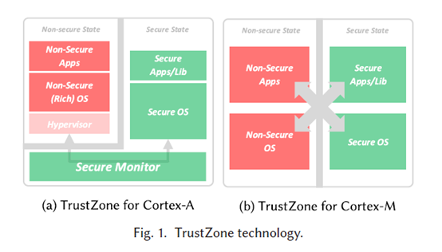
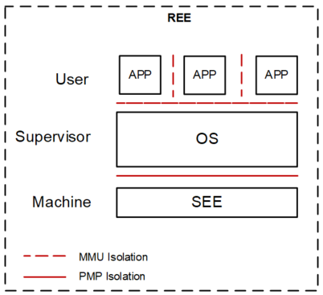
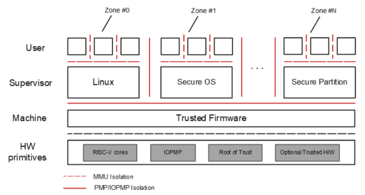
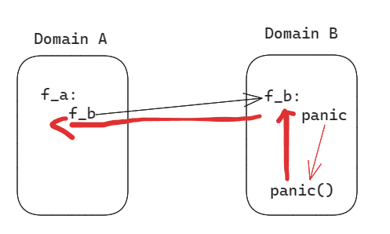
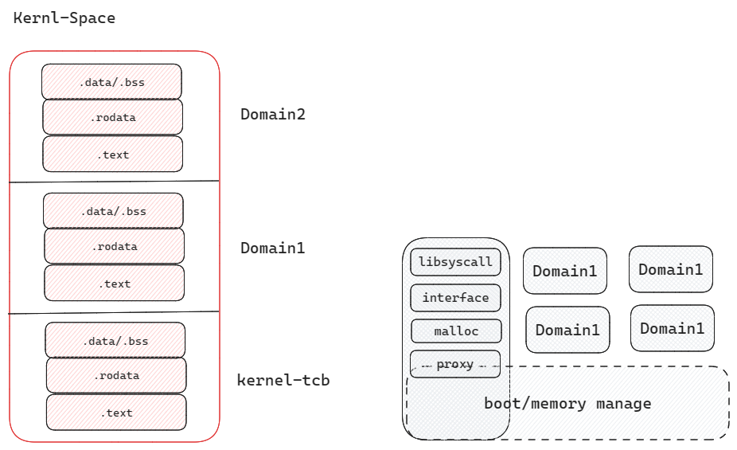

# 研究思路

/隔离/崩溃恢复/安全

## Safety 和 Security

软件并不会直接造成伤害，但是软件可以与外界的设备（硬件）相连，即是软件可以控制设备的运作；错误的（不安全的）软件指令就会导致设备错误的（不安全的）运作，从而导致危害。

safety强调的是软件自身的错误（不安全），通过软件连接的设备引发危险（危害）


安全性是系统保护数据和信息免受未经授权访问的能力的一种度量，同时仍然提供对经过授权的人员和系统的访问。攻击——即针对计算机系统采取的以造成伤害为目的的行动——可以采取多种形式。它可能是未经授权的访问数据或服务或修改数据的尝试，也可能旨在拒绝向合法用户提供服务。

security强调的是免受外部（其他）未经授权（非法）的攻击。


## 硬件隔离技术

在 21 世纪的众多新事物中，互联网和物联网是人类最重要的进步之一。随着它们的发展节奏加快，对连接设备数量的需求也随之大幅增加。“万物互联”已成为未来新的全球网络。虽然移动平台使用量的爆炸性增长使得商业交易得以成功，但不可避免地出现了各种安全漏洞问题。大多数应用程序都没有得到完全保护。因此，个人和企业都面临着隐私滥用和数据丢失的问题。 

设备芯片必须具有可信执行环境（TEE），以保护系统程序、设备参数、安全用户信息。TEE 已被广泛认为是移动设备、支付、数字版权管理 (DRM)、汽车、无人机 (UAV) 和物联网行业的标准环境。目前，实现TEE的可用技术包括ARM的TrustZone、Intel的Software Guard Extensions（SGX）和AMD的Secure Encrypted Virtualization（SEV）。

### ARM TrustZone

两个不同权限的保护域——安全世界和普通世界，任何时刻处理器仅在其中的一个环境内运行。同时这两个世界完全是硬件隔离的，并具有不同的权限，正常世界中运行的应用程序或操作系统访问安全世界的资源受到严格的限制，反过来安全世界中运行的程序可以正常访问正常世界中的资源。这种两个世界之间的硬件隔离和不同权限等属性为保护应用程序的代码和数据提供了有效的机制：通常正常世界用于运行商品操作系统（例如Android、iOS等），该操作系统提供了正常执行环境（Rich Execution Environment，REE）；安全世界则始终使用安全的小内核（TEE-kernel）提供可信执行环境（Trusted Execution Environment，TEE），机密数据可以在TEE中被存储和访问。这样一来即使正常世界中的操作系统被破坏或入侵（例如iOS已被越狱或Android已被ROOT），黑客依旧无法获取存储在TEE中的机密数据。



除了Cortex-A微架构外，ARM发布的新一代Cortex-M微架构同样为TrustZone提供了硬件支持。与Cortex-A相同的是，Cortex-M依旧将处理器运行状态划分为安全世界和正常世界，并阻止运行于正常世界的软件直接访问安全资源。不同的是，Cortex-M已针对更快的上下文切换和低功耗应用进行了优化。具体来说，Cortex-M中世界之间的划分是基于内存映射的，并且转换是在异常处理代码中自动发生的（如图1（b）所示）。这意味着，当从安全内存运行代码时，处理器状态为安全，而当从非安全内存运行代码时，处理器状态为非安全。Cortex-M中的TrustZone技术排除了监视模式，也不需要任何安全的监视软件，这大大减少了世界切换延迟，使得世界之间的转换为更高效。为了在两个世界之间架起桥梁，Cortex-M引入了三个新指令：secure gateway（SG），branch with exchange to non-secure state（BXNS）和branch with link and exchange to non-secure state（BLXNS）。 SG指令用于在安全入口点的第一条指令中从非安全状态切换到安全状态。安全软件使用BXNS指令来返回到非安全程序；最后，安全软件使用BLXNS指令来调用非安全功能。此外，Cortex-M中的状态转换也可以由异常和中断触发

TrustZone通过硬件隔离出的安全世界提供了TEE，根据在安全世界中运行的可信程序的不同，又可以将其提供的TEE划分为两类：TEE内核与TEE服务。

在TEE内核中，可信程序实现一套基本的OS功能，以管理多个TEE实例，每个实例托管一个特定的应用程序。TEE内核实现的功能有：管理安全世界的内存、对每个TEE实施内存保护、处理TEE与OS之间的通信以及为TEE应用程序提供API 。为了解决正常世界中的操作系统和TEE内核的协同工作问题，业界提出了一系列有关TEE内核的标准。在2009年，Open Mobile Terminal Platform (OMTP)便提出了一个TEE标准，该标准定义了TEE应该支持的一系列安全功能。随后，GlobalPlatform组织以此为基础定义了可信应用程序可以依赖的内部API，以及正常世界的OS软件与TEE中的应用程序进行交互的通信接口。许多常见的TEE产品方案都遵守GlobalPlatform标准，例如SierraTEE、T6 、OP-TEE、Open-TEE和Samsung KNOX。

TEE服务只实现某种特定功能，它们不需要任何低级OS逻辑来管理它们自己的内存和跨世界的通信。为了避免相互干扰，设备上只能部署一种TEE服务。与TEE内核相比，这是一个缺点，后者允许多个应用程序在独立的TEE实例中运行。但是，TEE内核的缺点是，与部署单个TEE服务的系统相比，它们通常依赖于较大的TCB，这意味着相比于TEE服务，TEE内核可能存在着更多的漏洞。常见的TEE服务包括：可信存储、安全的身份验证和加密、Rich OS验证和监控、可信I/O等。

#### TrustZone安全隐患

当前已发现的TrustZone漏洞主要可以归纳为两类：

1. 缺乏鲁棒的TEE实现，导致无法为应用程序提供安全的运行容器
2. 实现TrustZone的硬件存在缺陷，攻击者可以针对硬件漏洞发起攻击，进而获取存储的机密数据。

根据国家漏洞数据库（National Vulnerability Database，NVD）和一些公司（例如，高通，华为和三星）发布的安全公告，已发现的有关TrustZone和基于TrustZone的TEE的漏洞已达到了130多个。==这些漏洞中的大多数都与TEE内核以及TEE驱动程序有关，例如缺乏输入验证、缓冲区溢出、过度读取、未初始化变量以及竞争条件等==。出现这种情况的原因在于，==尽管在设计TEE时能够保证其具有安全的体系结构以及能够提供完善而鲁棒的隔离，但是TEE内部运行的代码可能包含一些漏洞，攻击者可以利用这些漏洞破坏TEE并进而损害整个系统的信任状态==。针对TEE中运行的代码存在的漏洞，业界尚缺乏用于验证和分析代码安全性的框架，同时TEE中也缺乏适当防御机制。

除了与TEE中运行的代码有关的漏洞外，在过去的几年中，研究者还发现了许多与实现TrustZone的硬件相关的漏洞，这些漏洞涉及构成平台信任根的组件、缓存、电源管理机制和FPGA等。


## XuanTie VirtualZone: RISC-V-based Security Extensions

基于RISC-V的玄铁C系列处理器的安全扩展，该处理器基于RISC-V的物理内存保护（PMP）机制和特权架构而开发。创建多个相互隔离且可执行的虚拟化区域，形成RISC-V架构中的TEE。此设计的目的是保护区域内的软件、内存、外围设备和 I/O 免受外部入侵。此外，处理器资源（例如高速缓存、中断、内存和代码执行）是隔离的，以便处理器可以同时在不同区域运行。

传统 RISC-V 处理器没有 ARM TrustZone 等隔离技术。RISC-V 处理器在丰富执行环境 (REE) 中运行




事实上，RISC-V提供了两种安全机制：PMP和机器模式（M-mode）。PMP 是将处理器的物理内存划分为多个任意大小的内存区域并为这些区域定义不同的访问权限的功能。它还可以将运行在管理模式（S-mode）下的环境彼此分开，这将在后续章节中详细描述。此外，ARM还有相当于RISC-V PMP、MPU，仅在Cortex-M架构中支持。第二种安全机制是机器模式（M-mode）。它具有最高的权限，类似于ARM中的监视模式。M模式可以管理S模式下多个环境的执行，并干扰S模式或用户模式（U模式）中任何环境的中断和异常。通过PMP和M模式，S模式下运行的环境可以相互隔离。环境可以由更高的权限级别进行管理。


尽管 RISC-V 处理器已经整合了 PMP、特权架构和内存管理单元 (MMU) 来实现 TEE，但处理器必须支持其他安全规范，以实现完全安全的执行环境。为了满足TEE的隔离要求，玄铁C系列处理器配备了基于RISC-V架构的扩展安全特性。结果，在M模式下运行的软件的协调下，创建了多个具有唯一标识符的虚拟化执行区域。如图2所示，每个区域包含一个独立的操作系统和一些应用程序。操作系统在S模式下运行，而应用程序在U模式下运行。处理器可以根据需要在不同区域之间切换。当这种情况发生时，处理器会实时占用整个物理核心，并且区域ID也会更新为相应的虚拟化执行区域的ID。这种区域切换是由运行在最高特权模式（即M模式）下的可信固件（TF）执行的





尽管 RISC-V 处理器已经整合了 PMP、特权架构和内存管理单元 (MMU) 来实现 TEE，但处理器必须支持其他安全规范，以实现完全安全的执行环境。为了满足TEE的隔离要求，玄铁C系列处理器配备了基于RISC-V架构的扩展安全特性。结果，在M模式下运行的软件的协调下，创建了多个具有唯一标识符的虚拟化执行区域。如图2所示，每个区域包含一个独立的操作系统和一些应用程序。操作系统在S模式下运行，而应用程序在U模式下运行。处理器可以根据需要在不同区域之间切换。当这种情况发生时，处理器会实时占用整个物理核心，并且区域ID也会更新为相应的虚拟化执行区域的ID。这种区域切换是由运行在最高特权模式（即M模式）下的可信固件（TF）执行的.通过PMP的实时切换实现区域间的访问和隔离


### MPK

Intel MPK是**一种轻量的内存隔离技术**。 该技术能够将进程的内存页划分成不同的内存页组。 在程序运行时，通过设置寄存器PRKU的值，指定程序访问各个内存页的权限。 当需要改变当前进程上下文对这些内存页组的访问权限时，只需调用WRPKRU指令修改PKRU的值，而不需要昂贵的修改页表项的操作

https://blog.csdn.net/warmmingm/article/details/128015677

https://charlycst.github.io/posts/mpk/

ERIM系统使用MPK来帮助应用

### EPT

x86为了加速内存虚拟化引入的硬件机制

一般来说，基于虚拟化的隔离技术都会导致较大的开销

## 软件隔离/安全措施

### CFI(Control-Flow Integrity)

一些常见的技术：

1. 对访存指令加入额外的判断

## 当前的系统存在的问题

当前的隔离机制包括了硬件隔离与基于软件的隔离。

| 系统 | 优缺点 |
| ---- | ------ |
|      |        |
|      |        |
|      |        |


## 技术探索

在开始正式的工作之前，我们需要对已有的技术进行探索，确定其是否真实有效。首先一个非常重要的前提需要明确：<font color = red>在redleaf中，大部分的域由安全的rust构成</font>  。为了禁止在rust中使用`unsafe`的代码，我们可以加入

```rust
#![deny(unsafe_code)]
```

这个属性将在编译时禁止`unsafe`代码出现。

### 共享堆和私有堆——内存隔离

为什么需要这个设计呢？<font color = #F000f3>为了提供跨域的故障隔离并确保域的安全终止，我们强制跨域堆隔离，即分配在域的私有堆、堆栈或全局数据部分上的对象无法从域外部访问。这个不变量允许我们在任何执行时刻安全地终止任何域。由于没有其他域保存指向终止域的私有堆的指针，因此释放整个堆是安全的。</font>

> 按照这个说法，私有堆就是为各个域提供内部的堆分配，但是各个域需要通信，所以产生共享堆。这里<font color=#FF0000> 强制域的堆隔离</font>的含义与基于硬件隔离技术(MPK)的方法相同，都是为了确保隔离区域的数据不会被其它区域访问，在那些基于硬件技术的方法中，通过对内存页打上标记并进行权限的交换来完成，在这里，因为域在`safe rust`中实现，而如果域想对其它域的数据访问，<font color=#FF0000>则其必须使用`unsafe`代码进行指针的强制转换 </font>，而这会触发编译时错误。这里我们要思考的一个问题是<font color=#0000FF>通过强制域使用`safe rust`是否确实可以达到硬件技术的效果呢？</font>如果想要对内核模块做隔离，但是大多数内核模块是必然包含`unsafe code`的，在这种情况下，redleaf的做法似乎是将这些`unsafe`的核心操作当作TCB对待。<font color = #00000FF>在内核中真的可以将那些unsafe的核心操作全部归纳到TCB吗，如果不行，则域必须包含`unsafe code`，这可能会打破堆隔离机制？ </font>


在共享堆中，redleaf定义了`RRef<T>` 类型， 这是一个类似于 `Box<T>`的类型，但包含了更多关于域的元数据以便更好地释放。

在`redleaf`中，私有堆的实现依靠rust的`#[global_allocator]` 。对于系统中的每一个域而言，比如`sys/driver/`目录下的几个驱动实现，他们都会进行堆分配，而在依赖项中，都引入了`malloc`这个库，在`lib/core/malloc`下包含这个库的具体实现。

这里存在两个比较重要的全局变量：

```rust
#[global_allocator]
static SLAB_ALLOC: SafeZoneAllocator = SafeZoneAllocator(Mutex::new(ZoneAllocator::new()));

/// A pager for GlobalAlloc.
static mut PAGER: Pager = Pager;
```

对于`SLAB_ALLOC` ，其定义了rust的全局分配器，这也就是说，任何引入了这个库的域的堆分配最终都会运行到这里进行最后的分配。 而这里的`PAGER` 是定义分配的真正接口：

```rust
fn alloc_page(&mut self, _page_size: usize) -> Option<*mut u8> {
        let r = sys_alloc();

        if r as u64 != 0 {
            Some(r)
        } else {
            None
        }
    }

    /// De-allocates a given `page_size`.
fn dealloc_page(&mut self, ptr: *mut u8, page_size: usize) {
    let _layout = match page_size {
        Pager::BASE_PAGE_SIZE => {
            Layout::from_size_align(Pager::BASE_PAGE_SIZE, Pager::BASE_PAGE_SIZE).unwrap()
        }
        Pager::LARGE_PAGE_SIZE => {
            Layout::from_size_align(Pager::LARGE_PAGE_SIZE, Pager::LARGE_PAGE_SIZE).unwrap()
        }
        _ => unreachable!("invalid page-size supplied"),
    };

    sys_free(ptr);
}
```

可以看到，`Pager` 在实现分配的时候，其最终调用了<font color=#FF0000>系统调用</font>。而`SafeZoneAllocator` 虽然实现了`global_allocator`这个trait，但是从其实现可以看出来存在一定的问题，首先是对于任何大小的堆分配，它都被转换成了页大小的分配，虽然被注释的代码中存在类似`SLAB`的分配，但不知道什么原因被注释掉。同样对于释放内存，`Pager`也会调用<font color=#FF0000>系统调用</font>。 

在`rust_main`函数中，系统被初始化，并加载各个域。阅读各个域的代码入口(`domain/generated`目录下)来看，各个域的初始化代码都包含了:

```rust
libsyscalls::syscalls::init(s);
interface::rref::init(heap, libsyscalls::syscalls::sys_get_current_domain_id());
```

1. 初始化了内核提供的系统调用接口
2. 初始化了共享堆

在redleaf的实现中，出现了很多全局变量，模块之间通过这些全局变量进行交互。这些域通常包含一个`main`函数入口，IDL编译器会生成一个新的入口来包装这个入口。这里的两步完成之后，此时这个域的私有堆+共享堆就初始化完了。<font color = #FF0000>编译时这个域将会作为一个`crate`被编译</font>.

这里我们再次考察私有堆的实现，在redleaf中，其是一个两级内存分配方案，在底层，微内核为域提供了一个接口，用于分配无类型的粗粒度内存区域（大于一个页面）。<font color =#F000f3>每个粗粒度的分配都记录在堆注册表中</font>。为了在域的私有堆上提供细粒度的类型化分配，每个域都链接到rust的`globalAllocator`分配器。两级方案具有以下优点：只分配大的内存区域，微内核记录域分配的所有内存，而没有显著的性能开销。如果域出现异常，微内核将遍历所有由分配器分配给域的非类型化内存区域的注册表，并在不调用任何析构函数的情况下释放它们。

这段话的含义在于这个两级的私有堆的作用其实更多是有利于<font color = red>域的崩溃回收</font>，因为域从内核中请求的页面被记录下来，当域发生错误时，内核可以直接将这些页面全部回收，而因为这些页面不会被其它域使用，这个回收不会出现错误。所以私有堆本质上并没有提供数据上的隔离，<font color = red>是 `safe rust `提供了数据的隔离</font>. 

> 在redleaf中，我们并没有看到两级内存分配的实现

> 怎么实现两级内存分配的实现呢?

要实现两级内存分配，我们需要确保每个域具有唯一标识符，内核的分配器根据这个标识符分配页面。<font color = blue>这个标识符应该由内核指定还是域来指定呢？</font>在redleaf中，每个域被内核加载后，有一个唯一的标识符，这个标识符是由内核分配的。想要内核分配页面时得到域标识符信息，唯一途径只能是域内的第二级分配器在请求时带上标识符，否则内核是不知道到底是那个域在请求页面的。

可行的方案可以是这样的:

1. 参考`libsyscalls` 的实现，定义一个全局数据，原来保存属于这个域的标识符

2. 因为`libsyscall` 是 内核TCB提供功能的入口点，而私有堆设计中的第二级分配器应该通过这里向内核TCB的第一级分配器请求页面。

3. 内核在加载域的时候，除了执行上文提到的两个初始化外，首先初始化域的标识符

   ```rust
   libsyscalls::syscalls::init(s,domain_id);
   interface::rref::init(heap, libsyscalls::syscalls::sys_get_current_domain_id());
   ```

注意这里的标识符和内核中的表示一个域的结构中标识符可能不同。

### demo实现

在我们的实现中，我们针对redleaf的一些缺陷做了处理，同时需要对其缺乏的功能进行完善。在`domain-tools` 目录下中，`libsyscall`  定义了隔离域与内核TCB进行交互所需要的接口和域标识符，每个隔离域都直接或者间接依赖了这个`crate`, 现在这里面只定义了几个简单的接口:

```rust
pub trait Syscall: Send + Sync {
    fn sys_alloc_pages(&self, domain_id: u64, n: usize) -> *mut u8;
    fn sys_free_pages(&self, domain_id: u64, p: *mut u8, n: usize);
    fn sys_write_console(&self, s: &str);
}
```

我们通过两个全局变量来让内核在启动后注入内核提供的功能和域的标识符:

```rust
static SYSCALL: Once<Box<dyn Syscall>> = Once::new();
static CRATE_DOMAIN_ID: Once<u64> = Once::new();
pub fn init(syscall: Box<dyn Syscall>, domain_id: u64) {
    SYSCALL.call_once(|| syscall);
    CRATE_DOMAIN_ID.call_once(|| domain_id);
}
```

在`domain-tools/malloc`中，我们定义了隔离域所使用的私有堆分配器，它会通过`libsyscall`向内核TCB请求物理页。每个可能需要使用堆分配的隔离域都引入这个`crate`。

`domain-tools/interface` 目前定义了隔离域的功能，现在只包含一个块设备驱动。<font color = red>对于隔离域来说，这个接口是它唯一可以和其它域进行交互的途径. </font> 而因为交互涉及到堆栈的数据访问，而隔离需要杜绝这种情况的发生，因此接口的参数目前被严格进行限定，redleaf通过使用共享堆的设计来解决这个问题，目前我们暂时遵守这样的设计，虽然并没有使用到。`domain-tools/rref`定义了共享堆上可以进行分配的数据结构，这些数据结构被用在域接口当中。

我们定义的块设备驱动隔离域的接口如下:

```rust
pub trait BlkDevice: Send + Sync {
    fn read(&self, block: u32, data: RRef<[u8; 4096]>) -> AlienResult<RRef<[u8; 4096]>>;
    fn write(&self, block: u32, data: &RRef<[u8; 4096]>) -> AlienResult<usize>;
    fn get_capacity(&self) -> AlienResult<u64>;
}
```

在`domains/drivers/blk`目录下，我们实现一个简单的块设备驱动。首先我们在项目的顶层添加<font color = red > 禁止`unsafe code`的属性。</font>

```rust
#![no_std]
#![deny(unsafe_code)]
```

这个属性禁止了块设备驱动域当中不安全的代码出现，这保证了两个不变量:

1. 不存在任何裸指针的转换和访问
2. 在隔离域进行通信时传递的对象不会被解引用从而产生信息泄露

> **这两个不变量应该保证了数据的隔离性**。

对于第二个不变量，上文提到，隔离域接口定义了隔离域的功能，其会以一个rust的`trait`对象存在。而这个对象通常由隔离域的入口函数返回，所以这个对象应该是位于隔离域的私有堆上的数据。比如我们的`blk`驱动实现:

```rust
pub fn main() -> Box<dyn interface::BlkDevice> {
    Box::new(NullDev::new())
}
```

当一个域想要使用另一个域的功能时，通常会将代表另一个域的`trait`对象作为参数传递进来。`Box<T>`是可以进行解引用的，这可以获取到其元数据。而上文的属性保证了这个动作不能发生，因此杜绝了数据泄露。


> 这里我们需要再思考一个问题，如果隔离域使用了禁止`unsafe code`标记，那么共享堆是否还有存在的必要？

考虑一下，如果去掉共享堆，那么域之间进行数据传输，引用的数据就是各自堆栈上的数据，这里我们暂且忽略栈上的数据，因为还没有考虑是否在每个隔离域中为其准备独立栈。在c代码中，因为可以对指针进行任意操作，这导致需要隔离就不得不限制隔离域对超出这些数据区域的其它数据进行访问。

```c
// domain_a.c
void domain_a(char *ptr, int len){
    // buf overflow
    char data =  ptr[len+2];
    printf("%c",data);
}

// domain_b.c
void domain_c(){
    char *buf = "Hello, world!";
    char *buf_private = "x";
    domain_a(buf,5);
}
```

在上面的例子中，`data` 引用了超过参数所限定的数据范围，导致了数据泄露。所以想要在C语言中使用基于语言的隔离几乎是不可能的。大多数的工作基于硬件机制完成隔离，这些工作对隔离域之间通信所涉及的数据进行了标记，只允许另一个域访问数据所在的狭小页面。

在rust中，当我们使用`&[u8]` 或其他数据结构进行数据传递时，按理来说已经限定了数据的访问范围，因此任何想要访问超过这些数据范围之外的操作都是`unsafe`的，这可以直接在编译时出现错误。

那为什么还是需要共享堆呢？按照文章的论述<font color = #f000f3>借用共享堆上对象的移动语义来提供干净的故障隔离，同时支持来自 Singularity 的零复制通信 </font> 。

首先对于**故障隔离**来说：单一所有权模型表明一次只能有一个域具有对共享堆上的对象的引用。当一个对象的引用被跨域传递时，对象的所有权在域之间被“移动”（在将对象传递到另一个域后，试图访问该对象被编译器拒绝）。单一所有权是一个干净实用的故障隔离模型的关键-崩溃的域不能影响系统的其余部分。崩溃的域无法触发其他域中共享引用的撤销，或使共享对象处于不一致状态。单一所有权所蕴含的移动语义保证了数据的发送者失去了对数据的访问，同时接收者拥有所有权限，这有点类似于函数式编程倡导的函数无副作用。

如果只有私有堆的存在，首先我们**无法确保域之间传递的数据只能蕴含移动语义或者不可变语义**，比如如果域的接口包含一个`Arc<T>`的数据结构，如果我们在原来的域使用`clone`拷贝了一份数据，那么这时候移动语义将会被破坏，如果恰好这个时候崩溃的域已经修改了一部分数据，那么原来的域将会包含错误数据。不可变语义同样有这样的原因。这导致域无法隔离故障。

通过定义共享堆，并限定从共享堆上分配的数据结构，可以确保域之间进行数据通信时保证移动语义或者不可变语义，从而达到故障隔离，而且可以实现端到端零拷贝通信。


在`domains/generated/gblk` 中，我们对`domains/drivers/blk` 进行了一个简易的封装，这类似redleaf中IDL编译器为各个域生成代码。在这里，我们需要对`libsyscall`进行初始化，完成前文提到的共享堆和私有堆的初始化，然后就是简单的调用`blk`的初始化函数。

```rust
#[no_mangle]
fn main(sys: Box<dyn Syscall>, domain_id: u64) -> Box<dyn BlkDevice> {
    // init basic
    libsyscall::init(sys, domain_id);
    libsyscall::write_console("Blk domain start");
    // call the real blk driver
    blk::main()
}
```

因为内核TCB需要加载各个域，因此我们不得不借助一些`unsafe`手段，比如这里我们同样定义了一个`main`函数，但这个`main`函数配合了编译隔离域使用的链接脚本，从而可以在加载域的时候找到域的初始化函数。这个封装代码通常由IDL编译器来生成，因此我们将其视为TCB的一部分，认为这个操作是安全的。


在`subsystems/domain-loader`中，我们实现了一个简易的域加载器来尝试将隔离域加载到内核地址空间中。`subsystem/domain-helper`中，我们实现了`libsyscall`中定义的`Syscall`接口。要想将隔离域加载到内核地址空间中，还有一个必须的编译条件，我们需要**生成位置无关代码**，因为这些域在编译时是不知道放在内核地址空间的位置的。当然这可以通过加上`PIC`标志完成，主要的工作在于进行一些重定位工作。

[位置无关代码的加载](./位置无关代码.md)

就目前的实现来看，这里仍然存在一些问题，不过域的加载是可以正常进行的。

> 接下来做什么?

- [x] 首先是域加载后，在调用初始化函数后，原来的执行流出现了损坏，目前还没有解决到底是为什么？

- [ ] 对于域通信涉及到的共享堆和其上分配的数据结构，我们还得进一步思考，这些数据结构全部从共享堆上分配，相比直接使用栈上的数据，速度肯定会降低，有没有更好的方法来处理域间通信呢，同时保持**故障隔离**呢？

- [ ] 在域崩溃后，如何处理数据回收，对于私有堆应该较为容易，可以直接扫描由域分配的页面，然后回收掉，如果采用共享堆，如何回收共享堆的数据呢？

- [ ] 我们使用代理对象来中介域间调用，并确保发生故障的域只能返回错误，该怎么保证呢？


> 域加载后，原来的执行流出现了损坏，为什么？

通过debug发现，在我们测试域加载的代码中，加载完隔离域之后我们获得了一个代表域的`Box<T>`对象，这个对象是在隔离域中被分配的，使用的是私有堆分配器。但我们的测试代码位于内核代码中，这两部分是被分开编译的，在编译内核时，编译器不知道这个对象是来自另外一个被独立编译的部分，因此它只会机械地调用对象的`drop`函数来释放对象，而通过观察函数的执行流，发现这会跳转到隔离域的代码中，但是从其跳转的地址来看，其并没有跳转到正确的位置上，这说明我们的加载没有正确地修正对应的地址。

通过查看其地址，我们发现其会加载位于`rodata`段上的地址的值并跳转过去，而编译后的PIE文件中并没有修正这一段的信息，通过多次的尝试发现，我们在域的配置文件中指定了:

```rust
[profile.release]
strip = true
```

这会去除掉PIE文件中不需要的信息，这就包括了`.rela.rodata`这个段，从网络上已经学习到的知识来看，这个段理论上来说不应该在加载PIE代码时使用到，但鉴于目前遇到的问题，我们暂时放松了这个限制，并利用这个段修正了`.rodata`的数据，从而使得执行流可以正确地进行。

但随之而来的是另一个问题，即<font color = red> 虽然drop函数被正确调用，但是随后会继续调用`dealloc`函数释放内存，这个`dealloc`函数却是内核代码的`dealloc`</font>, 上面我们知道，这个`Box<T>`对象有隔离域私有堆创建，因此它应该被私有堆回收，这里应该是在编译内核代码时，内核仍然将`dealloc`函数链接到了自身。目前我们的解决方法是,

每个域都会实现一个回收自身的函数:

```rust
pub trait Basic {
    fn drop_self(self: Box<Self>) {
        drop(self);
    }
}
```

我们需要手动地调用`drop_self`来释放代表一个域的`Box<T>`对象。

#### PIE链接问题

为了进一步探索隔离域实现，我们还需要再实现一个隔离域与之前的这个`blk` 域进行交互，这里我们选择实现一个简单的文件系统模块，同样的，我们在`domains/fatfs` 下实现这个域，因为文件系统需要块设备，所以其入口的参数需要传入代表块设备域的对象:

```rust
pub fn main(blk_device: Box<dyn BlkDevice>) -> Box<dyn Fs> {}
```

在`domains/generated/gfatfs`中，我们将其封装，与`blk`域类似。我们简单地用fat32文件系统进行测试，因此需要对`blk`域进行修改，让其读取使用真正的块设备。

在这一阶段，我们遇到了两个主要的问题：

1. 无法生成PIE代码
2. 开始触及一个本质问题: <font color = #f000f3> 内核可信基</font>

> 无法生成PIE代码？

这个问题的发生在于我们在隔离域中引入输出，从其编译链接错误来看，标准库的一部分代码在编译后无法正常的链接成PIE，对这个问题，搜寻了许多资料都无法解决，但是我观察到`redleaf`中存在同样的代码，但它是能通过编译的，因此我努力将链接脚本和编译选项等调正和其一致，但问题仍然没有解决。

这个问题耽误了中间大段时间进行尝试和调试。在即将对代码进行大手术(不使用位置无关代码PIC而是转而正常编译成位置相关的代码)之前，我将链接器更换成了`riscv64-linux-gnu-gcc`后， 问题突然得到了解决，而且更好的是，之前编译的PIE程序的一些问题也被解决了，比如`.rela.dyn`段不存在。

在更换这个链接器后，之前对`.rela.rodata`段的特殊使用也就不需要了，因为现在只要按照标准的重定位过程就可以完成PIE程序的加载。

#### 内核可信基

在许多文章中，这个部分也被称为`TCB` 或者 `Threat Model`， 这主要描述了在隔离的系统中，始终存在一部分代码是不安全的但是又必须存在的，比如说内核的启动代码，内存管理，甚至是任务调度，我们把这些部分作为TCB的一部分，将其视为安全的，可信的，因此可以被隔离域安全地使用。

在以硬件技术做隔离的系统中，通常会减小TCB的大小。

在上文中，我们已经讨论了基于语言机制来做隔离，这里是rust, 其主要是依靠safe code 来达到数据的隔离。这引出了一个问题，就是**我们的隔离域实现需要使用`safe rust`**. 但通常这是不太可能的，就`blk`驱动来说，内核只会从设备树中探测到一个地址范围，驱动程序的职责就是解析这段地址范围内的内容并配置这些内容，这些内容可能包含了很多寄存器或者缓冲区，而这些寄存器或者缓冲区的访问通常使用裸指针进行转换和访问，这都是`unsafe`的。

在`redleaf`中提到了其<font color = #f000f3>隔离域由一组白名单和安全的crate来构成</font>。 按照我的理解这里的白名单就是内核对于这些底层设备或者资源的抽象，这被视作TCB的一部分，而隔离域只能使用这些部分来完成具体的逻辑，因为这些代码都有内核编写者实现，因此我们可以将对这些硬件进行抽象的部分视作安全性要求更高的一部分，其应该由更核心的人员编写，其应该严格地限制使用者对这些寄存器或者缓冲区的访问手段，只提供必要的方法并进行严格的检查。

对于隔离域来说，应该只能使用内核提供的这些基本抽象, 就算引入了外部库，我们也应该确保这些库全部由`safe`代码构成或者被确认对内核来说是安全的。

当前我们实现的两个域并没有按照上面的叙述进行约束，因为只是原型系统，所以做了一定的简化，当开始完全进行开发时，需要遵守这些约束并重新实现。


#### 故障隔离

`redleaf`论文中描述了故障隔离的高级别定义:

当进入域的线程之一发生panic时，我们说域崩溃并需要终止。panic可能会使域内部可访问的对象处于不一致的状态，从而使域内任何线程的进一步进展变得不切实际（即，即使线程没有死锁或恐慌，计算结果也是不确定的）如果满足以下条件，我们就说故障是隔离的：

1. **可以将崩溃域内运行的所有线程展开到域入口点并向调用者返回错误**
2. **随后尝试调用域会返回错误，但不会违反安全保证或导致panic**
3. **崩溃域的所有资源都可以安全地释放，即其他域不保留对崩溃域的堆的引用（堆隔离不变式），并且我们可以回收该域拥有的所有资源而不会泄漏**
4. **其他域中的线程继续执行，并且可以继续访问由崩溃的域分配但在崩溃之前移动到其他域的对象。**

为了强制执行故障隔离，RedLeaf 依靠调用代理来干预所有跨域调用。为了确保隔离和安全，代理在每个包装函数内实现以下内容：

1. 代理在执行调用之前检查域是否处于活动状态。如果域处于活动状态，代理会通过更新微内核中的状态来记录线程在域之间移动的事实。当域崩溃时，我们使用此信息来展开域内执行的所有线程
2. 对于每次调用，代理都会创建一个轻量级延续，捕获跨域调用之前线程的状态。延续允许我们展开线程的执行，并向调用者返回错误。
3. 代理移动作为域之间参数传递的所有 RRef<T> 的所有权，或更新所有不可更改借用的引用的借用计数


对于第一点，代理检查域释放处于活动状态并在活动状态下让线程继续执行，这可以通过为每一个域增加一个标志和实现一个接口来实现：

```rust
// interface/src/lib.rs
pub trait Basic {
    fn drop_self(self: Box<Self>) {
        drop(self);
    }
    fn is_active(&self) -> bool {
        is_active()
    }
}
static ACTIVE: AtomicBool = AtomicBool::new(false);

/// Activate the domain
///
/// It should be called in the `main` function of the domain.
pub fn activate_domain() {
    ACTIVE.store(true, core::sync::atomic::Ordering::SeqCst);
}

fn is_active() -> bool {
    ACTIVE.load(core::sync::atomic::Ordering::SeqCst)
}

/// Deactivate the domain
///
/// It should be called in the `panic` function of the domain and it should block the thread which
/// calls this function when the `ACTIVE` flag is false.
pub fn deactivate_domain() {
    while !ACTIVE.swap(false, core::sync::atomic::Ordering::SeqCst) {
        spin_loop();
    }
}
```

因为每一个隔离域都需要引入`interface`作为依赖，因此可以定义一个全局标志来表明域的存活状态，在加载域的时候，我们可以在之前的初始化步骤中再加入激活域的调用。在域的`panic`函数中，我们调用`deactivate_domain` 来让域死亡。这里我们只允许第一个调用`deactivate_domain` 的线程通过，其它在崩溃域线程如果同时也崩溃了，其会被阻塞在这个位置，这主要是为了解决域崩溃后需要展开所有的线程。

在代理对象内部，进行真正的调用前，第一步会调用`Basic::is_active` 来检查域是否存活。

- [ ] <font color = blue>这里后期应该用宏来自动生成代码</font>

这个问题的一个简单场景就是：域A在调用域B的功能时，如果域B发生了panic，怎么确保域B的资源被回收后执行流可以顺利地回到调用时，并且调用返回错误。






## Alien

这里我们对几个比较核心且未来可能作为隔离域存在的子系统进行讨论。

`drivers` 子系统是不同设备的驱动实现集合，目前我们将其放在一个`crate`中，在未来驱动被作为一个隔离域实现时，需要将其拆分出来形成不同的`crate`。

块设备驱动`GenericBlockDevice`:

1. 如果是一个virtio 设备，其会需要依赖一块设备地址空间。
2. 如果是一个sdio设备，其会需要依赖一块设备地址空间。

向上，块设备驱动使用一个接口暴露功能

```rust
pub trait BlockDevice: Send + Sync + DeviceBase {
    fn read(&self, buf: &mut [u8], offset: usize) -> AlienResult<usize>;
    fn write(&self, buf: &[u8], offset: usize) -> AlienResult<usize>;
    fn size(&self) -> usize;
    fn flush(&self) -> AlienResult<()>;
}
```

在设备管理子系统中，扫描程序会使用驱动程序实例化一个设备，并再次使用其提供的接口功能实现文件系统相关的接口。

因此，如果需要将其作为一个隔离域，这个隔离域向外暴露的功能就应该与其接口类似，<font color=red>这些驱动模块的参数通常来说会是一段设备地址空间</font>, 为了避免这些驱动隔离域使用unsafe的代码，内核TCB需要提供一个**安全抽象层**，隔离域只能使用抽象层提供的功能完成设备空间的访问和读写，同时，这个抽象层又应该尽可能地小。

比如对于一段地址空间的访问，抽象层可能会提供的一个安全抽象结构如下:

```rust
#[derive(Debug, Copy)]
pub struct SafeRegion {
    start: usize,
    size: usize,
}

impl SafeRegion {
    pub fn new(start: usize, size: usize) -> AlienResult<Self> {
        // check whether the start address is in the kernel space
        mem::is_in_kernel_space(start, size)
            .then(|| ())
            .ok_or(AlienError::EINVAL)?;
        Ok(Self { start, size })
    }
}
```

我们讨论这些安全抽象为什么需要时，是因为这些抽象在访问的过程中会通过一系列的检查，以确保访问是合法的。

串口设备驱动`Uart`:

1. 其依赖由几个寄存器构成的设备地址空间

向上，其使用一个接口暴露功能:

```rust
pub trait UartDevice: Send + Sync + DeviceBase {
    fn put(&self, c: u8);
    fn get(&self) -> Option<u8>;
    fn put_bytes(&self, bytes: &[u8]);
    fn have_data_to_get(&self) -> bool;
    fn have_space_to_put(&self) -> bool;
}
```

对于其它几个基本的驱动的分析也是类似。

### Task与VFS域的交互

在Task或者其它需要读取文件的模块中，通常我们使用一个对`Arc<dyn VfsDentry>`的包装器进行文件的读取，在原来的实现中，我们定义了一个`File`的 接口，并定义了一个`KernelFile`包装器来实现这个接口：

```rust
pub struct KernelFile {
    pos: Mutex<u64>,
    open_flag: Mutex<OpenFlags>,
    dentry: Arc<dyn VfsDentry>,
}
impl File for KernelFile {}
```

对于`pipe`和`socket`文件, 我们还定义了两个包装器来实现这个即可，这构成了内核对绝大多数文件的使用。

现在这些模块转换成了独立的隔离域，而这些域只能通过有限的接口进行通信，不能再直接传递这些对象，因此需要新的方式进行这些域间的交互。我们暂时考虑Task和VFS域的交互。

<font color = red> **这里的关键在于需要找到一个唯一的标识，这个标识作为Task让VFS进行读取文件或其它操作时的证明，而VFS域根据这个标识符可以找到其对应的文件。**</font>

最简单的标识符我们可以使用一个无限递增的`u64` 来进行表示。

```
#[derive(Debug)]
pub struct ShimFile {
    id: InodeId,
}

fn read_at(&self, offset: u64, buf: RRefVec<u8>) -> AlienResult<(RRefVec<u8>, usize)> {
    let res = VFS_DOMAIN
        .get()
        .unwrap()
        .vfs_read_at(self.id, offset, buf)
        .map_err(Into::into);
    res
}
```

新增的Syscall域与VFS域的交互遵循相同的原则。

|      | Task                   | Syscall                      | VFS                            |
| ---- | ---------------------- | ---------------------------- | ------------------------------ |
| 功能 | 负责创建/管理/调度任务 | 负责协调Task域和其它域的功能 | 负责处理文件的管理和相关的功能 |
| 依赖 | VFS                    | Task + VFS + Net()           | Task                           |
|      |                        |                              |                                |

我们将任务的切换与异常处理放到TCB当中，因为这包含了大量的汇编代码和体系结构相关的内容，TCB会提供几个接口供Task域使用，比如`switch`  

目前的域之间我们尽量保证了没有相互依赖，但现在不得不遇上相互依赖的问题，因为在加载域到内核中并调用其入口函数时，域会获取其它域的引用，为了破除循环依赖，一个简单的做法是入口函数不负责获取其它域，新增一个`init`接口，由`init`接口来初始化域并获取域所需要的依赖。


### Devices域

这个域会负责管理系统中的所有设备，其会扫描设备树或者PCI总线，将设备通过总线数据结构管理起来，这里需要考虑驱动如何和这里交互。

- 驱动程序通常只需要设备的少数信息：设备地址空间/IRQ
- 驱动程序通常是一个隔离域
  - 驱动域  `init(device_info:)` 
  - 设备域  `init(PCI:, DTB:)`
  - 可能会有多个相同的设备，这时候是需要构造多个驱动域来支持的

- 可能会有多个devices域==类似于多个总线==
  - mmio
  - pci

## 系统的启动流程

1. 系统系统并完成内存管理子系统的初始化
2. 开始加载各个域：
   1. 通过将域加载到内核地址空间，并建立域的数据结构，为其实现拷贝接口，可以再次生成一个域
   2. 当所有域都被加载完毕，开始逐步调用域的接口，
   3. 第一个调用的域是devices，其内部扫描到所有设备信息后，通过接口传出所有的设备信息，tcb根据设备信息，呼叫驱动域，完成设备的初始化。<font color = red>在TCB内部，要维护设备和驱动域的关系。</font>
   4. 在初始化驱动域时，注册外部中断，向外部中断域注册中断号和设备域信息
      1. 
   5. VFS域的初始化：在创建设备文件系统时，需要找到设备+驱动域 -> 驱动域用来创建设备文件，==如何知道有哪些设备？==  ==如何找到设备对应的驱动域？==
      1. 从devices域，我们可以得到所有设备的信息
      2. 根据信息，向TCB请求驱动域
   6. 加载Task域：task域会需要VFS的功能支持，用于读取文件
   7. 加载SysCall域：其会需要VFS和Task域的支持
3. Task的`init`函数导致系统开始运行第一个任务


## Reference

[Arm Trust Zone](https://zhuanlan.zhihu.com/p/101486119)

https://zhuanlan.zhihu.com/p/601083468vs
