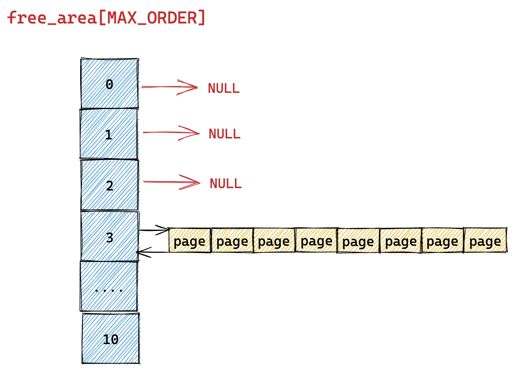
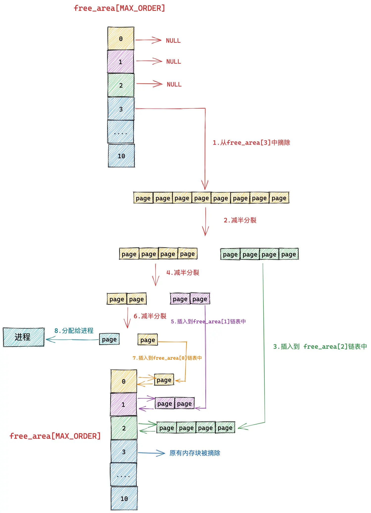
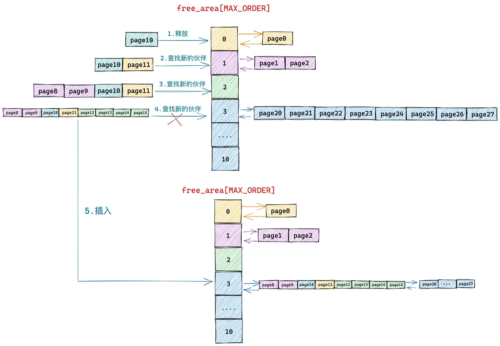

# 物理页帧分配器

此仓库包含两个页帧分配器实现：`Buddy` 与 `Bitmap`

## Interface

```rust
/// The trait of page allocator
pub trait PageAllocator {
    /// init the allocator according to the memory range
    ///
    /// 1. Guaranteed memory alignment to 4k.
    /// 2. Guaranteed memory size is greater than 4k.
    fn init(&mut self, memory: Range<usize>) -> PagerResult<()>;
    /// allocate 2^order pages
    /// # Return
    /// * `OK(usize)` - the start page
    fn alloc(&mut self, order: usize) -> PagerResult<usize>;
    /// free 2^order pages
    /// # Params
    /// * `page` - the start page
    /// * `order` - the order of pages
    fn free(&mut self, page: usize, order: usize) -> PagerResult<()>;
}

```


```rust
/// The trait of page allocator
///
/// It allows to allocate continuous pages
pub trait PageAllocatorExt {
    /// allocate pages
    /// # Params
    /// * `pages` - the number of pages, it may not be 2^order
    fn alloc_pages(&mut self, pages: usize, align: usize) -> PagerResult<usize>;
    /// free pages
    /// # Params
    /// * `page` - the start page
    /// * `pages` - the number of pages, it may not be 2^order
    fn free_pages(&mut self, page: usize, pages: usize) -> PagerResult<()>;
}
```


## Buddy

伙伴系统是Linux中经典的页帧分配器，这里对其进行了简化，去掉了高速缓存，以及迁移类型等复杂机制。



这里的实现使用了`doubly-linked-list`库，这是一个类似Linux中的双链表结构，每一物理块首页都后包含一个链表项：

```
pub struct ListHead {
    pub prev: *mut ListHead,
    pub next: *mut ListHead,
}
```

通过这个数据结构，可以将所有的物理块串联起来。

物理页的分配按照2的幂次进行，在当前幂次不足时向下一个幂次进行请求。



物理页的释放会触发合并操作，以便后续更大的页请求可以得到满足。



## Bitmap

位图分配器使用一个大数组或者一定数量的物理页来管理所有页面。

```rust
pub struct Bitmap<const N: usize> {
    /// Current number of allocated pages
    current: usize,
    /// Maximum number of pages
    max: usize,
    /// The bitmap data
    map: [u8; N],
    /// The bitmap start page
    map1: Option<usize>,
    /// start page
    start: usize,
}
```

当使用位图分配器时，有两种使用方式

1. 在明确知道管理的内存区间大小的情况下，可以指定`N`的大小

```rust
let mut bitmap = Bitmap::<{ 4096 / 8 }>::new();
```

这种方式下，位图将会管理N*8数量的物理页面，并在初始化阶段检查。

2. 在不知道管理的内存大小的情况下，设置`N = 0`

```rust
let mut bitmap = Bitmap::<0>::new();
```

这种方式下，位图分配器会尝试直接在管理的内存前部，使用一个或多个页的空间来管理剩余的内存。由于一个页大小的内存块可以管理4096*8个页，因此如果内存较小，可能会存在浪费的情况。

1. 这种情况下需要保证内存大于2*4096
2. 推荐内存较大的情况下使用

位图分配器循环扫描整个位图，寻找满足要求的区间。


## Feature

